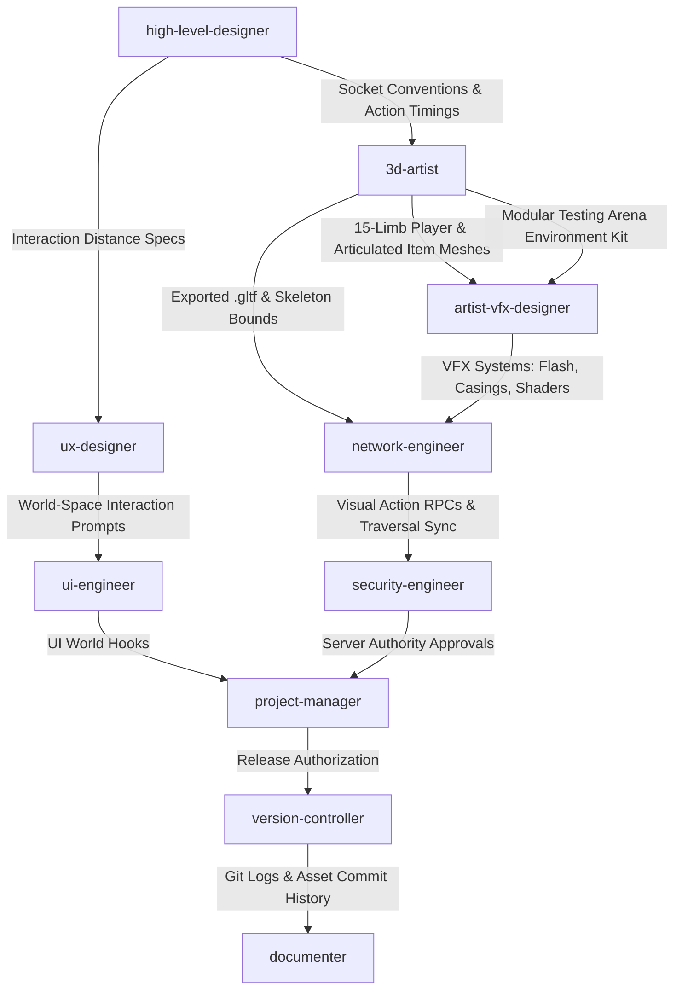

# 🚀 God-Caliber — Patch 0.4 "Hydra" Deployment & Execution Plan
**Focus:** Asset Pipeline Modernization, Modular 3D Architecture, Testing Arena Rebuild, & Networked Visual Action Replication

**Version Target:** `v0.4.0-alpha`  
**Patch Codename:** `Hydra` (Asset Foundation Refactor)  
**Status:** Planning & Execution  
**Orchestration Lead:** `project-manager`  
**Primary Objectives:** Complete 3D Asset Pipeline Overhaul, 15-Limb Player Rigging & Animation Suite, Modular "Testing Arena" Rebuild, Extensible Skin/Item/Map Foundation, and Server-Authoritative Action/Visual Replication.

---

## 📑 Executive Summary

Patch 0.4 strategically establishes God-Caliber's core **3D Asset Pipeline & Multiplayer Visual Replication Architecture**. Recognizing that upcoming systems (such as UI character viewports, dynamic container inspect panes, advanced movement overhauls, and procedural terrain) require a standardized 3D foundation, this patch delivers:

1. **Standardized 3D Player Character:** Replaces the archaic procedural placeholder with a high-fidelity 3D player model built in Blender, integrated with the existing 15-limb skeletal rig and full action animation suite.
2. **Interactive 3D Item Framework:** Replaces primitive item meshes with articulated 3D models supporting reload stages (magazine separation, slide racking), casing ejection, and world pickup states.
3. **Ground-Up Rebuild of "Testing Arena":** Replaces placeholder test geometry with modular PBR assets (buildings, ladders, ziplines, traversal props, and clean collision meshes).
4. **Extensible & Performant Asset Registry:** Implements standardized bone socket schemas, automated Blender MCP export pipelines, LOD hierarchies, and material instancing caches for zero-friction skin/item/map additions.
5. **Networked Visual Action Replication:** Synchronizes held items, ground loot visibility, muzzle flashes, casing ejections, and traversal states across all connected clients in real time with high tick-rate efficiency.

---

## 🛠️ Subagent Allocation & Ownership Matrix

| Subagent | Role & Primary Responsibility | Patch 0.4 Deliverables |
| :--- | :--- | :--- |
| `project-manager` | Workflow orchestration, milestone sequencing, dependency gating | Sprint dependency mapping, asset review gates, cross-agent handoff tracking, release milestone approval |
| `high-level-designer` | Game balance, action timing specs, socket naming schemas | Weapon action state trees (reload timings, casing ejection timestamps), socket convention specs (`socket_hand_r`, `socket_holster`), interaction rules |
| `industry-researcher` | Competitive benchmarking, tech stack & netcode research | Benchmark action replication latency, bandwidth budgets for visual event RPCs, and modular kit standards in modern shooters |
| `ux-designer` | Interaction ergonomics, world-space cues, visual feedback | World-space pickup interaction cues, ladder/zipline mounting prompts, weapon animation field-of-view (FOV) framing |
| `ui-engineer` | In-game HUD bindings, world-to-screen prompts, render profiling | World-space interaction dockets for ground items/traversal points, HUD-to-held-item state synchronization |
| `3d-artist` | 3D modeling, rigging, animation, Blender MCP automation | 15-limb player mesh & animations (locomotion, reload, pickup, climb); articulated weapon/item meshes; modular Testing Arena kit |
| `artist-vfx-designer` | Shaders, particle FX, lighting rigs, visual optimization | Muzzle flash particle systems, casing ejection physical particles, PBR master materials, Testing Arena environment lighting |
| `network-engineer` | Multiplayer replication, netcode prediction, RPC optimization | Replicated item attachment sockets, ground loot sync, visual event RPCs (muzzle flash, shell eject), client prediction for ladders/ziplines |
| `security-engineer` | Server authority, anti-tamper, interaction boundary validation | Server validation for ladder/zipline speed bounds, loot pickup distance sanity checks, animation rate-limit exploit defenses |
| `version-controller` | Git hygiene, Git LFS asset management, SemVer tagging | Git LFS configuration for `.blend`/`.gltf`/PBR textures, PR merge audits, `v0.4.0-alpha` release tagging |
| `documenter` | Technical specifications, asset standards guides, changelogs | 3D Asset Creation Standards Guide, Visual Action Replication API documentation, public & developer `CHANGELOG.md` |

---

## 🗺️ Dependency Flow & Execution Sequence

---

## 📋 Granular Task Breakdown by Phase

### Phase 1: Specifications, Socket Conventions, & Design Architecture

* **`industry-researcher`**
  * [ ] Benchmark competitive tick-rate budgets and bandwidth-efficient visual event replication (e.g., multicast RPCs vs. client-side cosmetic triggers).
  * [ ] Audit modular environment kit practices (grid snapping, draw call batching, LOD transitions) to optimize baseline performance.

* **`high-level-designer`**
  * [ ] **Socket Standardization:** Define unified skeletal socket naming schemas (`socket_hand_r`, `socket_hand_l`, `socket_back_primary`, `socket_holster_sidearm`, `socket_muzzle`, `socket_ejection_port`).
  * [ ] **Weapon Action State Trees:** Map exact animation phases and timestamps for all current weapons (e.g., Magazine Eject at $t = 0.4\text{s}$, Mag Insert at $t = 1.2\text{s}$, Bolt Rack at $t = 1.6\text{s}$, Casing Ejection at $t = 0.02\text{s}$ post-fire).
  * [ ] **Traversal Specs:** Standardize climbing speeds, mount/dismount collision margins for ladders, and acceleration curves for ziplines.

* **`ux-designer`**
  * [ ] Design world-space visual affordances and screen-edge indicators for interactable ground loot, ladders, and ziplines.
  * [ ] Establish First-Person / Third-Person camera framing guidelines to ensure reload and casing animations remain visually clear without obstructing gameplay FOV.

---

### Phase 2: 3D Asset Creation, Level Rebuild, & Netcode Replication

* **`3d-artist` (via Blender MCP)**
  * [ ] **15-Limb Player Model & Animation Suite:**
    * Model and texture a clean, modular 3D base player mesh in Blender, fully mapped to the 15-limb armature rig.
    * Author core animation tracks: Idle, 8-way Locomotion (Walk/Run/Crouch), Item Pickup, Reload (Rifle, Pistol, Shotgun), Ladder Climb, and Zipline Mount/Travel.
  * [ ] **Articulated Item & Weapon Models:**
    * Rebuild all existing weapon and item meshes with decoupled moving sub-parts (magazines, slides, bolts, triggers).
    * Model dedicated 3D shell casing assets and matching ejection ports for all ballistic calibers.
  * [ ] **Testing Arena Level Rebuild:**
    * Create a modular cyberpunk architectural kit (snappable walls, floors, catwalks, stairwells, cover blocks) with standardized pivots at $(0, 0, 0)$.
    * Build physical ladder and zipline 3D prefabs with precise collision meshes.
  * [ ] **Extensible Export Pipeline:**
    * Set up batch `.gltf` export scripts via Blender MCP with automated LOD generation (LOD0: 100%, LOD1: 50%, LOD2: 20%) and normalized scale ($1\text{ unit} = 1\text{ meter}$).

* **`artist-vfx-designer`**
  * [ ] **Particle Systems:** Build high-performance particle emitters for muzzle flashes, directional bullet impacts (concrete, metal, flesh), and physics-simulated bouncing casing ejections.
  * [ ] **PBR Master Materials & Lighting:** Create shared instanced PBR shaders (Albedo, Normal, Roughness, Metallic, Emissive) with caching to prevent shader permutation bloat across the Testing Arena.
  * [ ] Reconstruct lighting and post-processing in Testing Arena to support crisp shadows, neon accents, and optimized performance.

* **`ui-engineer`**
  * [ ] Implement world-space interaction prompts that dynamically track world items, ladders, and ziplines with responsive screen-space projection.
  * [ ] Bind HUD weapon status displays directly to weapon animation states (sync ammo counts to reload completion events).

* **`network-engineer`**
  * [ ] **Multiplayer Visual Action Sync:**
    * Implement server-replicated item attachment logic: actively held weapons replicate to third-person hands, while holstered weapons attach to back/sidearm sockets.
    * Replicate animation triggers (Reload, Pickup, Climb, Zipline) across all clients with local prediction and state reconciliation.
  * [ ] **Cosmetic Event Replication:**
    * Transmit lightweight, compressed visual RPCs for remote weapon firing events (triggering remote muzzle flashes, audio cues, and shell casing spawns).
  * [ ] **Ground Loot Replication:**
    * Build an authoritative ground item spawner with delta replication for pickup/drop states, ensuring all players see identical items resting on terrain.

---

### Phase 3: Security Validation, Git Hygiene, & Release Packaging

* **`security-engineer`**
  * [ ] **Interaction Distance & Traversal Auditing:**
    * Enforce server-side raycast distance checks before executing item pickup RPCs.
    * Validate ladder climbing and zipline traversal on the server to prevent speedhacks, teleportation, or no-clip movement exploits.
  * [ ] **Animation & Fire-Rate Anti-Tamper:**
    * Enforce server authority over minimum reload durations and fire rate intervals, preventing client-side animation speed tampering.

* **`version-controller`**
  * [ ] **Git LFS Architecture:** Configure `.gitattributes` to handle all binary 3D meshes (`.blend`, `.fbx`, `.gltf`, `.glb`) and texture maps (`.png`, `.tga`, `.exr`) through Git LFS.
  * [ ] Audit all incoming PRs (`feature/15-limb-player-mesh`, `feature/testing-arena-rebuild`, `feature/networked-action-sync`) to enforce Conventional Commits.
  * [ ] Tag the official repository release as `v0.4.0-alpha` and deliver commit digests to `documenter`.

* **`documenter`**
  * [ ] Create `/docs/art/ASSET_CREATION_STANDARDS.md` detailing bone socket requirements, vertex budgets, PBR texture packing conventions, and export presets.
  * [ ] Document network RPC payloads in `/docs/api/ACTION_REPLICATION.md`.
  * [ ] Publish internal and player-facing `CHANGELOG.md` highlighting the Testing Arena revamp, new animated player models, articulated weapon actions, and visual synchronization.

---

## 🔄 Inter-Agent Communication Protocols

* **3D Art to Netcode Handoff:** `3d-artist` must supply an exact list of bone socket names, pivot locations, and animation event trigger frame numbers before `network-engineer` hooks visual replication RPCs.
* **Level Geometry to VFX Handoff:** `3d-artist` modular meshes must be checked for unified scale ($1\text{m} = 1\text{ unit}$) and correct surface normals before `artist-vfx-designer` bakes lightmaps and assigns master materials.
* **Security Gatekeeping:** `version-controller` will block merges of the traversal and interaction systems to `main` until `security-engineer` signs off on server-side distance and velocity clamp checks.

---

## 🚀 Deployment & Post-Release Checklist

1. [ ] **Player Model & Animation Check:** Verify 15-limb player mesh renders correctly across all clients with smooth transitions between idle, locomotion, reload, climbing, and zipline animations.
2. [ ] **Articulated Item Actions:** Confirm weapon magazines detach/re-attach at the correct animation timestamps and shell casings eject dynamically from the ejection port socket.
3. [ ] **Testing Arena Performance:** Verify the rebuilt modular map runs with stable frame rates, zero missing textures, and consistent collision bounds across all ladders, ziplines, and buildings.
4. [ ] **Multiplayer Visual Sync Audit:** Conduct multi-client tests to verify:
   * Items in other players' hands update instantly upon weapon swapping.
   * Items dropped on the ground appear identically across all screens.
   * Remote weapon firing displays synchronized muzzle flashes, audio, and shell casing particles.
5. [ ] **Security & Anti-Exploit Verification:** Confirm server rejects out-of-range pickups, invalid climb speeds, and rapid-fire animation hacks.
6. [ ] **Git LFS & Version Tag:** `version-controller` tags `v0.4.0-alpha` on `main`.
7. [ ] **Documentation Publication:** `documenter` pushes the 3D Asset Creation Standards and release notes to `/docs/` and repository root.