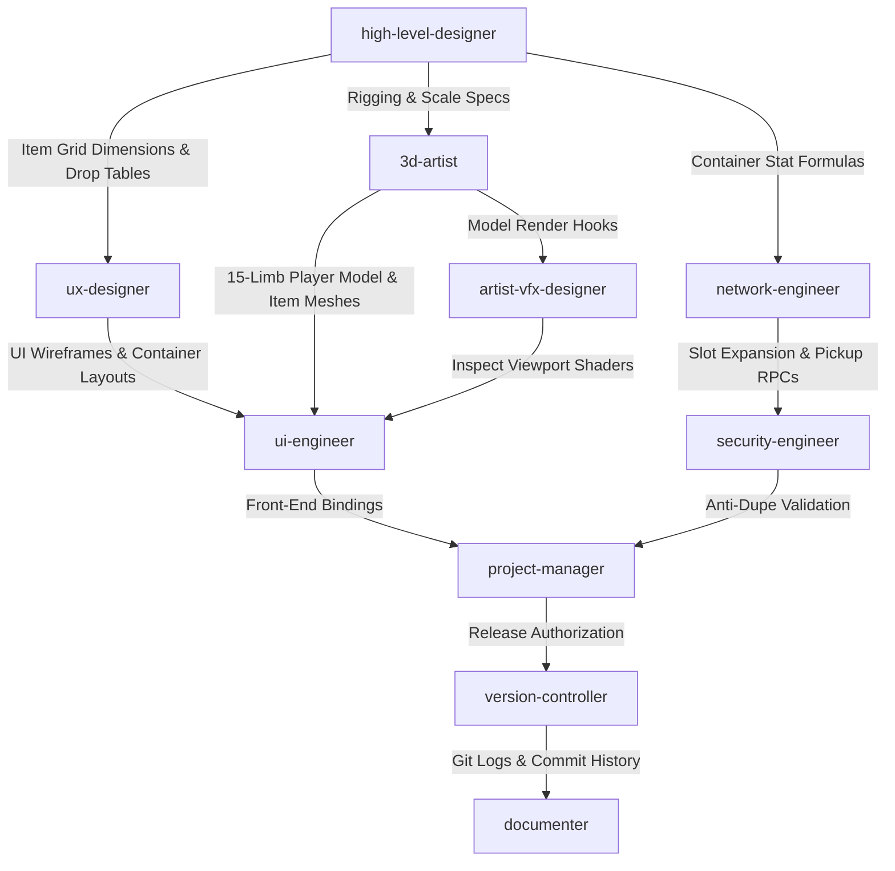

# 🚀 God-Caliber — Patch 0.4 "Hydra" Deployment & Execution Plan

**Version Target:** `v0.4.0-alpha`  
**Patch Codename:** `Hydra`  
**Status:** Planning & Execution  
**Orchestration Lead:** `project-manager`  
**Primary Focus:** Comprehensive Inventory Mechanics Overhaul, Tarkov-Style Container Architecture, Live 3D Character Viewport, Drop Pool Rebalancing, and Crafting Architecture Preparation.

---

## 📑 Executive Summary

Patch 0.4 **"Hydra"** executes a fundamental overhaul of God-Caliber's character display, inventory management, loot distribution, and crafting pipelines. 

This update replaces the legacy procedurally generated player model with an integrated **15-limb rigged 3D character mesh** built in Blender, introduces a live 3D character viewport inside the Inventory UI (similar to *World of Warcraft* and *Path of Exile*), and implements dynamic, container-driven inventory space (Combat Vests, Backpacks, and Pockets). 

Additionally, item grid footprints are standardized (reducing pistols, currency, and recipes to 1x1 slots), drop tables are retuned to establish Crafting Dust as the primary core drop, Legendary weapons are restricted strictly to crafting recipes, and the legacy bench upgrading system is excised to lay the groundwork for the upcoming crafting architecture.

---

## 🛠️ Subagent Allocation & Ownership Matrix

| Subagent | Role & Primary Responsibility | Patch 0.4 "Hydra" Deliverables |
| :--- | :--- | :--- |
| `project-manager` | Workflow orchestration, task breakdown, sprint tracking | Sprint tracking, dependency mapping, change order validation, release triggers |
| `high-level-designer` | Game balance, mechanics logic, economy specs | Item size re-specs (1x1 renames), drop rate rebalance matrices, GDD Section 5 updates |
| `industry-researcher` | Market benchmarking, player retention & feedback loops | Modular container inventory UX benchmarks (EFT/PoE/WoW character inspect systems) |
| `ux-designer` | Interaction ergonomics, user flows, HUD wireframes | Inventory UI layout wireframes (3D inspect pane, nested container slots, slot modifier feedback) |
| `ui-engineer` | Front-end implementation, component binding | 3D render-target viewport binding, MVVM nested container widgets, thumbnail render loops |
| `3d-artist` | Asset generation, PBR setup, Blender MCP execution | 15-limb player mesh in Blender, animation weight validation, 128x128 item thumbnail render pipeline |
| `artist-vfx-designer` | Procedural geometries, shader FX, neon cyberpunk aesthetics | UI character inspect lighting/post-fx, rarity glow shaders, slot scaling transition FX |
| `network-engineer` | Netcode replication, prediction, RPC optimization | Nested container state replication (`PlayerInventory` -> `Containers` -> `Slots`), dynamic slot bound RPCs |
| `security-engineer` | Anti-cheat audit, server authority, protocol security | Container boundary RPC verification, item duplication anti-tamper, stack-size memory encryption |
| `version-controller` | Git hygiene, SemVer tagging, merge reviews | Feature PR code reviews, Conventional Commit enforcement, `v0.4.0-alpha` tag creation |
| `documenter` | Documentation maintenance, API & release notes | API spec updates (`InventoryContainer`), GDD maintenance, public/internal `CHANGELOG.md` entry |

---

## 🗺️ Dependency Flow & Execution Sequence

---

## 📋 Task Breakdown by Phase

### Phase 1: Systems Design, Balancing, & UI Ergonomics

* **`industry-researcher`**
    * [ ] Benchmark modular slot-container UX (*Escape from Tarkov*) and live character preview panes (*World of Warcraft*, *Path of Exile*) for optimal viewport framing, aspect ratio responsiveness, and UI clarity.
    * [ ] Audit player friction metrics related to grid management, hot-swapping, and container slot accessibility.

* **`high-level-designer`**
    * [ ] **Item Footprint Rework:** Re-spec item grid footprints across all tables—reduce Pistols, Currency items, and Recipes/Blueprints to standard 1x1 slots.
    * [ ] **Loot Pool Rebalance:**
        * Adjust world drop table weights to establish Crafting Dust as the primary core drop.
        * Significantly reduce direct raw weapon drop frequencies across all zones.
        * *Exclusion:* Remove all Legendary weapons from the world drop tables (crafting-exclusive).
    * [ ] **Crafting System Preparation:** Draft specification removing the legacy Upgrading System from the Crafting Bench to pave the way for Patch 0.5 crafting mechanics.
    * [ ] **Dynamic Inventory Logic:** Define mathematical formulas for slot capacity calculations:
        $$\text{Total Capacity} = \text{Base Pockets} + \sum(\text{Equipped Container Slots}) + \text{Item Modifiers}$$

* **`ux-designer`**
    * [ ] Wireframe the unified Inventory Inspection Screen:
        * *Left/Center:* Live 3D Character Preview Pane with rotation affordances.
        * *Right:* Nested Container Slot Layouts (Backpack, Combat Vest, Pockets).
        * *Center/Bottom:* Dedicated Equipment slots featuring dynamic thumbnail displays.
    * [ ] Design visual affordances and UI transition states for dynamic grid expansion when gear with slot modifiers (e.g., "+2 Inventory Slots") is equipped/unequipped.

---

### Phase 2: Asset Pipeline, UI Integration, & Network Replication

* **`3d-artist` (via Blender MCP)**
    * [ ] **3D Player Model Overhaul:**
        * Model and texture a high-fidelity 3D player mesh inside Blender to replace the archaic procedural player model.
        * Rig the character mesh directly onto God-Caliber's existing 15-limb skeleton rig.
        * Validate weight painting and mesh deformation across standard locomotion, idle, and inspect animation cycles.
    * [ ] **Automated Thumbnail Pipeline:**
        * Configure an automated Blender MCP render pass to output clean 128x128 PNG thumbnails for all equipped gear, weapons, and inventory items.

* **`artist-vfx-designer`**
    * [ ] Build lighting rigs, rim lighting shaders, and subtle cyberpunk background bloom for the Inventory 3D Character Viewport.
    * [ ] Implement smooth visual grid-scaling transition animations when equipped items dynamically alter storage capacity.

* **`ui-engineer`**
    * [ ] **3D Viewport Binding:** Integrate a real-time render-target frame for the live 3D player model into the main UI character pane.
    * [ ] **Tarkov-Style Container System:**
        * Construct modular UI components for dedicated container slots: Combat Vest (Default 2x2), Backpack (Default 2x3), and 4 Single-Cell Pockets (1x1 each).
        * Bind dynamic 2D/3D item thumbnails to equipped gear slots and inventory cells.
    * [ ] **Dynamic Grid Scaling:** Bind inventory grid layout components to character state modifiers so added slot capacity seamlessly expands the UI grid in real-time.

* **`network-engineer`**
    * [ ] Refactor inventory replication netcode to support nested container hierarchies (`PlayerInventory` -> `EquippedContainers` -> `ContainerSlots`).
    * [ ] Implement server-authoritative validation to recalculate valid inventory bounds whenever gear modifying slot count is updated.

---

### Phase 3: Security Hardening, Versioning, & Release Management

* **`security-engineer`**
    * [ ] Audit item drop, swap, and equip RPC endpoints to prevent out-of-bounds slot storage or force-storing items in unequipped containers.
    * [ ] Enforce strict server-side validation against race condition exploits and item duplication during rapid container hot-swapping or disconnects.

* **`version-controller`**
    * [ ] Review incoming feature pull requests (`feature/15-limb-player-model`, `feature/container-inventory`, `feature/loot-drop-rebalance`).
    * [ ] Enforce Conventional Commit format across all art, design, and engineering commits (e.g., `feat(inventory): implement Tarkov-style container slots`).
    * [ ] Tag release build as `v0.4.0-alpha` upon green CI pass and dispatch git commit logs to `documenter`.

* **`documenter`**
    * [ ] Update `/docs/gdd/INVENTORY_AND_LOOT.md` with new item footprint tables, container default sizes, and drop rate matrices.
    * [ ] Publish developer-facing API specs for `InventoryContainer` and compile the public `CHANGELOG.md` entry detailing Patch 0.4 "Hydra" changes.

---

## 🔄 Inter-Agent Communication Protocols

* **Character Rigging Handoff:** `3d-artist` must verify mesh binding compatibility with the existing 15-limb skeleton rig before dispatching `.gltf`/`.fbx` files to `ui-engineer`.
* **Container Schema Handoff:** `high-level-designer` must supply structured JSON/YAML schemas for container slot arrays and item footprint dimensions before `network-engineer` updates RPC payload signatures.
* **Anti-Cheat Gatekeeping:** `version-controller` shall block all merges to main until `security-engineer` provides explicit sign-off on container duplication and out-of-bounds memory checks.

---

## 🚀 Deployment & Post-Release Checklist

1. [ ] **Model & Rig Integrity:** Confirm the 15-limb character mesh renders properly in both world gameplay and the Inventory UI preview viewport without missing bone bindings or skinning artifacts.
2. [ ] **Grid Scaling Verification:** Test equipped items with slot modifiers (e.g., "+2 Inventory Slots") to ensure they dynamically grow UI bounds without clipping or visual overlap.
3. [ ] **Loot Table Sanity Audit:** Verify zero Legendary weapons spawn in world loot drops and confirm Crafting Dust populates as the primary drop item across all test zones.
4. [ ] **Security & Duplication Test:** Run automated race-condition stress tests against item transfers between pockets, vest, and backpack to ensure 100% server authority.
5. [ ] **Git Tagging & Release:** `version-controller` applies `v0.4.0-alpha` tag to `main`.
6. [ ] **Documentation Publication:** `documenter` deploys updated GDD and public release notes to the team repository.