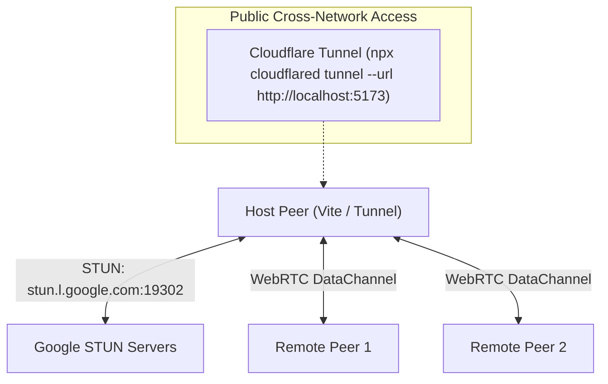

# God-Caliber — Complete Game Overview

> **Project Codename**: `delightful-franklin`  
> **Engine**: Three.js (v0.170.0) + Vite (v5.4.0)  
> **Genre**: Browser-based First-Person Shooter (FPS)  
> **Current Version**: Patch 0.2.2  
> **Author**: Built iteratively with Antigravity  
> **Date**: August 2026

---

## Table of Contents

1. [Architecture & Module Map](#1-architecture--module-map)
2. [Player System](#2-player-system)
3. [Weapon System](#3-weapon-system)
4. [Melee Combat System](#4-melee-combat-system)
5. [Bullet & Hitscan System](#5-bullet--hitscan-system)
6. [Enemy AI System](#6-enemy-ai-system)
7. [Inventory & Loot System](#7-inventory--loot-system)
8. [Terrain & Map System](#8-terrain--map-system)
9. [Multiplayer & Networking](#9-multiplayer--networking)
10. [Audio System](#10-audio-system)
11. [UI & HUD System](#11-ui--hud-system)
12. [Scene & Rendering](#12-scene--rendering)
13. [Controls & Input](#13-controls--input)
14. [Game Loop & Core Logic](#14-game-loop--core-logic)
15. [Patch History](#15-patch-history)

---

## 1. Architecture & Module Map

God-Caliber is a **single-page browser application** with no backend server. All game logic, rendering, physics, and AI run client-side using Three.js for 3D and the Web Audio API for procedural sound.

### File Structure

```
delightful-franklin/
├── index.html              # Full HTML structure: game canvas, HUD, menus, inventory overlay
├── package.json            # Dependencies: three@^0.170.0, vite@^5.4.0
├── src/
│   ├── main.js             # Game class, entry point, game loop, input routing
│   ├── player.js           # Player capsule physics, movement, zipline/ladder
│   ├── controls.js         # Keyboard/mouse input, keybinding, pointer lock
│   ├── weapon.js           # Weapon blueprints, procedural models, ADS, recoil
│   ├── bullets.js          # Hitscan raycasting, bullet/spark/tracer pools
│   ├── melee.js            # Combat knife state machine, hit detection
│   ├── inventory.js        # Inventory grid data model, rarity system, modifiers
│   ├── inventory-ui.js     # Inventory DOM rendering, drag-and-drop, crafting UI
│   ├── ui.js               # HUD, crosshair, kill feed, leaderboard, options, multiplayer UI
│   ├── scene.js            # Three.js scene, camera, renderer, lights, Octree
│   ├── terrain.js          # Modular map system, platforms, ramps, pillars, ladders, ziplines
│   ├── targets.js          # Enemy AI manager, wave/zone spawning, combat loop
│   ├── audio.js            # Procedural Web Audio API sound effects and ambient BGM
│   ├── world-items.js      # Ground loot physics, chest spawning, pickup interaction
│   ├── style.css           # Full visual design system (~33KB)
│   ├── multiplayer/
│   │   ├── NetworkManager.js   # Room codes, lobby hosting, peer management, sanitization
│   │   └── PeerPlayer.js       # 3D humanoid mesh + nameplate for remote players
│   └── enemies/
│       ├── EnemyRegistry.js    # Data-driven enemy archetypes (HUMANOID, GOLIATH, DRONE)
│       ├── EnemyFactory.js     # Procedural 3D mesh construction for enemy types
│       ├── SteeringBehaviors.js # Craig Reynolds steering (seek, arrive, separate, strafe, avoid)
│       └── ClusterSpawner.js   # Tactical squad spawning with player distance buffer
└── documentation/              # Patch documentation files
```

### Dependencies

| Package | Version | Purpose |
|---------|---------|---------|
| `three` | ^0.170.0 | 3D rendering, physics (Octree), math utilities |
| `vite` | ^5.4.0 | Development server & production bundler |

No additional runtime dependencies. No React, no Angular, no backend. Pure vanilla JS + Three.js.

---

## 2. Player System

**File**: [`src/player.js`](file:///c:/Users/benas/Documents/antigravity/delightful-franklin/src/player.js)  
**Class**: `Player`

### Physics Constants

| Constant | Value | Description |
|----------|-------|-------------|
| `GRAVITY` | 25.0 | Downward acceleration (m/s²) |
| `WALK_SPEED` | 8.0 | Walking speed (m/s) |
| `SPRINT_SPEED` | 16.0 | Sprint speed (m/s) |
| `CROUCH_SPEED` | 4.5 | Crouch walk speed (m/s) |
| `SLIDE_PENALTY_SPEED` | 3.0 | Post-slide crouch penalty speed (m/s) |
| `JUMP_FORCE` | 12.5 | Vertical jump impulse |
| `STANDING_HEIGHT` | 1.45 | Standing capsule height (m) |
| `CROUCH_HEIGHT` | 0.70 | Crouching capsule height (m) |
| Capsule Radius | 0.35 | Player collision radius (m) |

### Movement Features

- **WASD + Arrow Key** movement with axis-angle yaw rotation
- **Sprint**: Hold or Toggle mode (configurable). Auto-cancels when not pressing forward or when firing
- **Crouch**: Smooth capsule height transition (14 lerp factor)
- **Kinetic Slide**: Requires sprint momentum ≥ 12.0 m/s. 0.8s max duration. +12 m/s impulse kick. Anti-spam cooldown: 1.2s
- **B-Hopping**: 150ms landing grace timer enables consecutive jumps with preserved horizontal momentum
- **Air Strafing**: Quake-style wish-vector projection. 0% horizontal air drag for full momentum preservation
- **Slide-Jump**: Jump during slide to cancel slide with preserved velocity
- **Screen Shake**: Currently disabled per user request (`triggerScreenShake` returns 0)

### Dynamic Camera Effects

- **FOV Expansion**: Smooth 75° → 86° based on horizontal speed (sprint scaling)
- **Lissajous Bobbing**: Figure-8 head bob when sprinting on ground (>15 m/s)
- **Turn Roll Tilt**: Subtle Z-axis camera roll based on strafe velocity (max ±0.045 rad)

### Health & Combat

- **Max HP**: 100 (modifiable by gear)
- **Damage Reduction**: 0% base (modifiable by torso armor)
- **Headshot Zone**: Above 1.1m from capsule base = 1.5× damage multiplier
- **Death**: Resets HP, teleports to safe spawn point via `getSafeSpawnPoint()`, increments death counter

### Traversal Systems

- **Ziplines**: Attach with F key. 32 m/s traversal speed. Jump off mid-ride for 24 m/s forward + 8 m/s vertical boost. 0.35s attach grace timer prevents instant detach
- **Ladders**: Climb with W/S (7.0 m/s climb speed). Jump off ladder for 6.0 m/s push-back + 8.0 m/s vertical. Top dismount with forward step-off. 0.6m outward offset prevents mesh clipping
- **Void Fall Protection**: Below y=-25, player teleports to (0, 2, 0) with HUD notification

### Spawn System

- 10 predefined spawn points across the map (center, overlooks, courtyard corners, perimeters)
- **Safe Spawn Algorithm**: Picks spawn point with maximum minimum distance from all active enemies

---

## 3. Weapon System

**File**: [`src/weapon.js`](file:///c:/Users/benas/Documents/antigravity/delightful-franklin/src/weapon.js)  
**Class**: `Weapon`

### Weapon Blueprints Database

| Weapon | Type ID | Magazine | Fire Rate | Reload | Base Damage | Speed | Spread | ADS FOV |
|--------|---------|----------|-----------|--------|-------------|-------|--------|---------|
| Combat Rifle | `weapon_ar15` | 50 | 0.1333s (450 RPM) | 1.2s | 35 | 150 m/s | 0.015 | 60° |
| P-57 Pistol | `weapon_pistol` | 15 | 0.3s (200 RPM) | 0.9s | 20 | 110 m/s | 0.01 | 65° |
| A-20 Sniper Rifle | `weapon_sniper` | 1 | 1.2s (bolt-action) | 2.2s | 75 | 9999 (instant) | 0.0 | 30° |
| S-12 Shotgun | `weapon_shotgun` | 8 | 0.8s (pump) | 1.8s | 10/pellet | 90 m/s | 0.08 | 62° |

### Weapon Features

- **Procedural 3D Models**: Each weapon built from geometric primitives (BoxGeometry, CylinderGeometry) with cyberpunk neon accents
- **Iron Sights / ADS**: Right-click smooth zoom. Per-weapon ADS position and FOV. 0.16s ADS speed. Weapon sway reduced when scoped
- **Sniper Scope Overlay**: Full-screen CSS scope overlay appears at >90% ADS progress (sniper only). Weapon model hidden at >95%
- **Recoil System**: Per-weapon recoil offsets (position + rotation) with exponential decay (k=16 target, k=24 current)
- **Reload Animation**: 3-phase stow animation (lower → shake → raise) with rotation roll
- **Muzzle Flash**: Octahedron geometry flash + point light (5.5 intensity, 45ms duration). Random scale and rotation
- **Weapon Sway**: Mouse movement causes subtle viewmodel offset. Reduced by 62.5% when ADS

### Dual Weapon Slots

- **Slot 1** (Key 1): Primary weapon
- **Slot 2** (Key 2): Secondary weapon
- Ammo state preserved per slot on switch
- **Drop** (Key Q): Drops active weapon as ground loot in front of player

---

## 4. Melee Combat System

**File**: [`src/melee.js`](file:///c:/Users/benas/Documents/antigravity/delightful-franklin/src/melee.js)  
**Class**: `MeleeWeapon`

### Combat Knife Stats

| Property | Value |
|----------|-------|
| Base Damage | 50 |
| Damage Multiplier | 1.0 (modifiable by gloves) |
| Draw Time | 0.08s |
| Swing Time | 0.10s |
| Recover Time | 0.12s |
| Hit Range | 2.5m |
| Hit Cone | ~60° forward arc (dot product > 0.5) |

### State Machine

```
IDLE → DRAW → SWING → RECOVER → IDLE
```

- Triggered by Key X
- Cannot fire weapon during melee
- Weapon model hidden during active melee
- Single hit per swing (prevents multi-hit exploits)
- Procedural knife mesh with blade, guard, grip, ridges, and pommel

---

## 5. Bullet & Hitscan System

**File**: [`src/bullets.js`](file:///c:/Users/benas/Documents/antigravity/delightful-franklin/src/bullets.js)  
**Class**: `BulletManager`

### ALL Player Weapons Are Instant Hitscan

Every player weapon fires via `Ray.intersect()` against the Octree and enemy colliders. No projectile travel time.

### Object Pools

| Pool | Capacity | Purpose |
|------|----------|---------|
| Player Bullets | 60 | Legacy pool (unused since hitscan conversion) |
| Enemy Bullets | 30 | Red projectile spheres fired by HUMANOID enemies |
| Sparks | 40 | Particle burst on impact (cyan for environment, red for enemy) |
| Tracers | 20 | Instant laser line from muzzle to hit point (0.15s fade) |

### Hit Detection

- **Environment**: Octree ray intersection → spark + impact sound
- **Enemy**: Sphere collider intersection → damage number + hitmarker + kill feed
- **Headshot**: Hit point above `headshotMinY` = 1.5× damage
- **Kill Rewards**: 100 pts (body), 150 pts (headshot), kill counter increment, loot roll

### Enemy Projectiles

- Red glowing spheres (radius 0.06)
- Speed: 45–60 m/s with aim variance spread (~5-7° offset)
- Player hit detection: proximity < 0.85m from camera
- Damage: 10–12 per projectile

---

## 6. Enemy AI System

**Files**: [`src/targets.js`](file:///c:/Users/benas/Documents/antigravity/delightful-franklin/src/targets.js), [`src/enemies/`](file:///c:/Users/benas/Documents/antigravity/delightful-franklin/src/enemies)

### Enemy Archetypes

| Type | HP | Speed | Attack | Behavior |
|------|-----|-------|--------|----------|
| **HUMANOID** | 100 | 8.0 m/s | Ranged (Pistol/Rifle) | Standoff band 12-25m, lateral strafe, backpedal if too close |
| **GOLIATH** | 250 | 4.0 m/s | Melee (Battleaxe, 35 dmg) | Arrival steering at 2.5-3.0m, heavy armor plates |
| **DRONE** | 60 | 6.0 m/s | Kamikaze (45 dmg on contact) | Flying with sinusoidal altitude, seeks player directly |

### Steering Behaviors (Craig Reynolds Model)

- **Seek**: Move toward player position
- **Arrival**: Decelerate smoothly when approaching standoff range
- **Separation**: Prevent enemy stacking (2.5m radius)
- **Obstacle Avoidance**: Octree sphere probe ahead
- **Strafe**: Lateral movement perpendicular to player direction (periodically reverses)
- **Player Repulsion**: Hard 2.5m minimum distance enforcement
- **Flight Altitude**: Sinusoidal bobbing for drones (base 4.5m, ±1.2m amplitude)

### Zone Population System

- **Target Population**: 12 active mobs at all times
- **Continuous Spawning**: When count drops below 12, tactical cluster spawner fills gaps
- **Cluster Spawner**: Squads of 1-4 enemies spawned >25m from player with random type selection
- **Respawn Timer**: Dead enemies removed from scene after 5.0s

### Combat AI

- **HUMANOID**: Fires at player within 30m. Pistol: 1 shot, 1.2s cooldown. Rifle: 3-round burst (100ms intervals), 2.0s cooldown
- **GOLIATH**: Melee slash at ≤2.8m, 1.5s cooldown, 35 damage
- **DRONE**: Self-destructs at ≤1.8m, 45 damage explosion

---

## 7. Inventory & Loot System

**Files**: [`src/inventory.js`](file:///c:/Users/benas/Documents/antigravity/delightful-franklin/src/inventory.js), [`src/inventory-ui.js`](file:///c:/Users/benas/Documents/antigravity/delightful-franklin/src/inventory-ui.js), [`src/world-items.js`](file:///c:/Users/benas/Documents/antigravity/delightful-franklin/src/world-items.js)

### Grid Inventory

- **5 rows × 12 columns** = 60 cells
- Items occupy variable grid spaces (e.g., rifle = 3×2, pistol = 2×2)
- Drag-and-drop repositioning with collision detection
- Right-click to auto-equip items to matching slots

### Equipment Slots

| Slot | Type | Effect |
|------|------|--------|
| Head | Helmets | +Max HP, +Move Speed, +Jump Height |
| Torso | Vests | +Max HP, +Damage Reduction, ±Move Speed |
| Legs | (Future) | +Move Speed, +Jump Height, +Crouch Speed |
| Gloves | Gloves | +Reload Speed, +Fire Rate, +Melee Damage |
| Primary | Weapons | Equipped in Slot 1 |
| Secondary | Weapons | Equipped in Slot 2 |
| Melee | Knives | +Melee Damage, +Move Speed |

### Rarity Tiers

| Rarity | Color | Modifier Count | Examples |
|--------|-------|----------------|----------|
| Normal | Gray (#64748b) | 0 | Base stats only |
| Magic | Cyan (#00f0ff) | 1 | "+15% Reload Speed" |
| Rare | Yellow (#ffe600) | 2 | "+20% Damage, +12 HP" |
| Epic | Purple (#d946ef) | 4 | Multiple stat boosts |
| Legendary | Orange (#f97316) | 6 | Unique named items (e.g., "VOID STALKER") |

### Crafting System

- **Recycling**: Break down items into colored dust (Normal→⚪, Magic→🔵, Rare→🟡, Epic→🟣, Legendary→🟠)
- **Recycle All**: Mass recycle all non-locked items
- **Lock Mode**: Protect items from mass recycling
- **Legendary Recipes**: 12% drop chance from tactical crates. Combine with dust to forge unique legendaries

### World Loot

- **Ground Items**: 3D floating sprites with physics (gravity, bounce, velocity kick)
- **Tactical Crates**: Spawn at center platform and random pillar top. Auto-refresh every 45s. Open to burst 4 random items
- **Enemy Loot Drops**: 40% chance on kill. Random category and rarity roll
- **Interaction**: Press F within proximity to pick up. Items auto-find first available grid space

---

## 8. Terrain & Map System

**File**: [`src/terrain.js`](file:///c:/Users/benas/Documents/antigravity/delightful-franklin/src/terrain.js)  
**Class**: `TerrainManager`

### Current Map: "Testing Arena"

**Size**: 160m × 160m with 12m perimeter walls

### Map Elements

| Element | Count | Details |
|---------|-------|---------|
| Ground Floor | 1 | 160×160 with tiled grid texture |
| Perimeter Walls | 4 | 12m tall, 2m thick |
| Platforms | 3 | Center (18×3×18), North Overlook (24×7×12), South Overlook (24×7×12) |
| Triangular Ramps | 4 | True prism geometry. Center N/S (6×3×12), Overlook E/W (5×7×20) |
| Pillars | 6 | Cylindrical (r=1.4-1.5m, h=10m) with neon torus accent rings |
| Cover Walls | 10 | Short 1.0m walls at ground and platform level. Some angled 45° |
| Elevated Walkways | 4 | Open sky bridges at y=10m connecting corner pillars (2.5m wide) |
| Ladders | 6 | Glowing rungs, 2 on overlooks + 4 on corner pillars |
| Ziplines | 4 | NW→Center, SE→Center, North cross, South cross. Neon cable tubes |
| Zipline Posts | 5 | Metallic posts with glowing pulley hooks |

### Map Configuration System

- **Data-driven**: All map elements defined in `TESTING_ARENA_CONFIG` object
- **MAP_PRESETS registry**: Designed for future map switching
- **Modular TerrainManager**: Reads config and builds geometry + Octree collision

---

## 9. Multiplayer & Networking

**Files**: [`src/multiplayer/NetworkManager.js`](file:///c:/Users/benas/Documents/antigravity/delightful-franklin/src/multiplayer/NetworkManager.js), [`src/multiplayer/PeerPlayer.js`](file:///c:/Users/benas/Documents/antigravity/delightful-franklin/src/multiplayer/PeerPlayer.js)

### Architecture: PeerJS WebRTC Cross-Network Transport

The networking system uses PeerJS over WebRTC DataChannels for peer-to-peer multiplayer supporting both local LAN and public WAN sessions.



### Key Technical Specifications

- **STUN/TURN ICE Server Configuration**: Peer connections use public Google STUN servers (`stun:stun.l.google.com:19302`, `stun:stun1.l.google.com:19302`, etc.) and configurable TURN relays for NAT traversal across different networks and routers.
- **Dual DataChannel Transport Mode**:
  - **Unreliable (`{ reliable: false }`)**: Used for 20 Hz (50ms interval) movement updates (position, yaw, pitch). Prevents head-of-line blocking so dropped packets do not cause latency spikes.
  - **Reliable (`{ reliable: true }`)**: Used for critical hit registration, inventory/state synchronization, and match phase updates (`LOOT_PHASE`, `COMBAT_PHASE`, `VICTORY`, `DEFEAT`).
- **Timestamp Guarding**: State broadcast packets include monotonic timestamps (`timestamp: performance.now()`). Receivers compare timestamps against `lastTimestamp` and silently drop any packets that arrive late or out-of-order over the unreliable DataChannel.
- **Public Tunnel Hosting Workflow**: Sessions can be hosted across WAN networks without router port forwarding using Cloudflare Tunnel:
  ```bash
  npx cloudflared tunnel --url http://localhost:5173
  ```
  Provides HTTPS/WSS SSL protection, bypassing modern browser WebCrypto and mixed-content restrictions for external players joining via shareable URL.

### Features & Capabilities

- **Room Code Generation**: Cryptographic 4-character codes (e.g., `GC-8K4P`) using `crypto.getRandomValues()`
- **Host Lobby Toggle**: Start/Stop hosting with full PeerJS lifecycle cleanup (`peer.destroy()`)
- **Join Lobby**: By room code + optional 4-digit PIN validation
- **Auto-Join via URL**: `?lobby=GC-XXXX` parameter triggers automatic join on load
- **Copy Invite Link**: Clipboard API with legacy `execCommand` fallback
- **Discord Invite Formatter**: Rich markdown card with room code, host name, and join URL
- **XSS Sanitization**: `sanitizeName()` strips HTML tags and control characters (16-char limit)
- **Peer Player Rendering**: 3D humanoid mesh reuse from `EnemyFactory` with health bar sprite and floating nameplate
- **Interpolation**: Exponential smoothing (k=20) for smooth remote player movement
- **Kick System**: Host can remove peers by Peer ID
- **20 Hz Tick Rate**: High-frequency position broadcast at 50ms intervals
- **Connected Players List**: Interactive UI panel displaying connected peers and latency

---

## 10. Audio System

**File**: [`src/audio.js`](file:///c:/Users/benas/Documents/antigravity/delightful-franklin/src/audio.js)  
**Class**: `SoundFX` (singleton exported as `sound`)

### All sounds are procedurally generated via Web Audio API oscillators and noise buffers.

| Sound | Method | Layers |
|-------|--------|--------|
| Gunshot | `playGunshot()` | 4 layers: mechanical click, low thump, high crack (bandpass noise), tail reverb |
| Hit Marker | `playHit()` | Sine 1400→800 Hz, 80ms |
| Impact | `playImpact()` | Triangle 200→50 Hz, 80ms |
| Reload | `playReload()` | Sine 600 Hz, 50ms |
| Empty Click | `playEmpty()` | Square 900 Hz, 30ms |
| Jump | `playJump()` | Sine 120→280 Hz, 150ms |
| Melee Swing | `playMeleeSwing()` | Sawtooth sweep 2000→4000→1200 Hz + highpass noise burst |
| Melee Hit | `playMeleeHit()` | Sine 250→80 Hz, 60ms |
| Ambient BGM | `startAmbientBGM()` | Sine A1 (55 Hz) with 0.2 Hz LFO modulation + lowpass filter |

### Audio Routing

```
Individual Sound → SFX Gain Node (0.8) → Master Gain (1.0) → Destination
Ambient BGM → BGM Gain Node (0.4) → Master Gain (1.0) → Destination
```

- Volume sliders in Options menu control SFX and BGM independently
- Auto-resume on suspended AudioContext (browser autoplay policy)
- User gesture unlock on first click/keypress

---

## 11. UI & HUD System

**File**: [`src/ui.js`](file:///c:/Users/benas/Documents/antigravity/delightful-franklin/src/ui.js)  
**Class**: `UIManager`

### HUD Elements

- **Health Bar**: Gradient fill (green→yellow→red). Numeric display. DOM-cached to avoid unnecessary updates
- **Ammo Counter**: Current/Max display
- **Stamina/Posture Bar**: Shows WALKING / SPRINTING / CROUCHING / SLIDING / ZIPLINE / CLIMBING state
- **Kill Feed**: Scrolling list of events (kills, headshots, pickups, drops). Max 7 entries, 5s auto-fade
- **Hitmarker**: White cross flash on hit (150ms duration)
- **Crosshair**: Canvas-rendered on HUD overlay. Configurable style, color, size, thickness, gap, opacity
- **Damage Numbers**: 3D-projected floating numbers at hit positions (yellow normal, red headshot)
- **Interaction Prompt**: "[F] PICK UP item" / "[F] ATTACH TO ZIPLINE" / "[F] CLIMB LADDER"
- **Wave/Zone HUD**: "TESTING ARENA [PvPvE]" + zone population count
- **Center Notice**: "RELOADING..." banner during reload

### Menu System (ESC to open)

| Tab | Contents |
|-----|----------|
| Start | "ENGAGE" button, title branding |
| Multiplayer | Call-sign input, Host/Stop toggle, Room Code, PIN, Copy Link, Discord Share, Join, Connected Players list |
| Options | SFX Volume, BGM Volume, Sensitivity slider, Sprint Mode (Hold/Toggle), Fullscreen toggle |
| Controls | Rebindable keybindings table with "Click to Rebind" buttons |
| Crosshair | Style selector (cross, dot, cross_dot, circle, circle_dot), color picker, size/thickness/gap/opacity sliders, live preview canvas |

### Leaderboard (Hold TAB)

- Shows player + 4 simulated rival bots
- Columns: Rank, Name, Points, Kills, Deaths
- Rivals accumulate simulated points over time

### Crosshair Styles

- `cross`: Four directional lines
- `dot`: Center dot only
- `cross_dot`: Lines + center dot
- `circle`: Circle outline
- `circle_dot`: Circle + center dot

---

## 12. Scene & Rendering

**File**: [`src/scene.js`](file:///c:/Users/benas/Documents/antigravity/delightful-franklin/src/scene.js)  
**Class**: `GameScene`

### Renderer Configuration

| Setting | Value |
|---------|-------|
| Antialias | Enabled |
| Power Preference | high-performance |
| Shadow Map | PCFSoftShadowMap, 2048×2048 |
| Tone Mapping | ACES Filmic |
| Exposure | 1.35 |
| Pixel Ratio | min(devicePixelRatio, 2) |
| Near Clip | 0.01 (prevents weapon clipping) |
| Far Clip | 140m |

### Lighting

| Light | Type | Color | Intensity | Position |
|-------|------|-------|-----------|----------|
| Ambient | AmbientLight | #fff1d0 | 1.8 | — |
| Sun | DirectionalLight | #ffe4a0 | 4.5 | (35, 30, 20) |
| Fill | DirectionalLight | #7dd3fc | 1.2 | (-30, 20, -20) |

### Environment

- **Sky**: Late-afternoon gradient (sky blue → golden → sunset orange)
- **HDR Environment Map**: Procedural canvas → equirectangular → PMREM
- **Fog**: Exponential² (warm haze, density 0.012)
- **Octree**: From environmentGroup for capsule + sphere collision

---

## 13. Controls & Input

**File**: [`src/controls.js`](file:///c:/Users/benas/Documents/antigravity/delightful-franklin/src/controls.js)  
**Class**: `Controls`

### Default Keybindings

| Action | Default Key | Notes |
|--------|-------------|-------|
| Forward | W | + Arrow Up |
| Backward | S | + Arrow Down |
| Left | A | + Arrow Left |
| Right | D | + Arrow Right |
| Sprint | Left Shift | Hold or Toggle mode |
| Crouch | Left Ctrl | |
| Jump | Space | |
| Reload | R | |
| Melee | X | Quick knife |
| Inventory | I | Opens Storage tab |
| Crafting | C | Opens Crafting tab |
| Interact | F | Pickup / Zipline / Ladder |
| Drop | Q | Drop active weapon |
| Slot 1 | 1 | Primary weapon |
| Slot 2 | 2 | Secondary weapon |
| Leaderboard | Tab (hold) | |
| Pause Menu | Escape | |

### Mouse

- **Left Click**: Fire weapon
- **Right Click (Hold)**: Aim Down Sights (ADS)
- **Sensitivity**: Default 0.0022, adjustable via slider
- **Mouse Delta Clamping**: Max ±200 raw, ±120 accumulated per frame

### Persistence

- Keybindings saved to `localStorage` key `cyberstrike_keybindings`
- Player profile (name, sprint mode, crosshair config) saved to `cyberstrike_player_profile`

---

## 14. Game Loop & Core Logic

**File**: [`src/main.js`](file:///c:/Users/benas/Documents/antigravity/delightful-franklin/src/main.js)  
**Class**: `Game`

### Per-Frame Update Order (60 FPS target via requestAnimationFrame)

1. `handleInputs()` — Inventory toggle, melee, drop, weapon switch, interact/pickup
2. `handleFiring()` — Weapon fire with convergence raycasting
3. `player.update(dt)` — Capsule physics, movement, camera
4. `weapon.update(dt)` — Recoil decay, ADS, reload, sway
5. `melee.update(dt)` — Knife state machine
6. `network.update(dt)` — 20Hz peer state broadcast
7. `worldItemManager.update(dt)` — Ground loot physics
8. **Interaction HUD** — Proximity check for zipline/ladder/loot prompts
9. `bulletManager.update(dt)` — Bullet/tracer/spark pool updates
10. `targetManager.update(dt)` — Enemy AI steering + combat
11. **Chest Refresh** — Every 45s, respawn tactical crates
12. `ui.updateHUD()` — DOM-cached health/ammo/stamina
13. `ui.updateDamageNumbers()` — 3D-projected floating numbers
14. **Leaderboard** — Show/hide on Tab key
15. `renderer.render()` — Three.js draw call

### Delta Time Safety

- Raw delta clamped to max 0.05s (50ms) to prevent physics explosions on tab-away

### Global References

- `window.gameInstance` — Singleton Game instance for cross-module access

---

## 15. Patch History

| Patch | Type | Summary |
|-------|------|---------|
| 0.1.1 | Bugfix | Initial Three.js framework fixes, rendering pipeline corrections |
| 0.1.2 | Bugfix | Movement, UI, and weapon interaction fixes |
| 0.1.3 | Bugfix | Jump physics, B-hopping, momentum conservation |
| 0.2 | Feature | 8-player netcode scaffolding, crosshair editor, iron sights ADS, sprint toggle |
| 0.2.1 | Feature | Functional lobby hosting, shareable invite links, browser security, passcode PIN, host kick, XSS sanitization |
| 0.2.2 | Feature | Host lobby lifecycle toggle, Discord invite integration, ngrok deployment architecture |

Full documentation for each patch is available in the [`documentation/`](file:///c:/Users/benas/Documents/antigravity/delightful-franklin/documentation) directory.
