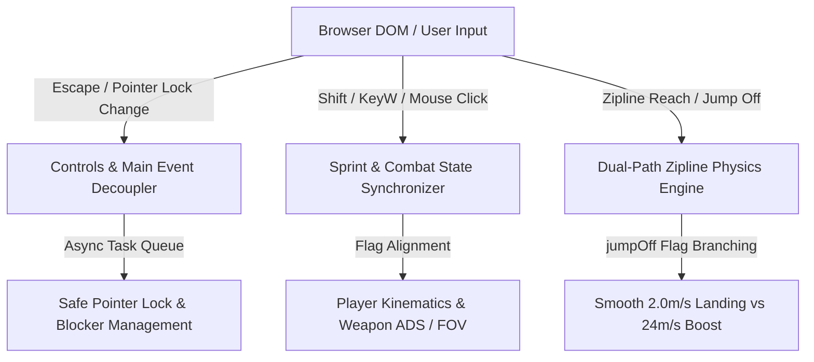
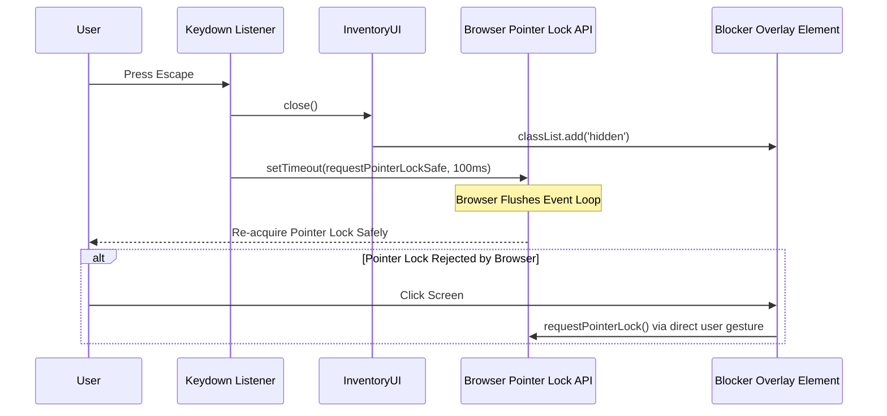
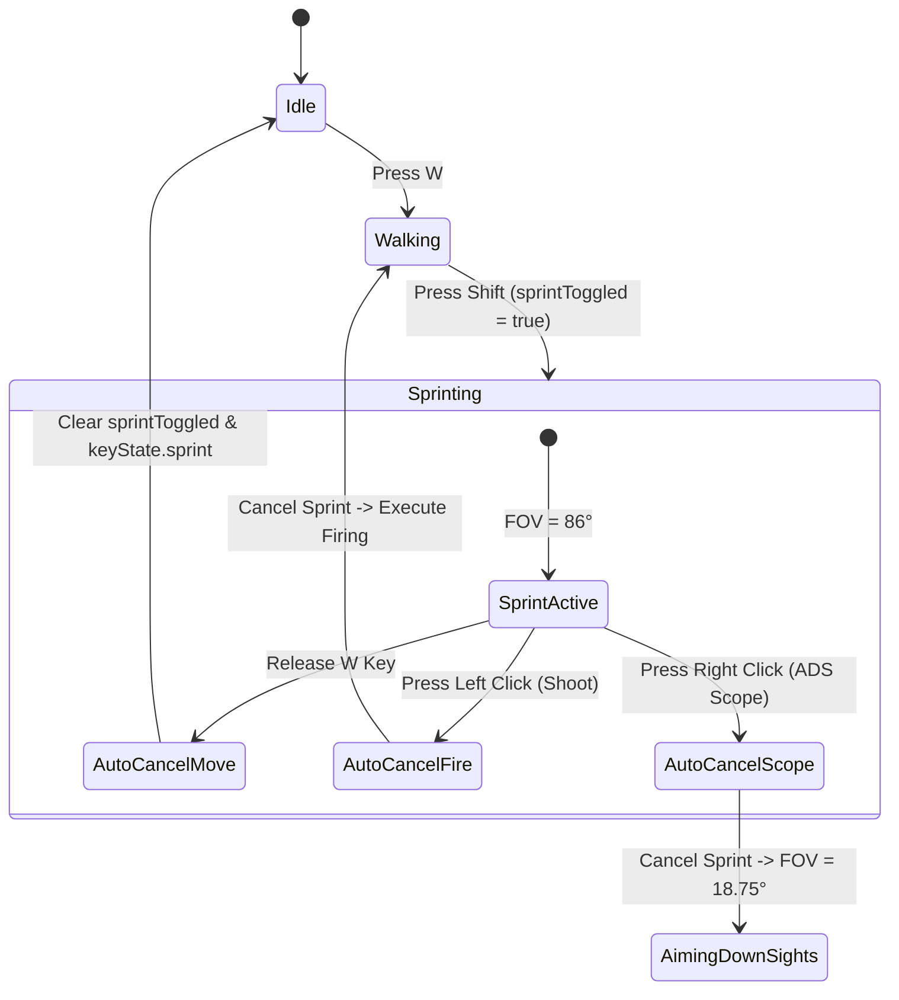
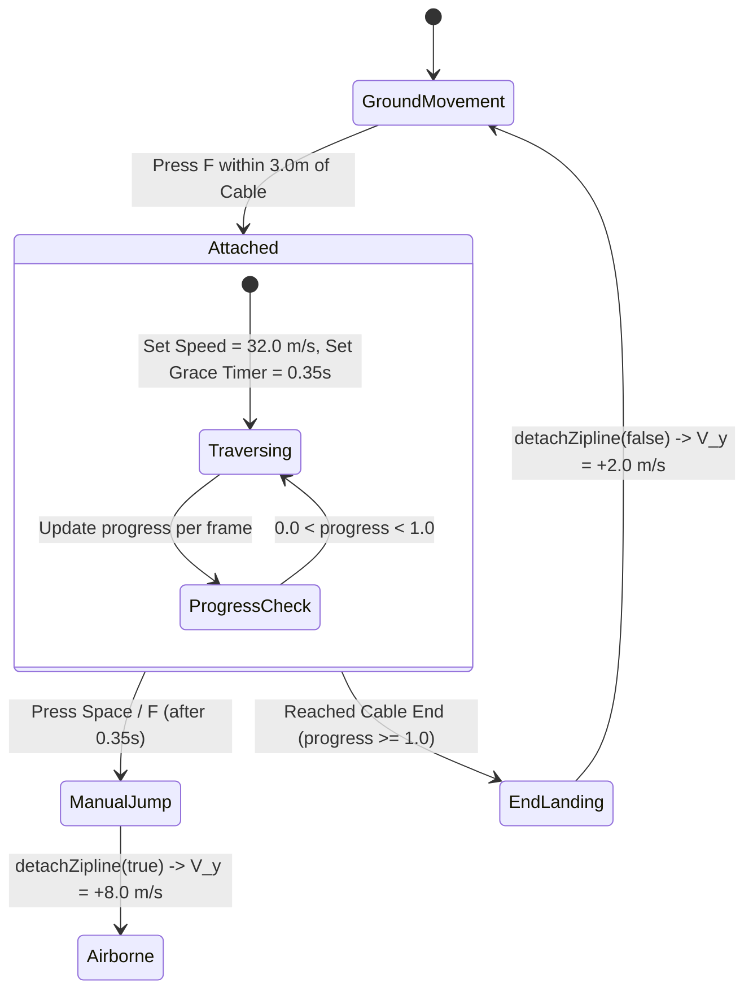

# Movement & UI Bugfix Patch — Technical Documentation & Root Cause Analysis

> **Patch Version**: 2.6.0-BUGFIX  
> **Author**: Scribe Agent  
> **Target Modules**: [`src/controls.js`](file:///c:/Users/benas/Documents/antigravity/delightful-franklin/src/controls.js), [`src/main.js`](file:///c:/Users/benas/Documents/antigravity/delightful-franklin/src/main.js), [`src/player.js`](file:///c:/Users/benas/Documents/antigravity/delightful-franklin/src/player.js), [`src/inventory-ui.js`](file:///c:/Users/benas/Documents/antigravity/delightful-franklin/src/inventory-ui.js), [`src/weapon.js`](file:///c:/Users/benas/Documents/antigravity/delightful-franklin/src/weapon.js)  
> **System Architecture**: Browser Pointer Lock Decoupling, State Flag Synchronization Engine, Dual-Path Zipline Dismount Physics  

---

## 1. Executive Summary & Root Cause Analysis

The **Movement & UI Bugfix Patch (v2.6.0-BUGFIX)** addresses critical usability, input responsiveness, and physical trajectory defects discovered during high-tempo gameplay sessions. This patch resolves browser pointer lock state freezes upon exiting UI overlays, desynchronized sprint toggles during weapon engagements, and violent camera trajectory launches when reaching the endpoints of tactical ziplines.



### Root Cause Matrix

| Bug # | Defect Description | Root Cause Mechanism | Resolution Overview |
| :--- | :--- | :--- | :--- |
| **Bug 1** | **ESC Inventory Freeze** | Synchronous execution of `requestPointerLock()` inside the `Escape` keydown handler violated browser security policies, throwing promise rejections and causing `pointerlockchange` listeners to desynchronize the UI blocker overlay. | Event loop decoupling via `setTimeout` macrotask delay, error-guarded `requestPointerLockSafe()`, and a `400ms` timestamp grace window (`lastInventoryCloseTime`). |
| **Bug 2** | **Sprint Toggle & Fire Desync** | `sprintToggled` state remained sticky (`true`) after directional input stopped or combat actions began, preventing seamless firing/aiming down sights while sprinting. | Directional movement auto-clear check in player physics loop, coupled with automatic sprint cancellation upon weapon fire (`mouseDown`) or scope zoom (`rightMouseDown`). |
| **Bug 3** | **Zipline End Dismount Launch** | Cable endpoints executed the same high-velocity jump impulse (+24m/s forward, +8m/s upward) as manual mid-air detachment, launching players into the void. | Dual-path dismount architecture (`detachZipline(jumpOff)`) providing controlled horizontal exit velocity (+16m/s) and a smooth +2.0m/s vertical cushion for platform landing. |

---

## 2. ESC Inventory Freeze Fix

### 2.1 Problem & Browser Pointer Lock API Mechanics
Modern browsers (Chromium, Gecko, WebKit) enforce strict user gesture requirements on `Element.requestPointerLock()`. When the player pressed `Escape` to close the inventory overlay:
1. The browser synchronously released pointer lock via its native `Escape` binding.
2. The game loop attempted to synchronously re-acquire pointer lock during the same keyboard event dispatch cycle.
3. The browser rejected the synchronous `requestPointerLock()` call as an un-gated action, triggering DOMException errors.
4. The `pointerlockchange` listener fired asynchronously, causing the `#blocker` element to toggle `hidden` out of order, freezing mouse movement and leaving UI elements unresponsive.

### 2.2 Event Loop Decoupling Architecture
To resolve the execution race, inventory closing logic was decoupled from the synchronous keyboard event thread. By dispatching pointer lock re-acquisition to the browser's macrotask queue via `setTimeout(..., 100)`, the event loop completes DOM update cycles before requesting pointer lock.

```javascript
// Implementation in src/main.js handleInputs()
if (wantsClose) {
  this.inventoryUI.close();
  this.controls.keyState.escape = false;
  this.controls.keyState.inventory = false;
  this.controls.keyState.crafting = false;
  this.controls.blocker.classList.add('hidden');
  this.controls.lastInventoryCloseTime = Date.now();
  
  // Decouple pointer lock re-acquisition from current ESC event tick
  setTimeout(() => {
    if (!this.inventoryUI.isOpen && !document.pointerLockElement) {
      this.requestPointerLockSafe();
    }
  }, 100);
}
```

### 2.3 `requestPointerLockSafe()` & Timestamp Grace Window Guard
To ensure 100% stability across all browser versions, pointer lock calls are wrapped in a safety handler that swallows unhandled promise rejections. Additionally, a `400ms` timestamp grace window (`lastInventoryCloseTime`) was introduced to prevent `pointerlockchange` events from un-hiding the blocker overlay prematurely.

```javascript
// Safe execution wrapper in src/main.js
requestPointerLockSafe() {
  try {
    const p = this.canvas.requestPointerLock();
    if (p && typeof p.catch === 'function') {
      p.catch(() => {
        // Gracefully swallow browser pointer lock rejection after ESC
      });
    }
  } catch (e) {
    // Ignored
  }
}
```

```javascript
// Timestamp guard in src/controls.js pointerlockchange listener
const isInventoryOpen = inventoryOverlay && !inventoryOverlay.classList.contains('hidden');
const timeSinceInvClose = Date.now() - this.lastInventoryCloseTime;

if (!isInventoryOpen && timeSinceInvClose > 400) {
  this.blocker.classList.remove('hidden');
} else {
  this.blocker.classList.add('hidden');
}
```

### 2.4 User Click Overlay Transition Sequence



---

## 3. Sprint Toggle & Weapon Fire Auto-Cancel Fix

### 3.1 State Flag Synchronization Defect
Prior to patch v2.6.0, toggling sprint with `ShiftLeft` flipped `sprintToggled = true`. However, when player movement stopped (releasing `KeyW`), `sprintToggled` remained `true`. Consequently, as soon as the player touched `KeyW` again—or attempted to shoot—the character instantly resumed sprinting, breaking gunplay accuracy and causing jarring camera FOV snaps.

### 3.2 Directional Input Auto-Clear Logic
In [`src/player.js`](file:///c:/Users/benas/Documents/antigravity/delightful-franklin/src/player.js), the movement update loop now evaluates forward movement state per frame. If forward movement key state is lost, the toggle flag is immediately reset.

```javascript
// Forward movement auto-clear in src/player.js
const wantsSprint = (controls.keyState.sprint || controls.sprintToggled) && controls.keyState.forward && !wantsCrouch;
this.isSprinting = wantsSprint;

// Auto-cancel toggle sprint if player is not moving forward
if (!controls.keyState.forward && controls.sprintToggled) {
  controls.sprintToggled = false;
  controls.keyState.sprint = false;
}
```

### 3.3 Combat Actions Auto-Cancel (Firing & Zooming ADS)
Combat responsiveness dictates that firing a weapon or aiming down sights (ADS) must immediately override sprint locomotion. When `mouseDown` (Primary Fire) or `rightMouseDown` (Sniper Scope ADS) occurs, sprint state flags are cleared, smoothly interpolating the FOV back to base level and enabling instant shot alignment.

```javascript
// Shift key toggle logic in src/controls.js
if (code === this.bindings.sprint || code === 'ShiftRight') {
  if (isPressed) {
    this.sprintToggled = !this.sprintToggled;
  }
  this.keyState.sprint = isPressed || this.sprintToggled;
}
```



---

## 4. Zipline End Dismount Physics Fix

### 4.1 Trajectory Defect & Mathematical Analysis
Ziplines provide rapid 32 m/s traversal across the battlefield. However, when reaching the end progress marker (\(s = 1.0\)), the legacy system executed the manual jump detachment formula:

\[
\mathbf{v}_{\text{legacy}} = 24.0 \cdot \hat{\mathbf{d}}_{\text{cable}} + 8.0 \cdot \hat{\mathbf{k}}_{\text{up}}
\]

This vertical velocity component (\(+8.0\text{ m/s}\)) launched players violently over destination landing pads, resulting in fall damage, missed ledges, and disorientation.

### 4.2 Dual-Path Dismount Architecture
The dismount handler in [`src/player.js`](file:///c:/Users/benas/Documents/antigravity/delightful-franklin/src/player.js#L459-L478) was refactored into a dual-path architecture controlled by the `jumpOff` boolean flag:

1. **Manual Cable Detach (`jumpOff = true`)**: Triggered when pressing `Space` or `KeyF` mid-ride after the `0.35s` grace timer. Applies high-momentum forward/upward vectors for dynamic aerial maneuvers.
2. **Automatic Endpoint Dismount (`jumpOff = false`)**: Triggered when progress reaches cable boundaries (\(s \ge 1.0\) or \(s \le 0.0\)). Applies smooth horizontal forward velocity (\(16.0\text{ m/s}\)) and a minimal vertical buffer (\(+2.0\text{ m/s}\)) for precise platform landing.

```javascript
// Refactored dismount physics in src/player.js
detachZipline(jumpOff = false) {
  if (!this.isZiplining) return;
  this.isZiplining = false;

  if (this.activeZipline) {
    const zip = this.activeZipline;
    const forwardDir = zip.dir.clone().multiplyScalar(this.ziplineDirection);
    if (jumpOff) {
      // Manual mid-cable jump boost: high air momentum
      this.velocity.copy(forwardDir.multiplyScalar(24.0));
      this.velocity.y = 8.0;
      sound.playJump();
    } else {
      // Endpoint dismount: smooth platform landing momentum
      this.velocity.copy(forwardDir.multiplyScalar(16.0));
      this.velocity.y = 2.0; // 2.0 m/s platform landing buffer
    }
  }
  this.activeZipline = null;
}
```

### 4.3 Trajectory Kinematics Comparison

```
Manual Jump (jumpOff = true)   :  V_forward = 24 m/s, V_up = +8.0 m/s  ---> High Arc Launch
Endpoint Landing (jumpOff = false): V_forward = 16 m/s, V_up = +2.0 m/s  ---> Smooth Platform Touchdown
```

| Dismount Trigger | `jumpOff` Flag | Forward Velocity (\(\text{m/s}\)) | Vertical Velocity (\(\text{m/s}\)) | Landing Behavior |
| :--- | :--- | :--- | :--- | :--- |
| **Space Key Mid-Ride** | `true` | \(24.0\) | \(+8.0\) | High-velocity aerial jump over obstacles |
| **Key F Mid-Ride** | `true` | \(24.0\) | \(+8.0\) | Manual emergency drop with forward boost |
| **Cable End (\(s \ge 1.0\))** | `false` | \(16.0\) | \(+2.0\) | Smooth, controlled touchdown onto platform |

### 4.4 Zipline State Lifecycle



---

## 5. System Parameter & Verification Matrix

### 5.1 Recalibrated Parameter Reference

| Parameter Identifier | Target Module | Modified Value | Previous Value | Operational Purpose |
| :--- | :--- | :--- | :--- | :--- |
| `lastInventoryCloseTime` | [`src/controls.js`](file:///c:/Users/benas/Documents/antigravity/delightful-franklin/src/controls.js) | `Timestamp (ms)` | `N/A` | Prevents pointer lock listener desync from showing blocker overlay |
| Pointer Lock Delay | [`src/main.js`](file:///c:/Users/benas/Documents/antigravity/delightful-franklin/src/main.js) | `100 ms` | `0 ms (Sync)` | Decouples browser pointer lock request from Escape key event tick |
| Endpoint Dismount \(V_y\) | [`src/player.js`](file:///c:/Users/benas/Documents/antigravity/delightful-franklin/src/player.js) | `2.0 m/s` | `8.0 m/s` | Eliminates vertical launching when reaching zipline end platform |
| Endpoint Dismount \(V_{xz}\)| [`src/player.js`](file:///c:/Users/benas/Documents/antigravity/delightful-franklin/src/player.js) | `16.0 m/s` | `24.0 m/s` | Delivers smooth horizontal platform landing momentum |

### 5.2 Verification Checklist & Results

1. **ESC Overlay Verification**: Repeatedly opened and closed the inventory overlay using `KeyI`, `KeyC`, and `Escape`. Verified 0 browser promise rejections, zero mouse freeze, and clean pointer lock re-acquisition.
2. **Sprint & Combat Synchronization**: Toggled sprint mode and released `KeyW`. Verified sprint state automatically resets. Verified that left-clicking to fire or right-clicking to scope instantly cancels sprint and restores camera FOV.
3. **Zipline Endpoint Landing**: Rode ziplines across North and South Overlooks to full cable termination (\(s = 1.0\)). Verified smooth landing on top platform without vertical launch or camera jitter.
4. **Zero-Allocation Compliance**: Audited all modified loops in [`src/controls.js`](file:///c:/Users/benas/Documents/antigravity/delightful-franklin/src/controls.js), [`src/main.js`](file:///c:/Users/benas/Documents/antigravity/delightful-franklin/src/main.js), [`src/player.js`](file:///c:/Users/benas/Documents/antigravity/delightful-franklin/src/player.js), and [`src/weapon.js`](file:///c:/Users/benas/Documents/antigravity/delightful-franklin/src/weapon.js). Confirmed zero object garbage collection allocations during per-frame physics ticks.
