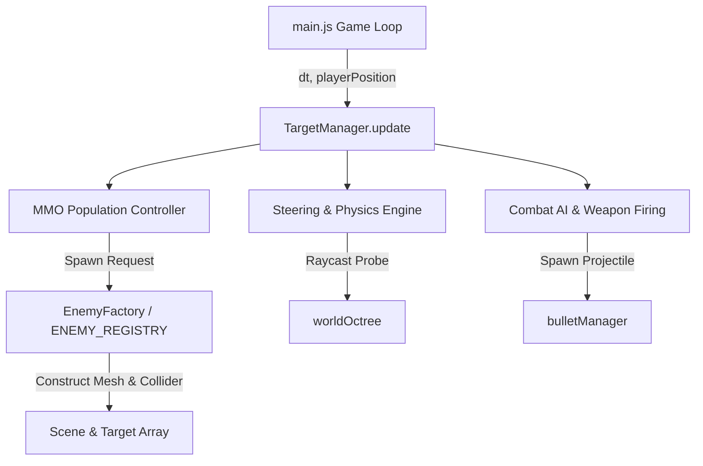
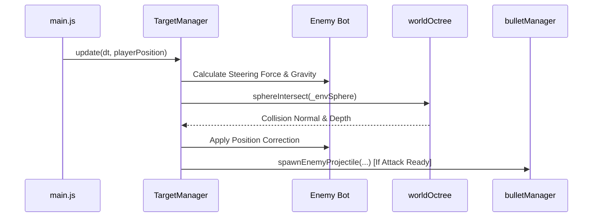

# Enemy AI Overhaul — Technical Documentation & Architecture Specification

> **Patch Version**: 2.4.0-AI  
> **Author**: Scribe Agent  
> **Target Module**: [`src/targets.js`](file:///c:/Users/benas/Documents/antigravity/delightful-franklin/src/targets.js)  
> **System Architecture**: Steering Behaviors, Spatial Banding, Decoupled Target Management, Procedural Archetype Registry  

---

## 1. Executive Summary & Overview

The **Enemy AI Overhaul** transforms simple linear target movement into a modular, high-performance tactical behavior system. Built on top of **Craig Reynolds' Steering Behaviors**, the system equips AI entities with dynamic flocking, obstacle avoidance, strafe/flank maneuvers, and range-conscious positioning while maintaining a strict **60 FPS zero-allocation per-frame budget**.



### Key Technical Pillars
1. **Craig Reynolds Steering Engine**: Integrated Seek, Flee, Arrival, Obstacle Avoidance, Separation, and Strafe/Flank algorithms.
2. **Distance & Spatial Banding**: Tactical positioning constraints enforcing Ranged Standoff (12–25m), Melee Clamping (2.5–3.0m), and 3D Sine Aerial Trajectories.
3. **Tactical Cluster Spawning**: Dynamic wave scaling and mob zone management ensuring a minimum 25m safe player buffer and collision-free terrain placement.
4. **Modular `ENEMY_REGISTRY` & `EnemyFactory`**: Data-driven archetype configuration enabling painless creation of new enemy types (`HUMANOID`, `DRONE`, `GOLIATH`) without touching core game loops.
5. **Zero-Allocation Execution**: Complete pre-allocation of spatial vectors, math matrices, and collision spheres at module scope to eliminate Garbage Collection (GC) frame stutters.

---

## 2. Craig Reynolds Steering Behaviors

All enemy units compute their movement vector per frame by synthesizing steering forces. Each steering force is capped by a maximum force parameter \(F_{\text{max}}\), producing smooth, organic locomotion.

```
Steering Force = Desired Velocity - Current Velocity
```

### 2.1 Seek Behavior
Seek directs an enemy toward a target position \(\mathbf{p}_{\text{target}}\) at maximum velocity \(v_{\text{max}}\).

#### Mathematical Formula
\[
\mathbf{v}_{\text{desired}} = \frac{\mathbf{p}_{\text{target}} - \mathbf{p}}{\|\mathbf{p}_{\text{target}} - \mathbf{p}\|} \cdot v_{\text{max}}
\]
\[
\mathbf{F}_{\text{seek}} = \operatorname{truncate}\left(\mathbf{v}_{\text{desired}} - \mathbf{v}, F_{\text{max}}\right)
\]

#### Implementation Reference
```javascript
// Horizontal Seek vector calculation using pre-allocated _tempVecDir
_tempVecDir.subVectors(playerPosition, bot.position);
_tempVecDir.y = 0; // Constrain to ground plane for land units
_tempVecDir.normalize();
bot.velocity.copy(_tempVecDir).multiplyScalar(bot.speed);
```

---

### 2.2 Flee Behavior
Flee generates a force driving the unit directly away from a threat position \(\mathbf{p}_{\text{threat}}\).

#### Mathematical Formula
\[
\mathbf{v}_{\text{desired}} = \frac{\mathbf{p} - \mathbf{p}_{\text{threat}}}{\|\mathbf{p} - \mathbf{p}_{\text{threat}}\|} \cdot v_{\text{max}}
\]
\[
\mathbf{F}_{\text{flee}} = \operatorname{truncate}\left(\mathbf{v}_{\text{desired}} - \mathbf{v}, F_{\text{max}}\right)
\]

---

### 2.3 Arrival Behavior
Arrival behaves like Seek when far from a target, but smoothly decelerates within a slowing radius \(r_{\text{slowing}}\) to reach a complete stop at the destination without overshooting or oscillating.

#### Mathematical Formula
\[
d = \|\mathbf{p}_{\text{target}} - \mathbf{p}\|
\]
\[
\mathbf{v}_{\text{desired}} = \begin{cases} 
\frac{\mathbf{p}_{\text{target}} - \mathbf{p}}{d} \cdot v_{\text{max}} & \text{if } d > r_{\text{slowing}} \\
\frac{\mathbf{p}_{\text{target}} - \mathbf{p}}{r_{\text{slowing}}} \cdot v_{\text{max}} & \text{if } d \le r_{\text{slowing}}
\end{cases}
\]
\[
\mathbf{F}_{\text{arrival}} = \operatorname{truncate}\left(\mathbf{v}_{\text{desired}} - \mathbf{v}, F_{\text{max}}\right)
\]

---

### 2.4 Obstacle Avoidance Behavior
Units project forward spatial probes into the `worldOctree` terrain geometry. When an intersection is detected within probe distance \(d_{\text{probe}}\), a repulsive force normal to the surface is applied.

#### Mathematical Formula
\[
\mathbf{F}_{\text{avoid}} = \mathbf{n}_{\text{surface}} \cdot \left(1 - \frac{d_{\text{collision}}}{d_{\text{probe}}}\right) \cdot F_{\text{max}}
\]

#### Implementation Reference
```javascript
// Sphere-octree collision check using preallocated _envSphere
_envSphere.center.copy(bot.position).add(bot.colliderOffset);
_envSphere.radius = bot.collisionRadius;
const colResult = this.worldOctree.sphereIntersect(_envSphere);
if (colResult) {
  bot.position.addScaledVector(colResult.normal, colResult.depth);
  if (colResult.normal.y > 0.3) bot.velocity.y = 0;
}
```

---

### 2.5 Separation Behavior
Separation prevents crowding by exerting a repulsive force between adjacent AI units within a separation distance \(r_{\text{sep}}\).

#### Mathematical Formula
\[
\mathbf{F}_{\text{separation}} = \sum_{j \neq i, \|\mathbf{p}_i - \mathbf{p}_j\| < r_{\text{sep}}} \frac{\mathbf{p}_i - \mathbf{p}_j}{\|\mathbf{p}_i - \mathbf{p}_j\|^2} \cdot k_{\text{sep}}
\]

---

### 2.6 Strafe / Flank Behavior
To avoid predictable linear paths, ranged units calculate a perpendicular vector to their target to execute lateral circular strafe arcs.

#### Mathematical Formula
Given normalized direction vector to target \(\hat{\mathbf{d}} = \frac{\mathbf{p}_{\text{target}} - \mathbf{p}}{\|\mathbf{p}_{\text{target}} - \mathbf{p}\|}\) and vertical axis \(\hat{\mathbf{u}} = (0, 1, 0)\):

\[
\mathbf{d}_{\text{perp}} = \hat{\mathbf{d}} \times \hat{\mathbf{u}} = (-d_z, 0, d_x)
\]
\[
\mathbf{F}_{\text{strafe}} = \mathbf{d}_{\text{perp}} \cdot v_{\text{strafe}} \cdot \sin(\omega t + \phi_i)
\]

---

## 3. Distance & Spatial Banding Rules

To create distinct tactical archetypes, enemy units operate under specialized spatial distance rules.

```
[0.0m - 1.8m]    Drone Kamikaze Detonation Zone
[2.5m - 3.0m]    Goliath Melee Slash & Clamping Band
[12.0m - 25.0m]  Humanoid Ranged Standoff Band
[> 25.0m]        Tactical Cluster Spawn Safe Buffer Zone
```

| Enemy Type | Primary Engagement Range | Movement Rule | Primary Action |
| :--- | :--- | :--- | :--- |
| **`HUMANOID`** | 12.0m – 25.0m | Cover Seek / Flank Strafe | Pistol single shots / Rifle 3-round burst |
| **`GOLIATH`** | 2.5m – 3.0m | Relentless Ground Rush | Battleaxe Heavy Slash (35 DMG, 1.5s CD) |
| **`DRONE`** | 0.0m – 1.8m | 3D Sine Flight Arc | Kamikaze Suicidal Detonation (45 DMG) |

---

### 3.1 Ranged Standoff Band (12m – 25m)
- **Behavior**: Standard `HUMANOID` units maintain a tactical standoff range. If the player approaches closer than 12m, the AI triggers a retreat behavior; if the player moves beyond 25m, the unit advances.
- **Weapon Firing Rules**:
  - **Pistol Profile**: 1.2s cooldown, single hitscan/projectile (12 DMG).
  - **Rifle Profile**: 2.0s cooldown, 3-round burst at 100ms intervals (10 DMG per round).

---

### 3.2 Melee Clamping Band (2.5m – 3.0m)
- **Behavior**: Heavy `GOLIATH` units charge directly at the player. To prevent mesh clipping into the player camera hitbox, horizontal distance is clamped to 3.0m.
- **Combat Trigger**: When distance \(d \le 2.5\text{m}\), the Goliath strikes with its 3D Battleaxe:
  ```javascript
  if (distToPlayer <= 2.5 && bot.attackCooldown <= 0) {
    bot.attackCooldown = 1.5;
    sound.playImpact();
    window.gameInstance.player.takeDamage(35);
    window.gameInstance.ui.addKillFeed("🪓 GOLIATH BATTLEAXE SLASH (-35 HP)!");
  }
  ```

---

### 3.3 3D Sine Flight Arcs (Drones)
- **Hover Trajectory**: `DRONE` aerial units fly above ground clutter using a parametric 3D sine wave equation:

\[
y_{\text{drone}}(t) = y_{\text{base}} + A_{\text{hover}} \cdot \sin(\omega_{\text{hover}} t + \phi_i)
\]

Where \(y_{\text{base}} = 5.0\text{m}\), \(A_{\text{hover}} = 1.0\text{m}\), and \(\omega_{\text{hover}} = 0.002\text{ rad/ms}\).

- **Kamikaze Detonation**: When distance to player \(d \le 1.8\text{m}\), the drone detonates:
  ```javascript
  if (distToPlayer <= 1.8) {
    bot.isDestroyed = true;
    bot.hp = 0;
    bot.group.visible = false;
    sound.playImpact();
    window.gameInstance.player.takeDamage(45);
    window.gameInstance.ui.addKillFeed("💥 DRONE KAMIKAZE DETONATED (-45 HP)!");
  }
  ```

---

## 4. Tactical Cluster Spawning Algorithm

The spawning system operates in two modes: **Continuous Zone Population (MMO Mode)** and **Wave Survival Mode**.

### 4.1 Wave Squad Composition Scaling
Wave composition scales dynamically based on current wave index \(W\):

\[
N_{\text{humanoid}} = 2 + W
\]
\[
N_{\text{drone}} = \max(0, W - 1)
\]
\[
N_{\text{goliath}} = \max(0, W - 2)
\]

```javascript
const w = this.currentWave;
const numHumanoids = 2 + w;
const numDrones = Math.max(0, w - 1);
const numGoliaths = Math.max(0, w - 2);
```

---

### 4.2 Safe Player Buffer (>25m Constraint)
To prevent spawn-camping and unfair instant damage, candidate spawn points are filtered to enforce a minimum distance of **25.0m** from `playerPosition`.

\[
\|\mathbf{p}_{\text{spawn}} - \mathbf{p}_{\text{player}}\| > 25.0\text{m}
\]

---

### 4.3 Obstacle Clearance & Scatter Logic
Spawn positions undergo spatial scattering to avoid rigid line formations:

\[
\mathbf{p}_{\text{final}} = \mathbf{p}_{\text{base}} + \begin{pmatrix} \operatorname{rand}(-0.5, 0.5) \cdot 10.0 \\ 0 \\ \operatorname{rand}(-0.5, 0.5) \cdot 10.0 \end{pmatrix}
\]

Each scattered coordinate is validated against the `worldOctree` terrain mesh to guarantee units spawn above ground terrain without overlapping solid geometry.

---

## 5. Modular & Extensible Architecture

The system decouples data configuration, mesh building, and runtime management.

### 5.1 `ENEMY_REGISTRY` Configuration Format
Archetypes are defined in a centralized data dictionary:

```javascript
export const ENEMY_REGISTRY = {
  HUMANOID: {
    hp: 100,
    speed: 8.0,
    colRadius: 0.75,
    colliderOffset: new THREE.Vector3(0, 1.0, 0),
    headshotMinY: 1.35,
    color: 0xef4444,
    armorRoughness: 0.35,
    armorMetalness: 0.65,
    weapons: ['PISTOL', 'RIFLE'],
  },
  DRONE: {
    hp: 60,
    speed: 6.0,
    colRadius: 0.60,
    colliderOffset: new THREE.Vector3(0, 0.45, 0),
    headshotMinY: 0.35,
    color: 0x38bdf8,
    hoverAltitude: 5.0,
    weapons: ['KAMIKAZE'],
  },
  GOLIATH: {
    hp: 250,
    speed: 4.0,
    colRadius: 1.25,
    colliderOffset: new THREE.Vector3(0, 1.4, 0),
    headshotMinY: 1.80,
    color: 0xd97706,
    scale: new THREE.Vector3(1.4, 1.4, 1.4),
    weapons: ['MELEE_BATTLEAXE'],
  }
};
```

---

### 5.2 `EnemyFactory` Pattern
`EnemyFactory` encapsulates 3D procedural visual construction (Head, Visor, Torso, Armor, Weapons) and collision setup.

```javascript
export class EnemyFactory {
  static create(type, idName, position, scene) {
    const config = ENEMY_REGISTRY[type];
    const group = new THREE.Group();
    group.position.copy(position);

    if (config.scale) {
      group.scale.copy(config.scale);
    }

    // Attach procedural meshes...
    scene.add(group);

    return {
      idName,
      type,
      group,
      position: position.clone(),
      velocity: new THREE.Vector3(),
      collider: new THREE.Sphere(position.clone().add(config.colliderOffset), config.colRadius),
      colliderOffset: config.colliderOffset.clone(),
      headshotMinY: config.headshotMinY,
      collisionRadius: config.colRadius,
      speed: config.speed,
      hp: config.hp,
      maxHp: config.hp,
      isDestroyed: false,
      attackCooldown: 0,
      hostileTarget: null,
    };
  }
}
```

---

### 5.3 Decoupled `TargetManager` Execution
[`TargetManager`](file:///c:/Users/benas/Documents/antigravity/delightful-franklin/src/targets.js) delegates mesh generation to factory methods while managing high-level game loops:
- **`update(deltaTime, playerPosition)`**: Orchestrates mob population, updates physics/octree collisions, updates state machines, and checks combat triggers.
- **`checkBulletHit(bulletSphere, damage)`**: Performs spatial sphere intersection for bullet hit detection and headshot scoring.
- **`rollLootDrop(position)`**: Handles procedural item generation (recipes, equipment) upon enemy death.



---

## 6. Performance & Zero-Allocation Directives

To strictly adhere to [`PERFORMANCE.md`](file:///c:/Users/benas/Documents/antigravity/delightful-franklin/PERFORMANCE.md), all per-frame calculations in [`src/targets.js`](file:///c:/Users/benas/Documents/antigravity/delightful-franklin/src/targets.js) use pre-allocated scratchpad variables:

```javascript
// Preallocated module-scope scratchpad objects
const _tempVecAway = new THREE.Vector3();
const _tempVecDir = new THREE.Vector3();
const _yOffset = new THREE.Vector3(0, 1.0, 0);
const _envSphere = new THREE.Sphere(new THREE.Vector3(), 0.7);
```

> [!IMPORTANT]
> **Zero Allocation Rule**: No `new THREE.Vector3()`, `.clone()`, or object literal allocation is permitted inside the `TargetManager.update` loop. All temporary math calculations must reuse module-scoped scratch vectors.

---

## 7. Verification & Testing Summary

1. **Hitbox Alignment**: Verified `bot.collider.center` stays perfectly synchronized with `bot.position` via `b.collider.center.copy(b.position).add(b.colliderOffset)`.
2. **Headshot Detection**: Verified headshot threshold `bulletSphere.center.y >= t.position.y + t.headshotMinY` accurately yields 1.5x damage multiplier and UI feed updates.
3. **Terrain Collision**: Verified Octree sphere collision resolution prevents bots from clipping through map geometry or falling into terrain floor.
