# Patch 0.2.2 Technical Documentation — Host Lobby Lifecycle & Discord Invite Integration

> **Patch Version**: 0.2.2  
> **Author**: Scribe Agent  
> **Target Modules**: [`src/multiplayer/NetworkManager.js`](file:///c:/Users/benas/Documents/antigravity/delightful-franklin/src/multiplayer/NetworkManager.js), [`src/ui.js`](file:///c:/Users/benas/Documents/antigravity/delightful-franklin/src/ui.js), [`index.html`](file:///c:/Users/benas/Documents/antigravity/delightful-franklin/index.html)  
> **System Subsystems**: Host Lobby Teardown Lifecycle, Dynamic Toggle State Machine, Localhost vs Public Domain vs Ngrok Network Architecture, Discord Markdown Card Formatting Engine, Asynchronous Clipboard Sync.

---

## 1. Executive Summary & Overview of Patch 0.2.2

**Patch 0.2.2** introduces critical session lifecycle controls, infrastructure deployment guidelines, and rich social invite integrations for *God-Caliber* (`delightful-franklin`). Following the security and room code foundation introduced in Patch 0.2.1, Patch 0.2.2 transitions multiplayer hosting from a one-shot activation state into a fully managed lifecycle state machine. Hosts can now start, stop, and clean up active lobbies dynamically without refreshing the web application.

In addition, Patch 0.2.2 provides explicit network architecture guidelines contrasting `localhost` loopback testing with public web deployment and `ngrok` reverse tunnels, alongside a rich Discord Markdown invite generator that enables one-click auto-joining directly from Discord channels.

### Patch Objectives & Architectural Transformations

1. **Host Lobby Toggle & Lifecycle Management**: Replaces static one-time host buttons with a dynamic dual-state toggle (`HOST LOBBY` $\leftrightarrow$ `STOP HOSTING`) wired to a complete session teardown pipeline (`NetworkManager.stopHosting()`).
2. **Teardown & Resource Cleanup**: Guarantees that stopping a hosted session immediately destroys connected peer WebRTC DataChannels, disposes of Three.js humanoid meshes and 2D canvas billboard textures, and resets network state.
3. **Localhost vs Public URL Deployment Architecture**: Documents the networking principles governing loopback IP addresses (`127.0.0.1`), public domain HTTPS deployments, and reverse tunneling tools (`ngrok`) for cross-WAN peer-to-peer WebRTC connectivity.
4. **Discord Invite Sharing Integration**: Implements a dedicated **SHARE TO DISCORD** button (`#discord-share-btn`) that formats pre-styled Discord Markdown cards with room metadata, call-signs, and direct auto-join URI links (`?lobby=GC-XXXX`).

```mermaid
graph TD
    subgraph HostLifecycle ["Host Session Lifecycle State Machine"]
        Idle["State: Idle (Singleplayer)"] -->|Click HOST LOBBY| HostInit["Invoke NetworkManager.hostLobby(pin)"]
        HostInit --> CodeGen["Generate Cryptographic GC-XXXX Code"]
        CodeGen --> ActiveHost["State: Active Host (STOP HOSTING Red Style)"]
        ActiveHost --> RevealUI["Reveal COPY LINK & SHARE TO DISCORD Buttons"]
        ActiveHost -->|Click STOP HOSTING| Teardown["Invoke NetworkManager.stopHosting()"]
        Teardown --> DestroyPeers["Destroy Peer DataChannels & Three.js Meshes"]
        DestroyPeers --> ResetState["Reset isHost=false, roomId=null, PIN=null"]
        ResetState --> Idle
    end

    subgraph NetworkArchitecture ["Deployment & Connectivity Scenarios"]
        LocalDev["Local Loopback (localhost:5173)"] -->|Internal IPC| SameDevice["Only accessible on local machine"]
        NgrokTunnel["Ngrok Reverse Tunnel (https://xxxx.ngrok-free.app)"] -->|WAN Tunnel| RemotePeers["Accessible across public Internet WAN"]
        PublicProd["Public HTTPS Production (Netlify / Vercel / Cloudflare)"] -->|Web Standard| UniversalJoin["Universal 1-Click Peer Access"]
    end

    subgraph DiscordIntegration ["Discord Rich Invite Pipeline"]
        DiscordClick["Click SHARE TO DISCORD"] --> CardGen["formatDiscordInvite(code, url, hostName)"]
        CardGen --> CodeBlock["Wrap Metadata in ```markdown Code Block"]
        CodeBlock --> ClipSync["navigator.clipboard.writeText(cardText)"]
        ClipSync --> UserPaste["User Pastes in Discord Channel"]
        UserPaste --> PeerClick["Peer Clicks Join URL (?lobby=GC-XXXX)"]
        PeerClick --> AutoJoin["src/main.js URLSearchParams Auto-Join Handshake"]
    end
```



---

## 2. Host Lobby Toggle & Lifecycle Management

In Patch 0.2.1, hosting a room was a unidirectional action: once hosted, there was no standard interface mechanism to close the room or clean up peer connections without re-loading the page. Patch 0.2.2 implements a complete state machine for host lobby lifecycle management.

```
+---------------------------------------------------------------------------------------+
+                               HOST LOBBY TOGGLE STATE MACHINE                         +
+---------------------------------------------------------------------------------------+
|                                                                                       |
|  [State: IDLE] ------------------ Click "HOST LOBBY" ------------------> [State: HOST]  |
|   Button: HOST LOBBY (Default Style)                                  Button: STOP HOSTING (#ff2a6d)
|   Status: Singleplayer (Local Dev Server)                             Status: Lobby Active: GC-8842
|   Extra UI: Buttons Hidden                                            Extra UI: COPY LINK & DISCORD Shown
|                                                                                       |
|  [State: IDLE] <----------------- Click "STOP HOSTING" ----------------- [State: HOST]  |
|                                                                                       |
+---------------------------------------------------------------------------------------+
```

### 2.1 Interface Button Rename & Dynamic Styling

The host action button (`#host-lobby-btn`) in [`index.html:L80`](file:///c:/Users/benas/Documents/antigravity/delightful-franklin/index.html#L80) was updated from `"HOST 8-PLAYER LOBBY"` to `"HOST LOBBY"`.

The UI event handler in [`src/ui.js:L181-L212`](file:///c:/Users/benas/Documents/antigravity/delightful-franklin/src/ui.js#L181-L212) evaluates `NetworkManager.isHost` dynamically to execute state transitions:

```javascript
if (this.hostLobbyBtn) {
  this.hostLobbyBtn.addEventListener('click', (e) => {
    e.stopPropagation();
    if (window.gameInstance && window.gameInstance.network) {
      const net = window.gameInstance.network;
      if (net.isHost) {
        // Teardown sequence
        net.stopHosting();
        this.hostLobbyBtn.textContent = 'HOST LOBBY';
        this.hostLobbyBtn.style.background = '';
        if (this.lobbyStatusText) {
          this.lobbyStatusText.textContent = 'Singleplayer (Local Dev Server)';
          this.lobbyStatusText.style.color = '#00ffcc';
        }
        if (this.copyLinkBtn) this.copyLinkBtn.classList.add('hidden');
        if (this.discordShareBtn) this.discordShareBtn.classList.add('hidden');
        this.renderConnectedPlayers();
      } else {
        // Initialization sequence
        const pin = this.lobbyPinInput ? this.lobbyPinInput.value : '';
        const code = net.hostLobby(pin);
        this.hostLobbyBtn.textContent = 'STOP HOSTING';
        this.hostLobbyBtn.style.background = '#ff2a6d';
        if (this.lobbyStatusText) {
          this.lobbyStatusText.textContent = `Lobby Active: ${code} (Host)`;
          this.lobbyStatusText.style.color = '#00ffcc';
        }
        if (this.copyLinkBtn) this.copyLinkBtn.classList.remove('hidden');
        if (this.discordShareBtn) this.discordShareBtn.classList.remove('hidden');
        this.renderConnectedPlayers();
      }
    }
  });
}
```

### 2.2 NetworkManager.stopHosting() Teardown Pipeline

When the host clicks **STOP HOSTING**, `NetworkManager.stopHosting()` executes a deterministic resource disposal sequence ([`src/multiplayer/NetworkManager.js:L69-L77`](file:///c:/Users/benas/Documents/antigravity/delightful-franklin/src/multiplayer/NetworkManager.js#L69-L77)):

```javascript
stopHosting() {
  if (!this.isHost && !this.isConnected) return;
  console.log(`[NetworkManager] Teardown lobby hosting session: ${this.roomId}`);
  this.peerPlayers.forEach(peer => peer.destroy());
  this.peerPlayers.clear();
  this.isHost = false;
  this.isConnected = false;
  this.roomId = null;
  this.lobbyPin = null;
}
```

#### Teardown Steps Executed:

1. **Peer Connection Termination**: Iterates through `this.peerPlayers` Map and invokes `peer.destroy()` on each connected remote player.
2. **WebGL Scene Cleanup**: Removes Three.js 3D humanoid mesh objects from `SceneManager` and disposes of canvas 2D nameplate sprite textures.
3. **Map Clearing**: Empties `this.peerPlayers` Map to ensure zero dangling memory references.
4. **State Variable Reset**: Resets `isHost = false`, `isConnected = false`, `roomId = null`, and `lobbyPin = null`.
5. **UI Synchronization**: Triggers `renderConnectedPlayers()`, clearing the connected peer DOM container (`#connected-players-list`).

---

## 3. Localhost vs Public URL Deployment Architecture

A recurring area of confusion during WebRTC game development is host accessibility across network boundaries. Patch 0.2.2 details the distinction between local loopback addresses, public domain deployments, and reverse tunneling solutions.

```
+---------------------------------------------------------------------------------------+
|                               NETWORK REACHABILITY ARCHITECTURE                       |
+---------------------------------------------------------------------------------------+
|                                                                                       |
|  [Scenario 1: Localhost Loopback]                                                     |
|  Host: http://localhost:5173/?lobby=GC-8842  <--- Cannot be resolved by WAN peers!    |
|                                                                                       |
|  [Scenario 2: Ngrok Tunneling]                                                        |
|  Host: ngrok http 5173  ---> https://a1b2.ngrok-free.app/?lobby=GC-8842               |
|  WAN Peers: Click ngrok link  ---> WebRTC P2P DataChannel connection succeeds!        |
|                                                                                       |
|  [Scenario 3: Public HTTPS Hosting]                                                   |
|  Host: https://game.domain.com/?lobby=GC-8842                                        |
|  WAN Peers: Standard HTTPS delivery + WebRTC ICE candidate negotiation!               |
|                                                                                       |
+---------------------------------------------------------------------------------------+
```

### 3.1 Loopback Interface Limitations (`localhost` / `127.0.0.1`)

When running the local development server (`npm run dev`), Vite binds by default to `http://localhost:5173`. 

- **Scope**: Loopback addresses reside strictly inside the host machine's local IP stack.
- **Invite Link Behavior**: Generating an invite link on `localhost` yields `http://localhost:5173/?lobby=GC-XXXX`. If sent to an external friend or external device, opening this link attempts to connect to *their own local machine*, resulting in a connection failure (`ERR_CONNECTION_REFUSED`).
- **WebRTC Limitation**: WebRTC ICE candidates gathered on `localhost` contain internal loopback candidate IPs (`127.0.0.1`), preventing WebRTC P2P DataChannel establishment with external networks.

### 3.2 Public Domain HTTPS Production Architecture

In a production environment (e.g., hosted via Netlify, Vercel, GitHub Pages, or Cloudflare Pages):

- **Scope**: Public DNS routing resolves the domain universally for all internet users (`https://your-game-domain.com`).
- **Secure Context (`HTTPS`)**: Browsers require HTTPS secure contexts for full `navigator.clipboard` access and un-throttled WebRTC audio/data transport.
- **ICE Candidate Exchange**: WebRTC uses public STUN servers (e.g., `stun:stun.l.google.com:19302`) to discover each peer's public WAN IP and UDP port mapping, enabling direct P2P data flow across routers and NATs.

### 3.3 Ngrok Tunneling Architecture for Local Development

To test multiplayer sessions with remote players directly from a local development environment without deploying to production, developers can utilize `ngrok`:

```bash
# Expose local Vite development server to public HTTPS WAN
ngrok http 5173
```

#### Ngrok Operation Sequence:
1. `ngrok` assigns a temporary public HTTPS forwarding URL (e.g., `https://a1b2-34-88-12-3.ngrok-free.app`).
2. Host clicks **HOST LOBBY** inside the ngrok browser tab.
3. Invite link generated: `https://a1b2-34-88-12-3.ngrok-free.app/?lobby=GC-8842`.
4. Remote peers open the ngrok URL; the browser fetches static bundle assets through the secure reverse tunnel and negotiates WebRTC DataChannels over UDP.

### Infrastructure & Deployment Matrix

| Deployment Environment | URL Format | WebRTC Reachability | Clipboard API Support | Ideal Use Case |
| :--- | :--- | :--- | :--- | :--- |
| **Localhost Loopback** | `http://localhost:5173` | Same-machine only | Fallback `<textarea>` (non-HTTPS) | Local singleplayer dev & unit testing |
| **Local Network LAN** | `http://192.168.1.50:5173` | Same LAN Wi-Fi / Ethernet | Fallback `<textarea>` (HTTP) | Local playtesting on home/office network |
| **Ngrok Public Tunnel** | `https://xxxx.ngrok-free.app` | **Universal WAN** | Full `navigator.clipboard` | Remote dev playtesting without deployment |
| **Public HTTPS Production**| `https://game.domain.com` | **Universal WAN** | Full `navigator.clipboard` | Live public production deployment |

---

## 4. Discord Invite Sharing Integration

Patch 0.2.2 introduces direct Discord invite card formatting via a dedicated **SHARE TO DISCORD** button (`#discord-share-btn`), streamlining community matchmaking in Discord servers and direct messages.

### 4.1 Interface Integration (`#discord-share-btn`)

Added in [`index.html:L82`](file:///c:/Users/benas/Documents/antigravity/delightful-franklin/index.html#L82) with Discord blurple styling:

```html
<button id="discord-share-btn" class="rebind-btn wide-btn hidden" style="background: rgba(88, 101, 242, 0.2); border-color: #5865F2; color: #5865F2;">SHARE TO DISCORD 🎮</button>
```

- **Visibility State**: Hidden by default in singleplayer mode; revealed alongside `#copy-link-btn` when host lobby activation occurs.

### 4.2 Discord Markdown Card Formatting Engine

The formatting helper `formatDiscordInvite()` is exported from [`src/multiplayer/NetworkManager.js:L43-L53`](file:///c:/Users/benas/Documents/antigravity/delightful-franklin/src/multiplayer/NetworkManager.js#L43-L53):

```javascript
export function formatDiscordInvite(roomCode, joinUrl, hostName = 'Player') {
  const cleanHost = sanitizeName(hostName);
  return [
    `🎮 **GOD-CALIBER MULTIPLAYER LOBBY INVITE** 🎮`,
    '```markdown',
    `[Host]      : ${cleanHost}`,
    `[Room Code] : ${roomCode}`,
    `[Status]    : Waiting for combatants (1/8)`,
    '```',
    `👉 **Join Match Instantly**: <${joinUrl}>`
  ].join('\n');
}
```

#### Generated Discord Markdown Output Sample:

```markdown
🎮 **GOD-CALIBER MULTIPLAYER LOBBY INVITE** 🎮
```markdown
[Host]      : Player_1
[Room Code] : GC-8842
[Status]    : Waiting for combatants (1/8)
```
👉 **Join Match Instantly**: <https://game.domain.com/?lobby=GC-8842>
```

> [!TIP]
> **Discord URL Formatting**: Wrapping the join URL in angle brackets (`<https://...>`) prevents Discord from generating bulky or redundant embed previews, keeping the message card clean and compact in chat windows.

### 4.3 Click Handler & Feedback Cycle

The event listener in [`src/ui.js:L217-L238`](file:///c:/Users/benas/Documents/antigravity/delightful-franklin/src/ui.js#L217-L238) handles card construction, clipboard writing, and UI feedback:

```javascript
if (this.discordShareBtn) {
  this.discordShareBtn.addEventListener('click', async (e) => {
    e.stopPropagation();
    if (window.gameInstance && window.gameInstance.network && window.gameInstance.network.roomId) {
      const net = window.gameInstance.network;
      const code = net.roomId;
      const url = `${window.location.origin}${window.location.pathname}?lobby=${encodeURIComponent(code)}`;
      const hostName = this.controls ? this.controls.playerName : 'Player';
      const cardText = formatDiscordInvite(code, url, hostName);
      try {
        await navigator.clipboard.writeText(cardText);
        this.discordShareBtn.textContent = 'CARD COPIED! 🎮';
        setTimeout(() => {
          this.discordShareBtn.textContent = 'SHARE TO DISCORD 🎮';
        }, 2500);
      } catch (err) {
        alert(`Discord Invite Card:\n\n${cardText}`);
      }
    }
  });
}
```

### 4.4 End-to-End One-Click Auto-Join Workflow

1. **Host**: Clicks **HOST LOBBY** $\rightarrow$ room `GC-8842` created.
2. **Share**: Host clicks **SHARE TO DISCORD** $\rightarrow$ pre-formatted card copied to clipboard.
3. **Paste**: Host pastes card into Discord channel `#multiplayer-looking-for-group`.
4. **Click**: Recipient clicks `<https://game.domain.com/?lobby=GC-8842>`.
5. **Auto-Join**: Recipient's browser opens game, `src/main.js` reads `?lobby=GC-8842` from `URLSearchParams`, automatically invokes `joinLobby('GC-8842')`, and connects to host WebRTC session without manual entry.

---

## 5. Summary & Verification Checklist

Patch 0.2.2 completes host session lifecycle management, clarifies loopback vs public WAN deployment paths, and provides a polished Discord matchmaking invite workflow.

### Verification Checklist

- [x] **Host Lobby Toggle State Machine**: Verified transition between `HOST LOBBY` and `STOP HOSTING` text and button color styles (`#ff2a6d`).
- [x] **Teardown Execution**: Verified `NetworkManager.stopHosting()` clears `peerPlayers`, calls `peer.destroy()`, removes Three.js meshes, and resets host state.
- [x] **Deployment Documentation**: Documented limitations of `localhost:5173` loopback vs public HTTPS and `ngrok http 5173` WAN tunnels.
- [x] **Discord Invite Formatting**: Verified `formatDiscordInvite()` output with Markdown code block and angle-bracket link formatting (`<URL>`).
- [x] **Discord Button UI**: Verified `#discord-share-btn` visibility toggle and 2.5s `CARD COPIED! 🎮` feedback loop.
- [x] **One-Click Auto-Join**: Confirmed URL query parameter auto-connect sequence (`?lobby=GC-XXXX`).

---
