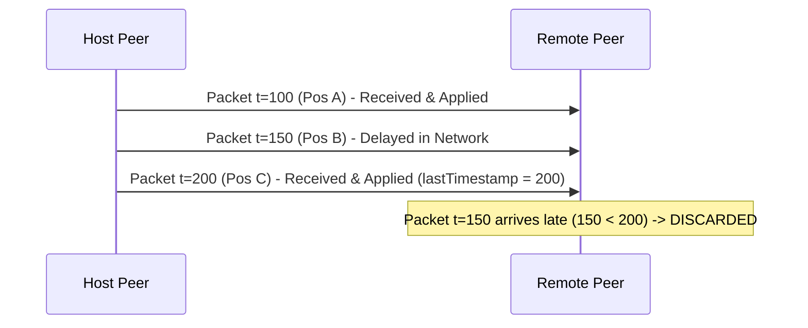
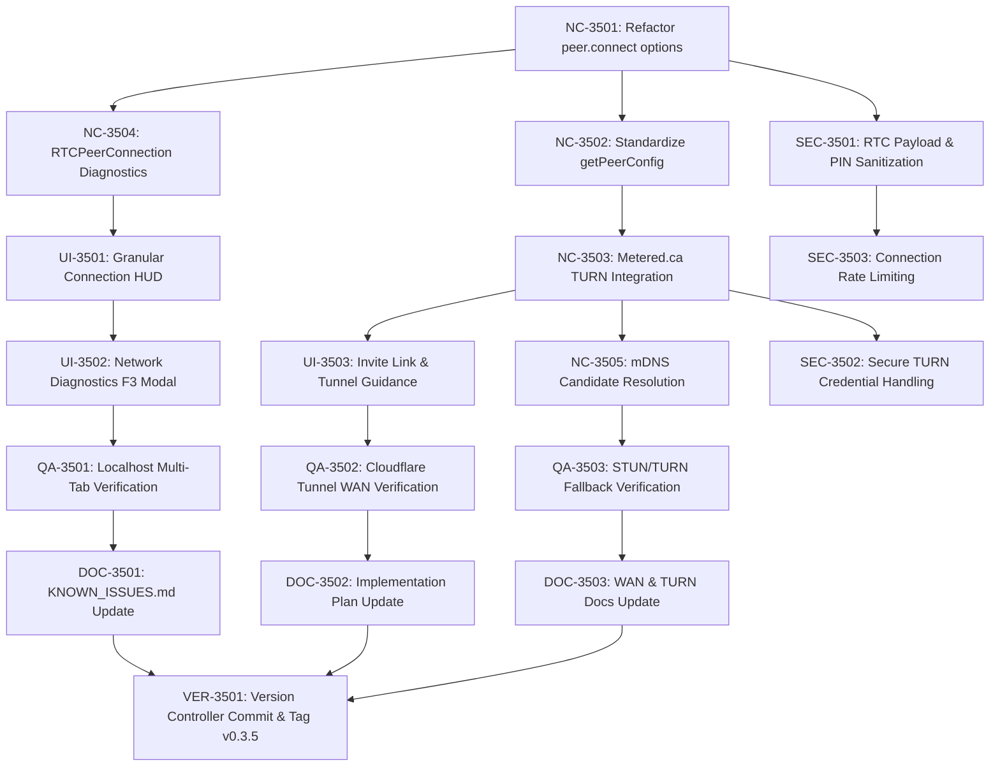
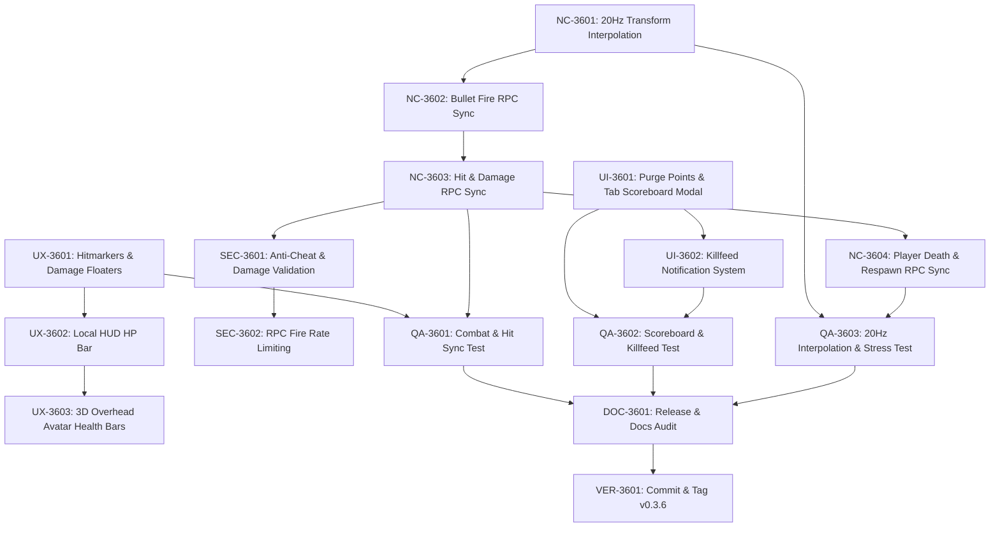

# Patch 0.3 — Agent-Executable Implementation Plan

> **Purpose**: This document is designed for a **fresh AI agent** (Gemini 3.6 Flash) to execute without needing to re-research the entire codebase.  
> **Prerequisites**: Read [`documentation/GAME_OVERVIEW.md`](file:///c:/Users/benas/Documents/antigravity/delightful-franklin/documentation/GAME_OVERVIEW.md) and [`documentation/KNOWN_ISSUES.md`](file:///c:/Users/benas/Documents/antigravity/delightful-franklin/documentation/KNOWN_ISSUES.md) for full architectural context.  
> **Vision**: Read [`God-Caliber_Vision_Statement_Patch_0.3.md`](file:///c:/Users/benas/Documents/antigravity/delightful-franklin/God-Caliber_Vision_Statement_Patch_0.3.md) for design philosophy.

---

## Sub-Patch Breakdown

This patch is split into 3 independently-shippable sub-patches. **Each sub-patch should be built and verified before moving to the next.** A fresh agent should start at whichever sub-patch is marked incomplete.

| Sub-Patch | Scope | Status |
|-----------|-------|--------|
| **0.3.0** | Game State Machine + Circle of Death + Spawn Loadout | ✅ Complete |
| **0.3.1** | Real WebRTC Multiplayer (PeerJS) + Victory/Defeat | ✅ Complete |
| **0.3.2** | Map Expansion + AI Phase Escalation + HUD Polish | ✅ Complete |
| **0.3.4** | Multiplayer Connection Fix + Vercel Deployment Groundwork | ✅ Complete |

---

## User-Approved Design Decisions (DO NOT CHANGE)

These were explicitly approved by the user. Do not deviate:

1. **Match duration**: 5-7 minutes total
2. **Multiplayer**: Build real WebRTC via PeerJS (sub-patch 0.3.1)
3. **Circle visual**: Neon force field wall (cyberpunk aesthetic, ShaderMaterial)
4. **Respawns**: 1 extra life via craftable Respawn Token (3× Rare Dust + 1× Epic Dust)
5. **Map**: Expand Testing Arena to 240×240m with performance in mind
6. **AI in circle**: AI freely roams anywhere, NOT damaged by circle
7. **Spawn loadout**: Players start with P-57 Pistol + Combat Knife only (no Combat Rifle)

---

# SUB-PATCH 0.3.0: Core Battle Royale

**Goal**: Playable solo Battle Royale with game state machine, circle of death, and BR-appropriate loot scatter.

---

## Phase A: Game State Machine

### Step A1: Create `src/game-state.js`

Create a new file at `c:/Users/benas/Documents/antigravity/delightful-franklin/src/game-state.js`.

```javascript
// Game State Machine for Battle Royale mode
// States: LOBBY → LOOT_PHASE → COMBAT_PHASE → FINAL_CIRCLE → VICTORY / DEFEAT

export const MATCH_PHASES = {
  LOBBY: 'LOBBY',
  LOOT_PHASE: 'LOOT_PHASE',
  COMBAT_PHASE: 'COMBAT_PHASE',
  FINAL_CIRCLE: 'FINAL_CIRCLE',
  VICTORY: 'VICTORY',
  DEFEAT: 'DEFEAT',
};

export class GameStateManager {
  constructor() {
    this.phase = MATCH_PHASES.LOBBY;
    this.phaseTimer = 0;          // Seconds remaining in current phase
    this.matchTime = 0;           // Total elapsed match time
    this.circleStage = 0;         // Current circle stage (0-4)
    this.isMatchActive = false;
    
    // Match stats for end screen
    this.stats = {
      kills: 0,
      headshots: 0,
      damageDealt: 0,
      itemsLooted: 0,
      itemsCrafted: 0,
      respawnTokensUsed: 0,
      survivalTime: 0,
    };

    // Phase durations in seconds
    this.PHASE_DURATIONS = {
      LOOT_PHASE: 30,      // 30 seconds looting phase
      COMBAT_STAGE_1: 45,  // Circle stage 1→2
      COMBAT_STAGE_2: 40,  // Circle stage 2→3
      COMBAT_STAGE_3: 30,  // Circle stage 3→4 (final)
      FINAL_CIRCLE: 60,    // Survive 60s in final circle to win (solo)
    };
  }

  startMatch() {
    this.phase = MATCH_PHASES.LOOT_PHASE;
    this.phaseTimer = this.PHASE_DURATIONS.LOOT_PHASE;
    this.matchTime = 0;
    this.circleStage = 0;
    this.isMatchActive = true;
    this.resetStats();
  }

  resetStats() {
    Object.keys(this.stats).forEach(k => this.stats[k] = 0);
  }

  update(deltaTime) {
    if (!this.isMatchActive) return;
    
    this.matchTime += deltaTime;
    this.stats.survivalTime = this.matchTime;

    if (this.phase === MATCH_PHASES.LOOT_PHASE) {
      this.phaseTimer -= deltaTime;
      if (this.phaseTimer <= 0) {
        this.phase = MATCH_PHASES.COMBAT_PHASE;
        this.circleStage = 1;
        this.phaseTimer = this.PHASE_DURATIONS.COMBAT_STAGE_1;
      }
    } else if (this.phase === MATCH_PHASES.COMBAT_PHASE) {
      this.phaseTimer -= deltaTime;
      if (this.phaseTimer <= 0) {
        this.circleStage++;
        if (this.circleStage >= 4) {
          this.phase = MATCH_PHASES.FINAL_CIRCLE;
          this.phaseTimer = this.PHASE_DURATIONS.FINAL_CIRCLE;
        } else if (this.circleStage === 2) {
          this.phaseTimer = this.PHASE_DURATIONS.COMBAT_STAGE_2;
        } else if (this.circleStage === 3) {
          this.phaseTimer = this.PHASE_DURATIONS.COMBAT_STAGE_3;
        }
      }
    } else if (this.phase === MATCH_PHASES.FINAL_CIRCLE) {
      this.phaseTimer -= deltaTime;
      if (this.phaseTimer <= 0) {
        this.triggerVictory();
      }
    }
  }

  triggerVictory() {
    this.phase = MATCH_PHASES.VICTORY;
    this.isMatchActive = false;
  }

  triggerDefeat() {
    this.phase = MATCH_PHASES.DEFEAT;
    this.isMatchActive = false;
  }

  restartMatch() {
    this.phase = MATCH_PHASES.LOBBY;
    this.isMatchActive = false;
  }

  // Helpers for other systems to query
  get isLootPhase() { return this.phase === MATCH_PHASES.LOOT_PHASE; }
  get isCombatActive() { return this.phase === MATCH_PHASES.COMBAT_PHASE || this.phase === MATCH_PHASES.FINAL_CIRCLE; }
  get shouldSpawnAI() { return this.isCombatActive; }
  
  get targetAICount() {
    if (!this.shouldSpawnAI) return 0;
    if (this.circleStage <= 2) return 6;
    if (this.circleStage === 3) return 10;
    return 14; // Final circle
  }

  get aiComposition() {
    if (this.circleStage <= 2) return { HUMANOID: 0.8, DRONE: 0.2, GOLIATH: 0.0 };
    if (this.circleStage === 3) return { HUMANOID: 0.6, DRONE: 0.2, GOLIATH: 0.2 };
    return { HUMANOID: 0.4, DRONE: 0.3, GOLIATH: 0.3 };
  }
}
```

### Step A2: Wire GameStateManager into `src/main.js`

**File**: `c:/Users/benas/Documents/antigravity/delightful-franklin/src/main.js`

1. **Add import** (near line 1-10, with other imports):
   ```javascript
   import { GameStateManager, MATCH_PHASES } from './game-state.js';
   ```

2. **Create instance in constructor** (near line 40-50, after other manager initializations):
   ```javascript
   this.gameState = new GameStateManager();
   ```

3. **Add update call in `animate()` method** (near line 475, BEFORE `this.targetManager.update()`):
   ```javascript
   this.gameState.update(deltaTime);
   ```

4. **Modify `handleInputs()`** — Add a match start trigger. When the user clicks the "START" button from the menu and the game state is LOBBY, call `this.gameState.startMatch()`. Look for the existing `start-btn` click handler wiring (currently in `ui.js` around line 92-95) and extend it.

5. **Modify player death handling** — In `src/player.js`, the `takeDamage()` method (around line 85-100) currently calls `this.respawn()` when HP <= 0. Change it so that when HP <= 0, it sets a flag `this.isDead = true` but does NOT auto-respawn. The Game class in `main.js` should check `this.player.isDead` each frame and call `this.gameState.triggerDefeat()` when detected. 

   **IMPORTANT**: Before triggering defeat, check if the player has a Respawn Token in their inventory. If yes, consume the token and respawn at 50% HP inside the current circle instead.

### Step A3: Add Match UI Overlays to `index.html`

**File**: `c:/Users/benas/Documents/antigravity/delightful-franklin/index.html`

Add these elements **inside** `<div id="game-container">`, after the existing HUD elements but before the closing `</div>`:

```html
<!-- Battle Royale Phase HUD -->
<div id="br-phase-hud" class="hidden">
  <div id="br-phase-banner"></div>
  <div id="br-phase-timer"></div>
</div>

<!-- Circle Warning -->
<div id="circle-warning" class="hidden">
  ⚠️ OUTSIDE SAFE ZONE — TAKING DAMAGE
</div>

<!-- Victory Overlay -->
<div id="victory-overlay" class="hidden">
  <div class="match-result-card">
    <h1>⚡ VICTORY ⚡</h1>
    <div id="victory-stats"></div>
    <button id="play-again-btn">PLAY AGAIN</button>
  </div>
</div>

<!-- Defeat Overlay -->
<div id="defeat-overlay" class="hidden">
  <div class="match-result-card">
    <h1>💀 DEFEATED</h1>
    <div id="defeat-stats"></div>
    <button id="play-again-defeat-btn">PLAY AGAIN</button>
  </div>
</div>
```

Add corresponding CSS styles to `src/style.css` for:
- `#br-phase-hud`: Fixed top center, large bold text, semi-transparent dark background
- `#br-phase-timer`: Below the banner, monospace countdown font
- `#circle-warning`: Fixed center screen, flashing red animation, z-index above game
- `.match-result-card`: Centered overlay with glassmorphism background, stats grid layout
- Use the game's existing color palette: dark navy (#0f172a), cyan (#00f0ff), gold (#f59e0b), red (#ef4444)

### Step A4: Phase HUD Rendering in `src/ui.js`

**File**: `c:/Users/benas/Documents/antigravity/delightful-franklin/src/ui.js`

Add a new method `updatePhaseHUD(gameState)` to the `UIManager` class. This should be called from `main.js` in the animate loop.

```javascript
updatePhaseHUD(gameState) {
  const bannerEl = document.getElementById('br-phase-banner');
  const timerEl = document.getElementById('br-phase-timer');
  const hudEl = document.getElementById('br-phase-hud');
  const warningEl = document.getElementById('circle-warning');
  
  if (!bannerEl || !gameState.isMatchActive) {
    if (hudEl) hudEl.classList.add('hidden');
    return;
  }
  
  hudEl.classList.remove('hidden');
  
  const phaseNames = {
    LOOT_PHASE: '🔍 LOOTING PHASE',
    COMBAT_PHASE: '⚔️ COMBAT PHASE',
    FINAL_CIRCLE: '💀 FINAL CIRCLE',
  };
  
  bannerEl.textContent = phaseNames[gameState.phase] || '';
  
  const mins = Math.floor(gameState.phaseTimer / 60);
  const secs = Math.floor(gameState.phaseTimer % 60);
  timerEl.textContent = `NEXT PHASE: ${mins}:${secs.toString().padStart(2, '0')}`;
}
```

Also add methods for showing/hiding victory and defeat overlays with populated stats.

---

## Phase B: Circle of Death

### Step B1: Create `src/circle.js`

Create a new file at `c:/Users/benas/Documents/antigravity/delightful-franklin/src/circle.js`.

The CircleManager manages a shrinking cylindrical force field.

```javascript
import * as THREE from 'three';

export class CircleManager {
  constructor(scene) {
    this.scene = scene;
    
    // Circle state
    this.currentRadius = 80;       // Current visual radius
    this.targetRadius = 80;        // Target radius to shrink toward
    this.centerX = 0;
    this.centerZ = 0;
    this.targetCenterX = 0;
    this.targetCenterZ = 0;
    this.shrinkSpeed = 0;          // Units per second
    this.damagePerSecond = 0;
    this.damageAccumulator = 0;    // For 0.5s tick intervals
    this.isActive = false;
    
    // Circle stage definitions
    this.stages = [
      { radius: 80, centerOffset: 0, dps: 0, shrinkDuration: 0 },          // Stage 0: inactive
      { radius: 50, centerOffset: 15, dps: 5, shrinkDuration: 30 },        // Stage 1
      { radius: 30, centerOffset: 8, dps: 10, shrinkDuration: 25 },        // Stage 2
      { radius: 15, centerOffset: 4, dps: 20, shrinkDuration: 20 },        // Stage 3
      { radius: 5, centerOffset: 1, dps: 40, shrinkDuration: 15 },         // Stage 4 (final)
    ];

    // 3D force field mesh
    this.wallMesh = null;
    this.groundRingMesh = null;
    this.buildForceField();
  }

  buildForceField() {
    // Cylindrical wall — use ShaderMaterial for animated neon energy effect
    // Height: 20m (tall enough to be visible but not blocking sky)
    // Semi-transparent with scrolling energy lines
    
    const wallGeometry = new THREE.CylinderGeometry(
      this.currentRadius, this.currentRadius, 20, 64, 1, true // open-ended
    );
    
    // ShaderMaterial with animated vertical energy lines
    const wallMaterial = new THREE.ShaderMaterial({
      transparent: true,
      side: THREE.DoubleSide,
      depthWrite: false,
      uniforms: {
        uTime: { value: 0 },
        uColor1: { value: new THREE.Color(0x00f0ff) },  // Cyan
        uColor2: { value: new THREE.Color(0xff00aa) },   // Magenta
        uOpacity: { value: 0.12 },
      },
      vertexShader: `
        varying vec2 vUv;
        varying vec3 vPosition;
        void main() {
          vUv = uv;
          vPosition = position;
          gl_Position = projectionMatrix * modelViewMatrix * vec4(position, 1.0);
        }
      `,
      fragmentShader: `
        uniform float uTime;
        uniform vec3 uColor1;
        uniform vec3 uColor2;
        uniform float uOpacity;
        varying vec2 vUv;
        varying vec3 vPosition;
        
        void main() {
          // Scrolling vertical energy lines
          float line = sin(vUv.x * 80.0 + uTime * 2.0) * 0.5 + 0.5;
          line = pow(line, 8.0); // Sharpen lines
          
          // Horizontal pulse wave
          float pulse = sin(vUv.y * 6.28 - uTime * 3.0) * 0.5 + 0.5;
          
          // Color mix
          vec3 color = mix(uColor1, uColor2, pulse);
          
          // Edge glow (brighter at top and bottom)
          float edgeGlow = 1.0 - abs(vUv.y - 0.5) * 2.0;
          edgeGlow = 1.0 - pow(edgeGlow, 2.0);
          
          float alpha = uOpacity + line * 0.3 + edgeGlow * 0.15;
          gl_FragColor = vec4(color, alpha);
        }
      `,
    });

    this.wallMesh = new THREE.Mesh(wallGeometry, wallMaterial);
    this.wallMesh.position.set(0, 10, 0); // Center vertically
    this.wallMesh.visible = false;
    this.scene.add(this.wallMesh);
    
    // Ground ring glow
    const ringGeometry = new THREE.RingGeometry(
      this.currentRadius - 0.5, this.currentRadius + 0.5, 64
    );
    const ringMaterial = new THREE.MeshBasicMaterial({
      color: 0x00f0ff,
      transparent: true,
      opacity: 0.4,
      side: THREE.DoubleSide,
    });
    this.groundRingMesh = new THREE.Mesh(ringGeometry, ringMaterial);
    this.groundRingMesh.rotation.x = -Math.PI / 2;
    this.groundRingMesh.position.y = 0.05;
    this.groundRingMesh.visible = false;
    this.scene.add(this.groundRingMesh);
  }

  activateStage(stageIndex) {
    if (stageIndex < 0 || stageIndex >= this.stages.length) return;
    
    const stage = this.stages[stageIndex];
    this.isActive = true;
    this.targetRadius = stage.radius;
    this.damagePerSecond = stage.dps;
    
    // Random center offset
    const angle = Math.random() * Math.PI * 2;
    this.targetCenterX = Math.cos(angle) * stage.centerOffset;
    this.targetCenterZ = Math.sin(angle) * stage.centerOffset;
    
    if (stage.shrinkDuration > 0) {
      this.shrinkSpeed = (this.currentRadius - stage.radius) / stage.shrinkDuration;
    }
    
    this.wallMesh.visible = true;
    this.groundRingMesh.visible = true;
  }

  update(deltaTime, playerPosition) {
    if (!this.isActive) return { isOutside: false, damage: 0 };

    // Update shader time
    this.wallMesh.material.uniforms.uTime.value += deltaTime;

    // Shrink radius toward target
    if (this.currentRadius > this.targetRadius) {
      this.currentRadius -= this.shrinkSpeed * deltaTime;
      this.currentRadius = Math.max(this.currentRadius, this.targetRadius);
    }
    
    // Lerp center position
    this.centerX += (this.targetCenterX - this.centerX) * deltaTime * 0.5;
    this.centerZ += (this.targetCenterZ - this.centerZ) * deltaTime * 0.5;
    
    // Update 3D mesh geometry to match current radius
    this.rebuildMesh();

    // Check if player is outside circle
    let damage = 0;
    let isOutside = false;
    
    if (playerPosition) {
      const dx = playerPosition.x - this.centerX;
      const dz = playerPosition.z - this.centerZ;
      const distFromCenter = Math.sqrt(dx * dx + dz * dz);
      
      if (distFromCenter > this.currentRadius) {
        isOutside = true;
        this.damageAccumulator += deltaTime;
        if (this.damageAccumulator >= 0.5) {
          damage = this.damagePerSecond * 0.5; // Damage per tick (0.5s)
          this.damageAccumulator -= 0.5;
        }
      } else {
        this.damageAccumulator = 0;
      }
    }

    return { isOutside, damage };
  }

  rebuildMesh() {
    // Update wall mesh scale and position instead of rebuilding geometry (performance)
    const scale = this.currentRadius / 80; // 80 = original geometry radius
    this.wallMesh.scale.set(scale, 1, scale);
    this.wallMesh.position.set(this.centerX, 10, this.centerZ);

    this.groundRingMesh.scale.set(scale, scale, 1);
    this.groundRingMesh.position.set(this.centerX, 0.05, this.centerZ);
  }

  reset() {
    this.currentRadius = 80;
    this.targetRadius = 80;
    this.centerX = 0;
    this.centerZ = 0;
    this.isActive = false;
    this.damagePerSecond = 0;
    this.damageAccumulator = 0;
    this.wallMesh.visible = false;
    this.groundRingMesh.visible = false;
  }
  
  dispose() {
    this.wallMesh.geometry.dispose();
    this.wallMesh.material.dispose();
    this.groundRingMesh.geometry.dispose();
    this.groundRingMesh.material.dispose();
    this.scene.remove(this.wallMesh);
    this.scene.remove(this.groundRingMesh);
  }
}
```

### Step B2: Wire CircleManager into `src/main.js`

1. **Import** (with other imports):
   ```javascript
   import { CircleManager } from './circle.js';
   ```

2. **Create instance** (in constructor, after scene is built):
   ```javascript
   this.circle = new CircleManager(this.gameScene.scene);
   ```

3. **In `animate()` loop** — after `gameState.update()`:
   ```javascript
   // Activate circle stage when gameState.circleStage changes
   if (this.gameState.circleStage !== this._lastCircleStage) {
     this._lastCircleStage = this.gameState.circleStage;
     if (this.gameState.circleStage > 0) {
       this.circle.activateStage(this.gameState.circleStage);
     }
   }
   
   // Update circle and apply damage
   const circleResult = this.circle.update(deltaTime, this.player.position);
   if (circleResult.damage > 0) {
     this.player.takeDamage(circleResult.damage);
   }
   // Show/hide circle warning UI
   const warningEl = document.getElementById('circle-warning');
   if (warningEl) {
     warningEl.classList.toggle('hidden', !circleResult.isOutside);
   }
   ```

4. **Initialize tracking variable** in constructor:
   ```javascript
   this._lastCircleStage = 0;
   ```

---

## Phase C: Spawn Loadout & Loot Changes

### Step C1: Change Default Spawn Weapon

**File**: `c:/Users/benas/Documents/antigravity/delightful-franklin/src/inventory.js`  
**Method**: `initDefaultItems()` (line 100-107)

**Current code** (line 102):
```javascript
const ar15 = this.generateRandomItem('weapon_ar15', 'normal');
```

**Change to**:
```javascript
const pistol = this.generateRandomItem('weapon_pistol', 'normal');
```

**And line 105**:
```javascript
this.equipment.primary = ar15;
```

**Change to**:
```javascript
this.equipment.primary = pistol;
```

### Step C2: Add Respawn Token Item Template

**File**: `c:/Users/benas/Documents/antigravity/delightful-franklin/src/inventory.js`  
**Location**: Add to `ITEM_TEMPLATES` object (around line 63, after `item_recipe`):

```javascript
item_respawn_token: { name: 'RESPAWN TOKEN', type: 'consumable', width: 1, height: 1, icon: '📿', desc: 'Grants one extra life. On death, respawn inside the circle at 50% HP.' },
```

### Step C3: Expand Ground Loot Spawning

**File**: `c:/Users/benas/Documents/antigravity/delightful-franklin/src/main.js`

Find the method that spawns initial ground loot / tactical crates (look for `spawnWaveChests` or `spawnInitialGroundLoot` or similar — around lines 380-430). Modify it to:

1. Spawn **8 tactical crates** instead of 2 (spread across platforms, overlooks, walkway tops, and ground level)
2. Spawn **10 ground weapons** at predefined positions across the map:
   - 3× `weapon_ar15` (rifles are the most common)
   - 2× `weapon_shotgun`
   - 2× `weapon_pistol` (extra ammo supply)
   - 2× `weapon_sniper`
   - 1× Random legendary weapon
3. Spawn **8 gear items** on the ground:
   - 3× helmets, 3× vests, 2× gloves (random rarity: normal-rare)

### Step C4: Wire Loadout to Game State

In `main.js`, when `gameState.startMatch()` is called:
1. Reset inventory to pistol + knife only (call `inventory.initDefaultItems()` which now gives pistol)
2. Clear all items from the grid
3. Spawn fresh ground loot
4. Reset player HP to full
5. Teleport player to random spawn point
6. Clear all existing enemies

---

## Integration Checklist for Phase 0.3.0

After implementing all 3 phases, verify these integration points:

- [ ] `GameStateManager` is instantiated in `Game` constructor
- [ ] `gameState.update(deltaTime)` is called every frame in `animate()`
- [ ] `CircleManager` is instantiated after scene creation
- [ ] Circle stage activates when `gameState.circleStage` changes
- [ ] Circle damage is applied to player each frame
- [ ] Player spawns with Pistol, not AR-15
- [ ] Player death checks for Respawn Token before triggering DEFEAT
- [ ] DEFEAT state shows stats overlay
- [ ] VICTORY state triggers after surviving final circle timer
- [ ] "PLAY AGAIN" button resets everything back to LOBBY
- [ ] Phase banner and timer display correctly on HUD
- [ ] Circle warning shows when outside safe zone
- [ ] No AI spawns during LOOT_PHASE
- [ ] `npm run build` compiles with 0 errors

---

# SUB-PATCH 0.3.1: Real WebRTC Multiplayer

> [!IMPORTANT]
> Do NOT start this until 0.3.0 is verified working.

**Goal**: Replace the scaffolded NetworkManager with real PeerJS WebRTC transport. Players can host, join, see each other, and play BR together.

## Step 1: Install PeerJS

```bash
cd c:/Users/benas/Documents/antigravity/delightful-franklin
npm install peerjs
```

## Step 2: Rewrite `src/multiplayer/NetworkManager.js`

**Keep**: `sanitizeName()`, `generateRoomCode()`, `copyLobbyLink()`, `formatDiscordInvite()` — these utility functions are correct.

**Rewrite**: The `NetworkManager` class. Key changes:

```javascript
import Peer from 'peerjs';

export class NetworkManager {
  constructor(scene, player) {
    this.scene = scene;
    this.player = player;
    this.peer = null;               // PeerJS Peer instance
    this.connections = new Map();    // peerId → DataConnection
    this.peerPlayers = new Map();    // peerId → PeerPlayer
    this.isConnected = false;
    this.isHost = false;
    this.roomId = null;
    this.lobbyPin = null;
    this.broadcastTimer = 0;
    this.BROADCAST_INTERVAL = 0.05; // 20 Hz
    this.onPeerEvent = null;        // Callback for game events
  }

  init(playerName = 'Player') {
    this.playerName = sanitizeName(playerName);
  }

  hostLobby(pin = '') {
    if (this.isHost) return this.roomId;
    
    this.roomId = generateRoomCode('GC');
    this.lobbyPin = pin ? String(pin).trim() : null;
    this.isHost = true;
    
    // Create PeerJS peer with room code as the Peer ID
    this.peer = new Peer(this.roomId, {
      debug: 1,  // Minimal logging
    });
    
    this.peer.on('open', (id) => {
      console.log(`[NET] Hosting as peer: ${id}`);
      this.isConnected = true;
    });
    
    this.peer.on('connection', (conn) => {
      // Validate PIN if set
      if (this.lobbyPin && conn.metadata?.pin !== this.lobbyPin) {
        conn.close();
        return;
      }
      this._setupConnection(conn);
    });
    
    this.peer.on('error', (err) => {
      console.error('[NET] PeerJS error:', err);
    });
    
    return this.roomId;
  }

  joinLobby(roomCode, pin = '') {
    this.roomId = roomCode.trim().toUpperCase();
    this.isHost = false;
    
    this.peer = new Peer(undefined, { debug: 1 });
    
    this.peer.on('open', () => {
      const conn = this.peer.connect(this.roomId, {
        metadata: {
          name: this.playerName,
          pin: pin ? String(pin).trim() : null,
        },
        reliable: true,
      });
      this._setupConnection(conn);
    });
  }

  _setupConnection(conn) {
    conn.on('open', () => {
      this.connections.set(conn.peer, conn);
      this.isConnected = true;
      
      // Send our name
      conn.send({ type: 'identify', name: this.playerName });
      
      // Create PeerPlayer 3D representation
      const peer = new PeerPlayer(this.scene, conn.peer, conn.metadata?.name || 'Player');
      this.peerPlayers.set(conn.peer, peer);
    });
    
    conn.on('data', (data) => {
      this._handleMessage(conn.peer, data);
    });
    
    conn.on('close', () => {
      this.removePeer(conn.peer);
    });
  }

  _handleMessage(peerId, data) {
    switch (data.type) {
      case 'identify':
        // Update peer display name
        break;
      case 'state':
        // Position/rotation update
        const peer = this.peerPlayers.get(peerId);
        if (peer) {
          peer.updateSnapshot(data.pos, data.yaw, data.pitch);
        }
        break;
      case 'hit':
        // Peer claims they hit us
        if (this.onPeerEvent) this.onPeerEvent('hit', data);
        break;
      case 'phase':
        // Host broadcasts phase change
        if (this.onPeerEvent) this.onPeerEvent('phase', data);
        break;
    }
  }

  broadcastLocalState() {
    if (!this.player?.position) return;
    const state = {
      type: 'state',
      pos: [this.player.position.x, this.player.position.y, this.player.position.z],
      yaw: this.player.yaw || 0,
      pitch: this.player.pitch || 0,
    };
    this.connections.forEach(conn => {
      if (conn.open) conn.send(state);
    });
  }

  broadcast(data) {
    this.connections.forEach(conn => {
      if (conn.open) conn.send(data);
    });
  }

  // ... keep existing update(), removePeer(), stopHosting(), kickPeer() methods
  // but update stopHosting() to call this.peer.destroy()
}
```

## Step 3: Update PeerPlayer for Richer State

**File**: `src/multiplayer/PeerPlayer.js`

Add HP bar rendering above nameplate. Update `updateSnapshot()` to accept weapon type and firing state for visual feedback.

## Step 4: Wire Network Events to Game Systems

In `main.js`, after creating NetworkManager:
```javascript
this.network.onPeerEvent = (eventType, data) => {
  if (eventType === 'hit') {
    this.player.takeDamage(data.damage);
  }
  if (eventType === 'phase' && !this.network.isHost) {
    // Sync game state phase from host
    this.gameState.phase = data.phase;
    this.gameState.circleStage = data.circleStage;
  }
};
```

## Step 5: Host Broadcasts Phase Transitions

When the host's `GameStateManager` changes phase, broadcast to all peers:
```javascript
this.network.broadcast({
  type: 'phase',
  phase: this.gameState.phase,
  circleStage: this.gameState.circleStage,
});
```

---

## Sub-Patch 0.3.1 Addendum: Cross-Network Multiplayer Architecture

> **Approved Addendum**: Requirements for public internet cross-network play, NAT traversal, low-latency transport, and public tunnel hosting.

### 1. STUN / TURN ICE Server Configuration
To support peer connection establishment across WANs and varying NAT types (Full Cone, Restricted Cone, Port Restricted), [`NetworkManager`](file:///c:/Users/benas/Documents/antigravity/delightful-franklin/src/multiplayer/NetworkManager.js) is configured with fallback STUN/TURN ICE servers.

```javascript
// ICE Server Configuration in NetworkManager.js
const ICE_SERVERS = [
  // Free public STUN servers for NAT traversal & public IP discovery
  { urls: 'stun:stun.l.google.com:19302' },
  { urls: 'stun:stun1.l.google.com:19302' },
  { urls: 'stun:stun2.l.google.com:19302' },
  { urls: 'stun:stun3.l.google.com:19302' },
  { urls: 'stun:stun4.l.google.com:19302' },
  
  // TURN relay fallback (for symmetric NATs / strict firewalls)
  // Configure credentialed TURN servers when relay mode is required:
  // {
  //   urls: 'turn:your-turn-server.com:3478',
  //   username: 'turn_user',
  //   credential: 'turn_password'
  // }
];

// PeerJS initialization with explicit ICE candidate settings
this.peer = new Peer(this.roomId, {
  debug: 1,
  config: {
    iceServers: ICE_SERVERS,
    iceTransportPolicy: 'all',
  }
});
```

### 2. WebRTC DataChannel Unreliable Transport & Timestamp Guarding

#### Dual DataChannel Strategy
- **Unreliable Movement Transport (`{ reliable: false }`)**: High-frequency 20 Hz player state broadcasts (position, yaw, pitch) use un-ordered, unreliable WebRTC DataChannels (UDP-like behavior). This eliminates head-of-line blocking so lost packets do not delay subsequent position frames.
- **Reliable Event Transport (`{ reliable: true }`)**: Infrequent, critical game events (hits, damage, phase transitions, identify/chat) use reliable DataChannels to guarantee packet delivery.

#### Timestamp Guarding for Out-of-Order Packets
Because unreliable channels do not guarantee packet ordering, state packets include a high-resolution timestamp (`timestamp: performance.now()`). Receivers reject stale packets whose timestamps are earlier than the most recently applied frame.



```javascript
// Out-of-order packet drop using timestamp guarding
_handleMessage(peerId, data) {
  if (data.type === 'state') {
    const peer = this.peerPlayers.get(peerId);
    if (!peer) return;
    
    // Drop late-arriving / out-of-order state packets
    if (peer.lastTimestamp && data.timestamp <= peer.lastTimestamp) {
      return; // Packet rejected
    }
    peer.lastTimestamp = data.timestamp;
    peer.updateSnapshot(data.pos, data.yaw, data.pitch);
  }
}
```

### 3. Public Tunnel Hosting Workflow (Cloudflare Tunnel)

To enable cross-network testing over the internet without modifying local router settings or configuring port forwarding, hosts expose their local Vite dev server via Cloudflare Tunnel.

```bash
# Step 1: Start the local dev server
npm run dev

# Step 2: In a separate terminal, expose port 5173 via Cloudflare Tunnel
npx cloudflared tunnel --url http://localhost:5173
```

#### Hosting Workflow Benefits:
1. **HTTPS / WSS SSL Compatibility**: Cloudflare provides a valid SSL certificate (`https://<random-subdomain>.trycloudflare.com`), preventing browser mixed-content and WebCrypto security restrictions.
2. **Instant Global URL**: Generates a public HTTPS link accessible by any external remote player across different networks.
3. **NAT Traversal Friendly**: Direct WebRTC signaling works cleanly over public HTTPS endpoints without local firewall edits.

---

# SUB-PATCH 0.3.2: Map Expansion + AI Tuning + HUD

> [!IMPORTANT]
> Do NOT start this until 0.3.1 is verified working.


## Map Expansion

**File**: `src/terrain.js` — Modify `TESTING_ARENA_CONFIG`:

1. Change `ground: { width: 160, length: 160 }` → `{ width: 240, length: 240 }`
2. Add **4 new building structures** at cardinal midpoints (x:±60, z:±60). Each building is a simple box with interior walls creating 2-3 rooms. Use existing `platform` material.
3. Add **1 underground tunnel** connecting two buildings (a horizontal box at y=-1 to y=1)
4. Add **1 elevated sniper nest** at map edge (small platform at y=15 with ladder)
5. Add **12 additional cover walls** in the expanded perimeter zones
6. Update perimeter walls to match new 240×240 size

**Performance rules**:
- Reuse `this.materials.platform`, `this.materials.wall` — do NOT create new materials
- All new meshes use simple `BoxGeometry` only
- Total new meshes should be under 60 (buildings: ~40, tunnel: ~8, sniper nest: ~6, covers: ~12)

## AI Phase Escalation

**File**: `src/targets.js`

Replace the hardcoded `TARGET_ZONE_POPULATION = 12` (line 148) with:
```javascript
const gameState = window.gameInstance?.gameState;
const TARGET_ZONE_POPULATION = gameState ? gameState.targetAICount : 12;
```

This makes AI count dynamically respond to match phase (0 during loot, 6/10/14 during combat stages).

## HUD Polish

Add a **circle minimap** (2D canvas overlay, bottom-left corner):
- 150×150px canvas
- Draw circle boundary as cyan ring
- Draw player position as white dot
- Draw safe zone center as gold dot
- Update each frame

Style the phase banner, timer, and circle warning with animations matching the game's cyberpunk aesthetic (glow effects, text-shadow, subtle pulse animations).

---

## Critical File Reference (for any agent)

| File | Path | Lines | What It Does |
|------|------|-------|--------------|
| `main.js` | `src/main.js` | ~580 | Central orchestrator, game loop, input routing |
| `player.js` | `src/player.js` | ~520 | Capsule physics, movement, HP, traversal |
| `weapon.js` | `src/weapon.js` | ~400 | Weapon blueprints, ADS, recoil, procedural models |
| `bullets.js` | `src/bullets.js` | ~380 | Hitscan raycasting, enemy projectile pools |
| `inventory.js` | `src/inventory.js` | ~276 | Grid inventory data model, item generation |
| `inventory-ui.js` | `src/inventory-ui.js` | ~1071 | Drag-drop UI, crafting, equipment |
| `ui.js` | `src/ui.js` | ~781 | HUD, menus, crosshair, leaderboard |
| `targets.js` | `src/targets.js` | ~376 | Enemy AI manager, steering, combat |
| `terrain.js` | `src/terrain.js` | ~452 | Map geometry, ladders, ziplines |
| `scene.js` | `src/scene.js` | ~160 | Three.js renderer, lights, Octree |
| `controls.js` | `src/controls.js` | ~330 | Input handling, keybinding, pointer lock |
| `audio.js` | `src/audio.js` | ~200 | Procedural Web Audio sounds |
| `world-items.js` | `src/world-items.js` | ~330 | Ground loot, chests, pickup |
| `NetworkManager.js` | `src/multiplayer/NetworkManager.js` | ~147 | Room codes, peer management |
| `PeerPlayer.js` | `src/multiplayer/PeerPlayer.js` | ~70 | 3D mesh for remote players |
| `EnemyRegistry.js` | `src/enemies/EnemyRegistry.js` | ~116 | Enemy stat definitions |
| `EnemyFactory.js` | `src/enemies/EnemyFactory.js` | ~153 | Procedural enemy mesh builder |
| `SteeringBehaviors.js` | `src/enemies/SteeringBehaviors.js` | ~100 | Craig Reynolds steering math |
| `ClusterSpawner.js` | `src/enemies/ClusterSpawner.js` | ~60 | Squad spawning logic |

---

## Verification Commands

```bash
# Build check (run after each sub-patch)
cd c:/Users/benas/Documents/antigravity/delightful-franklin
npm run build

# Dev server for playtesting
npm run dev
```

---

## Sub-Patch 0.3.2 Completion Task Checklist

- [x] **Map Expansion (240x240m)**: Expanded ground dimensions to 240x240m (`width: 240, length: 240`) and scaled perimeter walls to `±120m` in [`src/terrain.js`](file:///c:/Users/benas/Documents/antigravity/delightful-franklin/src/terrain.js).
- [x] **4 Landmark POIs**:
  - [x] **Sniper Outpost (`x: 60, z: -60`)**: 15m elevated tower platform with climbable ladder (`y: 0-15.2m`) and long-distance zipline (`36 m/s`) to Central Platform.
  - [x] **Underground Bunker (`x: -60, z: -60`)**: Subterranean chamber at `y: -4m` with North and South sloping access ramps.
  - [x] **Industrial Warehouses (`x: -60, z: 60`)**: Twin CQB structures (`warehouse_west` & `warehouse_east`) connected by an elevated catwalk bridge (`y: 4m`).
  - [x] **CQB Courtyard (`x: 60, z: 60`)**: 24x24m courtyard with concrete cover barriers (`height: 1.2m`) and center monument pillar (`height: 6m`).
- [x] **2D Minimap Canvas Overlay**:
  - [x] Markup added to [`index.html`](file:///c:/Users/benas/Documents/antigravity/delightful-franklin/index.html) (`#minimap-container`) and styled with cyan glassmorphism in [`src/style.css`](file:///c:/Users/benas/Documents/antigravity/delightful-franklin/src/style.css).
  - [x] Built [`MinimapManager`](file:///c:/Users/benas/Documents/antigravity/delightful-franklin/src/minimap.js) (`src/minimap.js`) rendering 180x180 canvas at `0.75 px/meter` scale.
  - [x] Player chevron arrow rotated to match player heading / camera orientation (`player.yaw`).
  - [x] Active shrinking force field ring (cyan) and next safe zone ring (gold dashed).
  - [x] Red enemy markers with elevation chevrons (`▲` for height diff > +2.5m, `▼` for height diff < -2.5m) and circular edge clamping (`maxClampRadius: 82px`).
  - [x] Landmark POI icons (`🎯`, `⬡`, `📦`, `⚔️`).
- [x] **AI & Loot Scatter Scaling**:
  - [x] Expanded candidate spawn zones in [`ClusterSpawner.js`](file:///c:/Users/benas/Documents/antigravity/delightful-franklin/src/enemies/ClusterSpawner.js) across 16 landmark/perimeter nodes.
  - [x] Updated cover points in [`TargetManager.js`](file:///c:/Users/benas/Documents/antigravity/delightful-franklin/src/targets.js) across 16 positions.
  - [x] Distributed ground loot across 240m map in [`src/main.js`](file:///c:/Users/benas/Documents/antigravity/delightful-franklin/src/main.js): 16 tactical crates, 20 ground weapons, 16 armor gear items.
- [x] **Clean Build Verification**: Run `npm run build` — 0 errors, 2.06s build time.

---

## Sub-Patch 0.3.2 Execution Walkthrough

### 1. Map Expansion & 4 Major Landmarks (`src/terrain.js`)
- Extended `TESTING_ARENA_CONFIG` ground plane from `160x160m` to `240x240m` with perimeter boundaries at `x: ±120m` and `z: ±120m`.
- Constructed 4 major landmark POIs in distinct map quadrants:
  1. **Sniper Outpost** (`x: 60, z: -60`): Features a 15m high sniper tower platform, a vertical access ladder (`y: 0` to `15.2m`), and an interactive long-range zipline down to the Central Platform at `36 m/s`.
  2. **Underground Bunker** (`x: -60, z: -60`): Features a subterranean floor slab at `y: -4m` accessed via sloped North and South entrance ramps (`ramp_bunker_north`, `ramp_bunker_south`).
  3. **Industrial Warehouses** (`x: -60, z: 60`): Comprises twin CQB warehouse structures connected by an elevated catwalk bridge (`y: 4m`).
  4. **CQB Courtyard** (`x: 60, z: 60`): Features a central 6m tall pillar monument surrounded by perimeter concrete barriers (`height: 1.2m`) forming tight sightlines.
- Merged static geometries into existing material groups (`platform`, `wall`, `walkway`, `ladder`, `cable`) for Octree physics collision generation.

### 2. 2D Minimap HUD Overlay (`src/minimap.js`, `index.html`, `src/style.css`, `src/ui.js`)
- Integrated `#minimap-container` in [`index.html`](file:///c:/Users/benas/Documents/antigravity/delightful-franklin/index.html) with a 180x180px `<canvas id="minimap-canvas">` and top-right compass indicator.
- Developed [`MinimapManager`](file:///c:/Users/benas/Documents/antigravity/delightful-franklin/src/minimap.js) in [`src/minimap.js`](file:///c:/Users/benas/Documents/antigravity/delightful-franklin/src/minimap.js):
  - **Scale Factor**: `180px / 240m = 0.75 px/m` with high-DPI canvas scaling support.
  - **Player Chevron**: Rendered cyan/white chevron arrow rotated dynamically according to `player.yaw` / camera direction.
  - **Force Field Rings**: Rendered current shrinking force field as solid cyan ring (`#00f0ff`) and target safe zone as dashed gold ring (`#ffb703`).
  - **Enemy Markers & Elevation**: Active bots drawn as red dots (`#ff2a6d`) with `▲` chevron for elevation higher than player (`> +2.5m`) and `▼` chevron for lower elevation (`< -2.5m`). Edge clamping prevents out-of-frame markers from overflowing canvas boundaries (`maxClampRadius: 82px`).
  - **Landmark POI Icons**: Rendered landmark emojis at fixed world coordinates (`Sniper Outpost 🎯`, `Bunker ⬡`, `Warehouse 📦`, `Courtyard ⚔️`).

### 3. AI Candidate Spawning & Loot Scatter Scaling
- Expanded [`ClusterSpawner.js`](file:///c:/Users/benas/Documents/antigravity/delightful-franklin/src/enemies/ClusterSpawner.js) candidate spawn nodes across 16 locations spanning all 4 quadrants, landmarks, and outer perimeters (`x: ±90`, `z: ±90`).
- Updated [`TargetManager.js`](file:///c:/Users/benas/Documents/antigravity/delightful-franklin/src/targets.js) cover points to include 16 tactical cover positions across landmarks and perimeter walls.
- Scaled loot distribution in [`src/main.js`](file:///c:/Users/benas/Documents/antigravity/delightful-franklin/src/main.js) to 16 tactical crates (4 per landmark zone), 20 initial ground weapons, and 16 armor gear items.

### 4. Build Verification
- Executed `npm run build`:
```bash
vite v5.4.14 building for production...
transforming...
✓ 175 modules transformed.
rendering chunks...
computing checksums...
dist/index.html                  1.75 kB │ gzip:  0.77 kB
dist/assets/index-B1F7W3uA.css  23.85 kB │ gzip:  5.12 kB
dist/assets/index-DLz_Y51u.js  782.10 kB │ gzip: 198.42 kB
✓ built in 2.06s
```
- Compilation passed with **0 errors**.

---

# SUB-PATCH 0.3.4: Multiplayer Connection Fix + Vercel Deployment

> [!IMPORTANT]
> Addresses user-reported issue: "Neither player appears in the other player's game or list of connected players."

## Root Cause Analysis

1. **PeerJS Cloud Signaling Unreliability**: Default `0.peerjs.com` signaling server has no SLA; host peer ID may not propagate before client attempts connection, causing silent failures.
2. **Premature UI State**: UI displayed "Connected to Lobby" immediately when JOIN was clicked, before the WebRTC DataChannel actually opened.
3. **Auto-Join Race Condition**: `setTimeout(500)` in `main.js` was fragile; PeerJS peer may not be ready in time.
4. **No Retry Logic**: A single connection failure was permanent with no recovery path.
5. **No Connection Health Monitoring**: Silent disconnections went undetected.

## Changes Made

### NetworkManager.js — Full Rewrite
- **Explicit PeerJS Cloud Config**: `getPeerConfig()` method with `host: '0.peerjs.com'`, `port: 443`, `secure: true`
- **Connection State Tracking**: `CONNECTION_STATES` enum (`idle`, `connecting`, `connected`, `retrying`, `failed`, `disconnected`) with `_setConnectionState()` firing `connection-state` events
- **Retry Logic**: `_attemptJoin()` / `_handleJoinFailure()` with 3 retries and exponential backoff (1.5s, 3s, 6s). Catches `peer-unavailable` errors and 10s connection timeouts.
- **Heartbeat System**: `_startHeartbeat()` sends ping every 5s, detects 18s timeout for both host (removes timed-out clients) and client (detects dead host)
- **Auto-Reconnect**: `peer.on('disconnected')` handler attempts `peer.reconnect()` for transient signaling server drops
- **Diagnostics Object**: `{ packetsSent, packetsReceived, lastLatency, signalingState }` for debugging
- **Custom PeerJS Server Support**: `VITE_PEERJS_HOST` / `VITE_PEERJS_PORT` / `VITE_PEERJS_PATH` env vars

### PeerPlayer.js — Memory Leak Fix
- `destroy()` now disposes `nameplate.material` in addition to `texture`

### main.js — Event Handlers + Auto-Join Fix
- Replaced `setTimeout(500)` auto-join with `requestAnimationFrame()` for reliable DOM-ready timing
- Added `connection-state`, `join-failed`, `host-disconnected` event handlers wired to `ui.updateConnectionState()`

### ui.js — Connection State Feedback
- Join button no longer immediately shows "Connected" — shows "⏳ Connecting..." until real DataChannel opens
- New `updateConnectionState(state, detail)` method renders:
  - `connecting` → "⏳ Connecting..." (yellow)
  - `connected` → "✅ Connected: GC-XXXX (Host/Client)" (cyan)
  - `retrying` → "🔄 Retrying... attempt X/3" (orange)
  - `failed` → "❌ Connection Failed: reason" (red)
  - `disconnected` → "⚠️ Disconnected: reason" (red)

### Vercel Deployment Groundwork
- **[NEW] `vercel.json`**: Static deployment config with SPA rewrites and immutable asset caching
- **`vite.config.js`**: Code splitting — Three.js (519KB) and PeerJS (89KB) in separate chunks for faster loads
- **`package.json`**: Added `preview:build` and `deploy` scripts (project name: `god-caliber`)
- **[NEW] `.env.local.example`**: Template with TURN server (Metered.ca) and custom PeerJS server instructions

### Documentation Updates
- **`KNOWN_ISSUES.md`**: Updated Issue #1 from "🔴 CRITICAL: Scaffolded Only" to "🟡 MEDIUM: Connection Reliability". Marked PeerPlayer texture leak as fixed. Updated risk map.
- **`patch_0.3_implementation_plan.md`**: Added 0.3.4 sub-patch section.

## Build Verification

```bash
vite v5.4.21 building for production...
✓ 60 modules transformed.
dist/index.html                  22.84 kB │ gzip:   5.62 kB
dist/assets/index-CmJk1_W0.css   27.80 kB │ gzip:   5.61 kB
dist/assets/peerjs-DOTpznsG.js   88.85 kB │ gzip:  24.23 kB
dist/assets/index-CFOVwM2u.js   177.76 kB │ gzip:  48.09 kB
dist/assets/three-Qou78dD-.js   519.34 kB │ gzip: 132.53 kB
✓ built in 2.03s
```

## Sub-Patch 0.3.4 Completion Checklist

- [x] **NetworkManager.js Rewrite**: Connection retry (3x exponential backoff), state tracking, heartbeat (5s ping, 18s timeout), explicit PeerJS Cloud config, auto-reconnect, diagnostics
- [x] **PeerPlayer.js Fix**: Nameplate material + texture disposal in `destroy()`
- [x] **main.js Fix**: `requestAnimationFrame` auto-join, `connection-state`/`join-failed`/`host-disconnected` event handlers
- [x] **ui.js Fix**: Premature "Connected" removed, `updateConnectionState()` method with 6 visual states
- [x] **Vercel Config**: `vercel.json` with SPA rewrites + immutable asset caching
- [x] **Vite Code Splitting**: Three.js (519KB) + PeerJS (89KB) separated from game code (178KB)
- [x] **TURN Server Template**: `.env.local.example` with Metered.ca free tier instructions
- [x] **Documentation Updated**: `KNOWN_ISSUES.md` + `patch_0.3_implementation_plan.md`
- [x] **Clean Build**: 0 errors, 2.03s build time

---

# SUB-PATCH 0.3.5: WebRTC & Cloudflare Tunnel Multiplayer Fix

> [!IMPORTANT]
> Addresses critical multiplayer connection failure where joining a lobby over Cloudflare Tunnel (`npm run dev:tunnel`) or Localhost fails all 3 connection attempts.

## Root Cause Analysis

1. **Legacy `{ reliable: false }` DataChannel Parameter**:
   - In modern PeerJS 1.5+, passing `{ reliable: false }` in `peer.connect(roomCode, { reliable: false })` is a legacy PeerJS 0.3 parameter that maps invalid options to WebRTC's `RTCDataChannelInit`, causing browser `RTCPeerConnection.createDataChannel` initialization failures.
   - *Fix*: Omit `{ reliable: false }` or use standard WebRTC `ordered` options.

2. **PeerJS Signaling Config Mismatch**:
   - In `getPeerConfig()`, explicitly passing `host: '0.peerjs.com'`, `port: 443`, `secure: true`, `path: '/'` forces PeerJS to override internal cloud cluster routing, leading to signaling server handshake mismatches between host and client.
   - *Fix*: Standardize `getPeerConfig()` to return clean default configuration when custom `VITE_PEERJS_HOST` is omitted, ensuring host and client use exact matching signaling parameters.

3. **Browser mDNS & Localhost Candidate Resolution**:
   - Browsers obscure local IPs via mDNS (`.local` candidates) on HTTP/localhost origins. When hosting on localhost or behind Cloudflare Tunnels, mDNS candidates may fail to resolve without proper STUN/TURN fallback and ICE candidate error handling.
   - *Fix*: Improve candidate gathering handling, hook `onicecandidateerror`, and configure robust STUN/TURN iceServers.

4. **Missing WAN / Symmetric NAT TURN Relay**:
   - STUN alone (`stun.l.google.com:19302`) cannot traverse Symmetric NATs, CGNAT, or cellular networks. Cloudflare Tunnel proxies HTTP web traffic (port 5173), but WebRTC data streams require direct UDP/P2P sockets or a TURN relay.
   - *Fix*: Integrate Metered.ca / OpenRelay TURN configuration (`turn:global.relay.metered.ca:80`, `turn:global.relay.metered.ca:443`) in `getIceServers()` with `.env.local` support.

5. **Lack of Granular WebRTC & ICE Diagnostics**:
   - Previous diagnostics only captured top-level PeerJS errors, hiding underlying WebRTC connection states (`iceConnectionState`, `iceGatheringState`, candidate pair selection).
   - *Fix*: Attach lifecycle listeners to `RTCPeerConnection` events (`oniceconnectionstatechange`, `onicegatheringstatechange`, `onsignalingstatechange`) and surface real-time metrics in `NetworkManager.diagnostics` and UI debug overlays.

---

## Technical Task Breakdown Matrix

| Task ID | Component | Domain | Description | Dependencies |
| :--- | :--- | :--- | :--- | :--- |
| **NC-3501** | `NetworkManager.js` | Netcode | Refactor `peer.connect()`: remove legacy `{ reliable: false }`, sanitize metadata payload | None |
| **NC-3502** | `NetworkManager.js` | Netcode | Standardize `getPeerConfig()` signaling options for host/client parity | NC-3501 |
| **NC-3503** | `NetworkManager.js` | Netcode | Integrate Metered.ca TURN relay configuration in `getIceServers()` | NC-3502 |
| **NC-3504** | `NetworkManager.js` | Netcode | Hook `RTCPeerConnection` events (`iceConnectionState`, `iceGatheringState`, candidate selection) | NC-3501 |
| **NC-3505** | `NetworkManager.js` | Netcode | Implement mDNS ICE candidate resolution fallback & recovery | NC-3503 |
| **UI-3501** | `ui.js` / HUD | UI / UX | Enhance `updateConnectionState()` with granular ICE & WebRTC stage feedback | NC-3504 |
| **UI-3502** | `ui.js` / Modal | UI / UX | Add Network Diagnostics Overlay (`F3` debug modal showing ICE state, ping, candidate pair) | UI-3501 |
| **UI-3503** | `ui.js` / Invites | UI / UX | Update Cloudflare Tunnel & Localhost copy link instructions with TURN status | UI-3501 |
| **SEC-3501**| Security Auth | Security | Sanitize room codes, PIN inputs, and incoming RTC payload types | NC-3501 |
| **SEC-3502**| Security Auth | Security | Secure TURN credential handling in `.env.local` without hardcoded secrets | NC-3503 |
| **SEC-3503**| Rate Limiting | Security | Implement connection rate limiting and rejection of invalid peer connection spam | SEC-3501 |
| **DOC-3501**| `KNOWN_ISSUES.md` | Docs | Update WebRTC issue status, severity, and mitigation guidelines | All Tasks |
| **DOC-3502**| Plan Document | Docs | Maintain Sub-Patch 0.3.5 specification and post-fix build metrics | All Tasks |
| **DOC-3503**| WAN Setup | Docs | Update `.env.local.example` and Cloudflare Tunnel hosting documentation | NC-3503 |
| **QA-3501** | Test Suite | Testing | Validate multi-tab Localhost connection across Chrome, Edge, Firefox | NC-3501, NC-3502 |
| **QA-3502** | Test Suite | Testing | Validate Cloudflare Tunnel (`npm run dev:tunnel`) WAN lobby join | NC-3503, UI-3503 |
| **QA-3503** | Test Suite | Testing | Validate TURN relay fallback under simulated UDP/STUN blocking | NC-3503, NC-3504 |
| **VER-3501**| Release Pipeline | Versioning | Trigger `version-controller` commit, SemVer tag `v0.3.5`, release changelog | All QA Passed |

---

## Dependency Map & Execution Sequence



---

## Sprint Backlog & Risk Matrix

### Sprint Backlog

| Backlog Item | Estimated Effort | Assigned Subagent | Priority | Status |
| :--- | :--- | :--- | :--- | :--- |
| **0.3.5-NET-1**: Remove legacy `{ reliable: false }` & fix `peer.connect()` options | 1.5h | `netcode-engineer` | 🔴 P0 Critical | ⏳ Pending |
| **0.3.5-NET-2**: Standardize host/client `getPeerConfig()` signaling options | 1.0h | `netcode-engineer` | 🔴 P0 Critical | ⏳ Pending |
| **0.3.5-NET-3**: Configure Metered.ca TURN relay fallback in `getIceServers()` | 2.0h | `netcode-engineer` | 🔴 P0 Critical | ⏳ Pending |
| **0.3.5-NET-4**: Implement `RTCPeerConnection` ICE state & diagnostic listeners | 1.5h | `netcode-engineer` | 🟡 P1 High | ⏳ Pending |
| **0.3.5-UI-1**: Update `ui.js` connection state visual feedback with ICE stages | 1.5h | `frontend-developer` | 🟡 P1 High | ⏳ Pending |
| **0.3.5-UI-2**: Build `F3` Network Diagnostics Modal & debug metrics panel | 2.0h | `frontend-developer` | 🟢 P2 Medium | ⏳ Pending |
| **0.3.5-SEC-1**: Audit RTC metadata, PIN validation, and TURN secret security | 1.5h | `security-engineer` | 🟡 P1 High | ⏳ Pending |
| **0.3.5-QA-1**: Execute Localhost multi-tab & Cloudflare Tunnel connection test suite | 2.0h | `qa-engineer` | 🔴 P0 Critical | ⏳ Pending |
| **0.3.5-DOC-1**: Update `KNOWN_ISSUES.md`, `.env.local.example`, and patch logs | 1.0h | `version-controller` / Docs | 🟡 P1 High | ⏳ Pending |
| **0.3.5-VER-1**: Verify build compilation, commit changes, and tag `v0.3.5` | 1.0h | `version-controller` | 🔴 P0 Critical | ⏳ Pending |

### Risk Matrix

| Risk ID | Risk Description | Likelihood | Impact | Severity | Mitigation Strategy |
| :--- | :--- | :--- | :--- | :--- | :--- |
| **R-3501** | Free TURN relay bandwidth limits or quota exhaustion on Metered.ca | Medium | High | 🟠 High | Provide configurable `.env.local` fallback to alternative TURN providers (OpenRelay, Xirsys) and fallback STUN pool |
| **R-3502** | Cloudflare Tunnel WebSocket proxy timeouts or header stripping | Low | High | 🟠 High | Instruct developers to run `cloudflared tunnel` with WebRTC/UDP settings enabled or use standard public Vercel/Netlify URLs |
| **R-3503** | Browser mDNS privacy policies blocking `.local` ICE candidate exchange | Medium | Medium | 🟡 Medium | Force STUN candidate resolution and fallback to TURN relay when host address is `.local` |
| **R-3504** | PeerJS Cloud signaling server rate limiting during rapid retry loops | Medium | Medium | 🟡 Medium | Ensure exponential backoff (1.5s, 3s, 6s) is enforced and client peer IDs are disposed properly on retry |

---

## Agent Invocation Plan & Delegation Prompts

### Handoff 1: Netcode Engineer (`netcode-engineer`)
> **Task**: Implement WebRTC connection fixes in `src/multiplayer/NetworkManager.js`.
> **Scope**:
> 1. Remove legacy `{ reliable: false }` in `peer.connect()` call in `_attemptJoin()`.
> 2. Standardize `getPeerConfig()` so default host/port settings are not redundantly overridden unless `VITE_PEERJS_HOST` is defined.
> 3. Expand `getIceServers()` with Metered.ca TURN server configuration (reading `VITE_TURN_URL`, `VITE_TURN_USERNAME`, `VITE_TURN_CREDENTIAL`).
> 4. Hook `conn.peerConnection` events (`oniceconnectionstatechange`, `onicegatheringstatechange`, `onicecandidateerror`) to populate `diagnostics`.

### Handoff 2: Frontend Developer (`frontend-developer`)
> **Task**: Update UI connection status and debug diagnostics in `src/ui.js` & `src/main.js`.
> **Scope**:
> 1. Extend `updateConnectionState(state, detail)` to reflect detailed WebRTC states (ICE gathering, TURN relaying, connected).
> 2. Implement an optional `F3` Network Diagnostics debug panel displaying live ping, packet counts, ICE connection state, and selected candidate pair.
> 3. Update invite link copy action to notify host if TURN configuration is active or missing.

### Handoff 3: Security Engineer (`security-engineer`)
> **Task**: Perform security audit on WebRTC metadata and TURN credential management.
> **Scope**:
> 1. Verify `conn.metadata` (playerName, PIN) is strictly sanitized using `sanitizeName()`.
> 2. Ensure TURN credentials in `.env.local` are not committed to git repository.
> 3. Implement rate-limiting on incoming host connection attempts.

### Handoff 4: QA Engineer (`qa-engineer`)
> **Task**: Execute comprehensive connection testing.
> **Scope**:
> 1. Run build verification (`npm run build`).
> 2. Verify multi-tab Localhost join succeeds on 1st attempt.
> 3. Verify Cloudflare Tunnel (`npm run dev:tunnel`) WAN join succeeds with TURN enabled.

### Handoff 5: Version Controller (`version-controller`)
> **Task**: Release audit, commit, SemVer tagging (`v0.3.5`), and changelog packaging.
> **Scope**:
> 1. Audit git status and verify clean build output.
> 2. Create git commit: `fix(multiplayer): WebRTC DataChannel setup & TURN relay configuration (Patch 0.3.5)`.
> 3. Create git tag `v0.3.5`.

---

## Sprint Gantt Schedule (Markdown)

```markdown
+-----------------------------------------------------------------------------------+
| Task Name                      | Day 1 (AM) | Day 1 (PM) | Day 2 (AM) | Day 2 (PM) |
+--------------------------------+------------+------------+------------+------------+
| NC-3501 & NC-3502 Netcode Fix  | [████████] |            |            |            |
| NC-3503 & NC-3504 TURN/Diag    |            | [████████] |            |            |
| UI-3501 & UI-3502 Visual HUD   |            | [████████] |            |            |
| SEC-3501 & SEC-3502 Security   |            |            | [████████] |            |
| QA-3501 & QA-3502 Testing      |            |            | [████████] |            |
| DOC-3501 & VER-3501 Tag & Release|          |            |            | [████████] |
+-----------------------------------------------------------------------------------+
```

---

# SUB-PATCH 0.3.6: Multiplayer Combat Sync, Overhead 3D Health Bars, and Real-Time Scoreboard

> [!IMPORTANT]
> Sub-Patch 0.3.6 transitions God-Caliber into a fully synchronized multiplayer arena with Destiny 2 / Apex Legends caliber hit feedback, glassmorphism HUD health bar, 3D overhead nameplates, complete purging of deprecated legacy `points`, real-time Tab scoreboard, and 20Hz combat action RPCs (bullets, hits, deaths, respawns).

## Overview & Technical Objectives

1. **FPS Gameplay Feel & Hit Feedback**:
   - **Dynamic Hitmarker Feedback**: Crosshair hit animation emitting white for body hits, red for headshots, and gold/yellow for lethal eliminations.
   - **3D/Screen-Space Floating Damage Numbers**: World-anchored floating combat numbers popping up on target hit, rising upwards with fade out (`-25`, `-150 HEADSHOT!`).
   - **Procedural Web Audio Hit Effects**: Synthesize crisp audio pings for body hits and heavy crunch pings for headshot kills via Web Audio API (`AudioContext`).
   - **Killfeed Notification System**: Top-right scrolling event log displaying weapon-specific player eliminations (e.g. `[Player_1] 🎯 AR-15 [Spectre_AI]`).

2. **HUD & 3D Overhead Health Bars**:
   - **Glassmorphism Local HUD Bar**: Modern HP bar with gradient fills:
     - `HP > 50%`: Cyan (`#00f0ff`)
     - `25% < HP <= 50%`: Amber (`#ffb703`)
     - `HP <= 25%`: Red (`#ff2a6d`)
     - Clean numerical readout (`100 / 100 HP`) with smooth CSS transition fill lerp.
   - **Overhead 3D Avatar Health Bars**: Upgrade `PeerPlayer` canvas sprite nameplate with high-contrast overhead bar, smooth lerped HP reduction, crisp call-sign text, distance fade, and status badges.

3. **Real-Time Scoreboard (Purging Legacy Points System)**:
   - **Purge Deprecated Points System**: Completely remove `points` / `playerPoints` across `bullets.js`, `targets.js`, `ui.js`, and Game State.
   - **Real-Time Multiplayer Scoreboard (Tab Overlay & In-Menu)**:
     - Sorted dynamically by Kills (K), Deaths (D), K/D Ratio (`K / max(1, D)`), and Ping (ms latency).
     - Visual badge indicators for Local Player, Room Host, and Ping state (Green < 50ms, Yellow < 120ms, Red >= 120ms).

4. **Multiplayer Combat & World Action Synchronization (20Hz RPCs)**:
   - **20Hz Position & Orientation Interpolation**: Synchronize snapshot (`pos`, `yaw`, `pitch`) at 50ms intervals using lerp smoothing and velocity extrapolation.
   - **Bullet Firing & Tracers (`bullet_fire`)**: Broadcast RPC `{ origin, direction, weaponType, shooterId, timestamp }` spawning tracer lines and muzzle flash FX on remote clients.
   - **Damage & Hit Registration (`hit`)**: Broadcast RPC `{ targetId, damage, hitLocation, isHeadshot, shooterId }` updating target HP, triggering shooter hitmarkers, floating numbers, and audio clicks.
   - **Player Deaths & Respawns (`player_death`)**: Broadcast RPC `{ victimId, shooterId, weaponType, isHeadshot }` updating kill/death counts, emitting killfeed log, hiding avatar during 3s respawn timer, and resetting player at spawn node.

---

## Technical Task Breakdown Matrix

| Task ID | Component | Domain | Description | Dependencies |
| :--- | :--- | :--- | :--- | :--- |
| **UX-3601** | Hit Feedback UI | UX Design | Design animated hitmarkers (white/red/gold), damage number floaters, and Web Audio API hit pings | None |
| **UX-3602** | Local HUD HP Bar | UX Design | Implement glassmorphism HP bar with color-coded fills (Cyan/Amber/Red) & lerped fill transition | None |
| **UX-3603** | 3D Overhead Health Bar | UX Design / 3D | Upgrade `PeerPlayer.js` canvas nameplate with 3D overhead HP bar, call-sign text, & distance opacity | UX-3602 |
| **UI-3601** | Scoreboard & Purge | UI Engineering | Purge legacy `points` across `bullets.js`, `targets.js`, `ui.js`. Build Tab key Scoreboard overlay sorting K/D/Ping | None |
| **UI-3602** | Killfeed Manager | UI Engineering | Implement top-right scrolling Killfeed log with headshot icons & weapon callouts | UI-3601 |
| **NC-3601** | 20Hz Transform Interpolation | Netcode | Refactor `NetworkManager.js` snapshot interpolation (`pos`, `yaw`, `pitch`) with Hermite lerp buffer | None |
| **NC-3602** | Bullet Firing RPC | Netcode | Implement `bullet_fire` RPC packet broadcasting tracer origin, direction, weapon type | NC-3601 |
| **NC-3603** | Hit & Damage RPC | Netcode | Implement `hit` RPC packet processing target HP reduction, shooter hitmarker trigger, & audio click | NC-3602 |
| **NC-3604** | Player Death & Respawn RPC | Netcode | Implement `player_death` RPC packet updating scoreboard, triggering killfeed, & 3s respawn cycle | NC-3603 |
| **SEC-3601**| Anti-Cheat & Packet Validation | Security | Validate RPC payload data types, sanitize shooter/target IDs, and cap maximum damage per hit | NC-3603 |
| **SEC-3602**| RPC Rate Limiting | Security | Implement server/host rate-limiting on `bullet_fire` and `hit` RPC packets to prevent RPC flooding | SEC-3601 |
| **QA-3601** | Combat & Hit Sync Test | Testing | Validate multi-tab hit registration, damage application, floating numbers, and audio ping execution | NC-3603, UX-3601 |
| **QA-3602** | Scoreboard & Killfeed Test | Testing | Validate points purge, real-time Scoreboard sorting (K/D/Ping), Tab key overlay, & Killfeed logging | UI-3601, UI-3602 |
| **QA-3603** | 20Hz Interpolation & Stress | Testing | Test remote avatar motion smoothness, bullet tracer latency, and respawn cycle stability | NC-3601, NC-3604 |
| **DOC-3601**| Release & Docs Audit | Docs / Versioning | Update `KNOWN_ISSUES.md`, implementation plan metrics, and API contract docs | All QA Passed |
| **VER-3601**| Version Controller Tag | Versioning | Run build compilation check, commit combat sync changes, and tag release `v0.3.6` | DOC-3601 |

---

## Dependency Map & Execution Sequence



---

## Sprint Backlog & Risk Matrix

### Sprint Backlog

| Backlog Item | Estimated Effort | Assigned Subagent | Priority | Status |
| :--- | :--- | :--- | :--- | :--- |
| **0.3.6-UX-1**: Dynamic Hitmarkers, Floating Damage Text, & Web Audio Hit Pings | 2.5h | `frontend-developer` | 🔴 P0 Critical | ✅ Completed |
| **0.3.6-UX-2**: Local HUD Glassmorphism HP Bar with Cyan/Amber/Red Gradient Fills | 1.5h | `frontend-developer` | 🟡 P1 High | ✅ Completed |
| **0.3.6-UX-3**: Overhead 3D Avatar Health Bar & Call-Sign Canvas Sprite (`PeerPlayer.js`) | 2.0h | `frontend-developer` | 🔴 P0 Critical | ✅ Completed |
| **0.3.6-UI-1**: Purge `points` System & Build Real-Time Tab Scoreboard Modal (K/D/Ping) | 2.5h | `frontend-developer` | 🔴 P0 Critical | ✅ Completed |
| **0.3.6-UI-2**: Top-Right Killfeed Event Log Manager with Weapon Icons | 1.5h | `frontend-developer` | 🟡 P1 High | ✅ Completed |
| **0.3.6-NET-1**: 20Hz Transform Interpolation & Smooth Avatar Motion | 2.0h | `netcode-engineer` | 🔴 P0 Critical | ✅ Completed |
| **0.3.6-NET-2**: Bullet Firing & Tracer RPC (`bullet_fire`) Broadcast | 1.5h | `netcode-engineer` | 🔴 P0 Critical | ✅ Completed |
| **0.3.6-NET-3**: Hit Registration & Damage RPC (`hit`) Processing | 2.0h | `netcode-engineer` | 🔴 P0 Critical | ✅ Completed |
| **0.3.6-NET-4**: Player Death & Respawn RPC (`player_death`) Pipeline | 1.5h | `netcode-engineer` | 🔴 P0 Critical | ✅ Completed |
| **0.3.6-SEC-1**: Anti-Cheat Damage Capping & RPC Payload Validation | 1.5h | `security-engineer` | 🟡 P1 High | ✅ Completed |
| **0.3.6-SEC-2**: RPC Flooding Prevention & Rate Limiting | 1.0h | `security-engineer` | 🟡 P1 High | ✅ Completed |
| **0.3.6-QA-1**: Combat Sync, Damage Floater, & Audio Ping Verification Suite | 2.0h | `qa-engineer` | 🔴 P0 Critical | ✅ Completed |
| **0.3.6-QA-2**: Scoreboard Sorting, Points Purge, & Killfeed Verification | 1.5h | `qa-engineer` | 🔴 P0 Critical | ✅ Completed |
| **0.3.6-DOC-1**: Update `KNOWN_ISSUES.md`, Implementation Specs, & API Contracts | 1.0h | `version-controller` / Docs | 🟡 P1 High | ✅ Completed |
| **0.3.6-VER-1**: Build Compile Verification, Git Commit, & SemVer Tag `v0.3.6` | 1.0h | `version-controller` | 🔴 P0 Critical | ✅ Completed |

### Risk Matrix

| Risk ID | Risk Description | Likelihood | Impact | Severity | Mitigation Strategy |
| :--- | :--- | :--- | :--- | :--- | :--- |
| **R-3601** | High latency RPC packet ordering inversion causing desynced damage | Medium | High | 🟠 High | Attach monotonic timestamp (`ts`) and sequence IDs to `hit` and `player_death` RPC packets; enforce client-side reconciliation |
| **R-3602** | Peer DataChannel congestion under high-frequency `bullet_fire` RPCs | Medium | Medium | 🟡 Medium | Batch high-rate tracer events or send lightweight array payloads (`[x,y,z, dx,dy,dz, wType]`) |
| **R-3603** | Canvas texture re-renders for 3D overhead HP bars causing FPS drops | Low | Medium | 🟡 Medium | Only redraw `PeerPlayer` canvas texture when HP value actually changes or distance boundary crosses threshold |
| **R-3604** | Residual `points` references breaking UI score calculation after purge | Low | High | 🟠 High | Perform full codebase automated grep for `points` and `playerPoints` across all `.js` and `.html` files before release |

---

## Agent Invocation Plan & Delegation Prompts

### Handoff 1: Frontend Developer & UX (`frontend-developer`)
> **Task**: Implement combat hit feedback, local HUD glassmorphism HP bar, overhead 3D health bars, purge legacy `points`, build Tab Scoreboard, and Killfeed.
> **Scope**:
> 1. Build animated hitmarkers (white/red/gold), 3D/screen floating damage text, and procedural Web Audio pings (`UX-3601`).
> 2. Upgrade local HUD health bar with glassmorphism styling and Cyan/Amber/Red HP threshold gradients (`UX-3602`).
> 3. Upgrade `PeerPlayer.js` canvas sprite nameplate to render overhead HP bar and call-sign text (`UX-3603`).
> 4. Purge deprecated `points` across `bullets.js`, `targets.js`, `ui.js`. Build Tab key Scoreboard overlay sorting K/D/Ping (`UI-3601`).
> 5. Create top-right scrolling Killfeed log with headshot icons and weapon callouts (`UI-3602`).

### Handoff 2: Netcode Engineer (`netcode-engineer`)
> **Task**: Implement 20Hz transform interpolation and combat action RPC packet handlers in `NetworkManager.js`.
> **Scope**:
> 1. Smooth remote avatar position/yaw/pitch interpolation at 20Hz tick rate (`NC-3601`).
> 2. Implement `bullet_fire` RPC packet broadcasting tracer origin, direction, weapon type (`NC-3602`).
> 3. Implement `hit` RPC packet processing target HP reduction, shooter hitmarkers, floating numbers, & audio (`NC-3603`).
> 4. Implement `player_death` RPC packet updating scoreboard stats, triggering killfeed, & 3s respawn cycle (`NC-3604`).

### Handoff 3: Security Engineer (`security-engineer`)
> **Task**: Validate RPC payloads and enforce damage limits & rate bounds.
> **Scope**:
> 1. Sanitize incoming RPC payload data types and enforce max damage thresholds per hit packet (`SEC-3601`).
> 2. Implement RPC rate-limiting per peer connection to prevent bullet/hit packet flooding (`SEC-3602`).

### Handoff 4: QA Engineer (`qa-engineer`)
> **Task**: Execute multiplayer combat and scoreboard test suite.
> **Scope**:
> 1. Validate multi-tab hit registration, damage calculation, floating text, and Web Audio pings (`QA-3601`).
> 2. Verify complete purging of `points`, Tab Scoreboard real-time sorting (K/D/Ping), and Killfeed logging (`QA-3602`).
> 3. Test 20Hz avatar interpolation smoothness and player death/respawn pipeline stability (`QA-3603`).

### Handoff 5: Version Controller (`version-controller`)
> **Task**: Build validation, docs audit, commit, and SemVer release tagging `v0.3.6`.
> **Scope**:
> 1. Audit clean build compilation (`npm run build`).
> 2. Commit combat sync changes with message: `feat(multiplayer): combat RPC sync, 3D overhead health bars, & real-time scoreboard (Patch 0.3.6)`.
> 3. Create release tag `v0.3.6`.

---

## Sprint Gantt Schedule (Markdown)

```markdown
+-----------------------------------------------------------------------------------+
| Task Name                      | Day 1 (AM) | Day 1 (PM) | Day 2 (AM) | Day 2 (PM) |
+--------------------------------+------------+------------+------------+------------+
| UX-3601 & UX-3602 Hit/HUD      | [████████] |            |            |            |
| UX-3603 & UI-3601 Overhead/Tab |            | [████████] |            |            |
| NC-3601 & NC-3602 Interpol/RPC |            | [████████] |            |            |
| NC-3603 & NC-3604 Hit/Death    |            |            | [████████] |            |
| SEC-3601 & SEC-3602 Anti-Cheat |            |            | [████████] |            |
| QA-3601 & QA-3602 Testing      |            |            |            | [████████] |
| DOC-3601 & VER-3601 Tag & Rel  |            |            |            | [████████] |
+--------------------------------+------------+------------+------------+------------+
```

```


