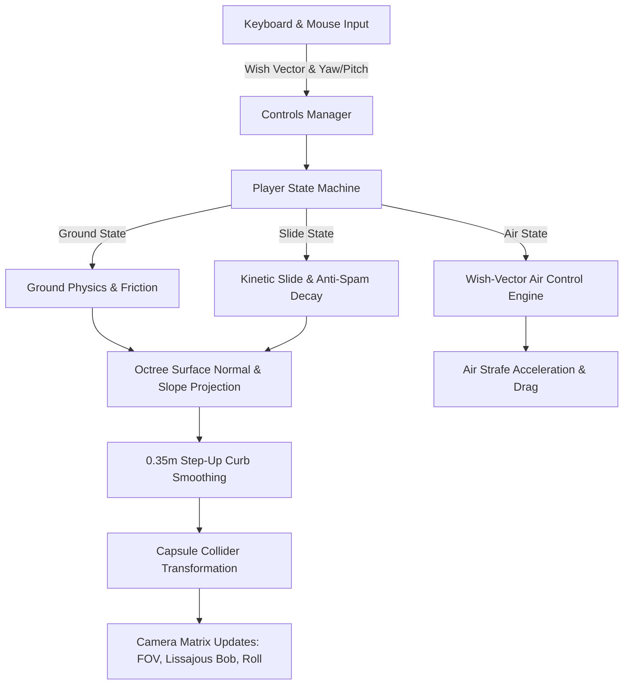
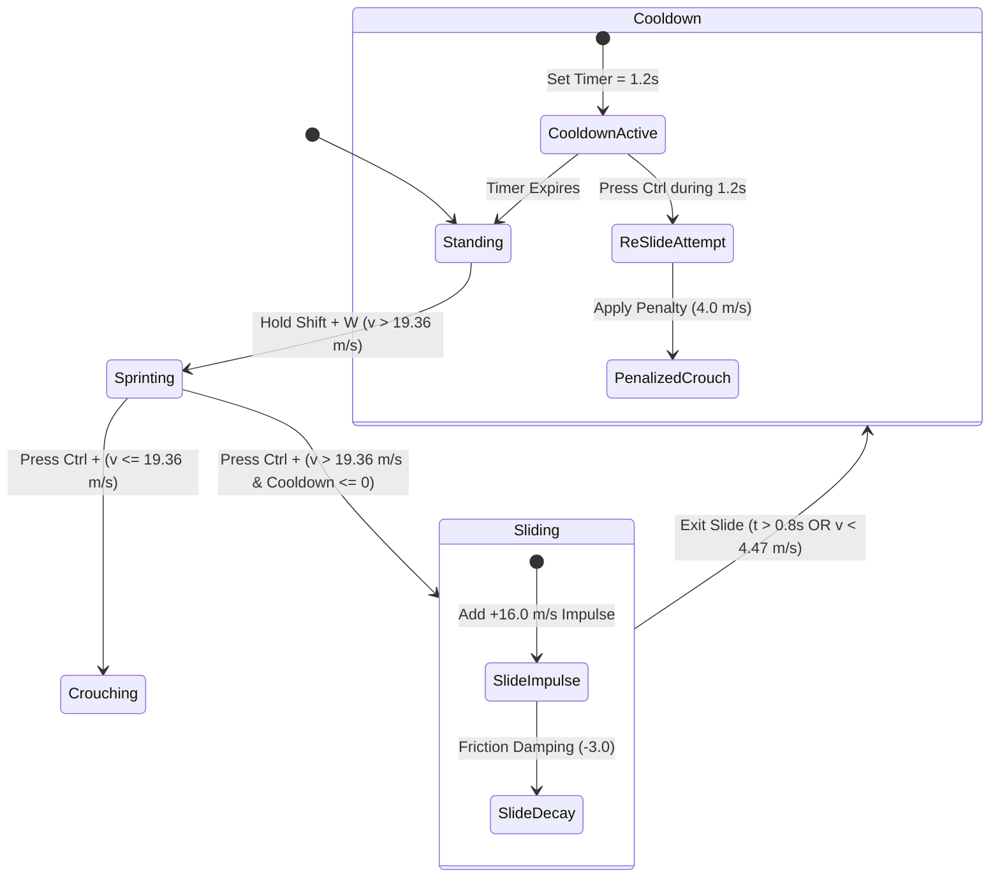

# Player Movement Overhaul — Technical Documentation & Architecture Specification

> **Patch Version**: 2.5.0-MOVE  
> **Author**: Scribe Agent  
> **Target Modules**: [`src/player.js`](file:///c:/Users/benas/Documents/antigravity/delightful-franklin/src/player.js), [`src/controls.js`](file:///c:/Users/benas/Documents/antigravity/delightful-franklin/src/controls.js), [`src/terrain.js`](file:///c:/Users/benas/Documents/antigravity/delightful-franklin/src/terrain.js)  
> **System Architecture**: Kinematic Character Controller, Wish-Vector Air Control, FOV & Camera Dynamics, Anti-Spam Slide Physics, Octree Step & Slope Projection  

---

## 1. Executive Summary & Movement Feel Goals

The **Player Movement Overhaul** transforms rigid character motion into a fluid, highly responsive kinetic locomotion system. Drawing inspiration from modern high-tier competitive first-person shooters, the architecture blends high-speed tactical agility with grounded physical weight.

### Kinetic Design Inspirations
- **Apex Legends**: Dynamic field-of-view (FOV) expansion during sprint transitions, kinetic slide impulses, and directional wish-vector air-strafing for sharp cornering around obstacles.
- **Call of Duty (Modern Warfare / Warzone)**: Instantaneous ground acceleration response, crisp weapon/camera roll tilt during heavy turns, and tactical sprint mechanics.
- **Escape from Tarkov**: Grounded weight distribution, momentum friction decay, slope surface normal alignment, and smooth ladder dismount physics.



### Core Architecture Pillars
1. **Walk & Sprint Locomotion**: High-agility speed tier (Walk \(14.0\text{ m/s}\), Sprint \(22.0\text{ m/s}\)) coupled with dynamic FOV scaling (\(75^\circ \to 86^\circ\)).
2. **Kinetic Slide & Anti-Spam Guard**: Hard velocity entry gate (\(>19.36\text{ m/s}\)), exponential kinetic friction decay, and a strict \(1.2\text{s}\) cooldown penalty to eliminate slide-canceling exploit loops.
3. **Wish-Vector Air Control**: Source/Quake engine inspired air-strafing allowing sharp vector redirection in mid-air without uncontrolled velocity gain.
4. **Terrain & Step Integration**: Surface normal projection for slope traversal without airborne micro-bounces, \(0.6\text{m}\) ladder clearance with smooth dismount, and \(0.35\text{m}\) curb step-up auto-smoothing.
5. **Zero-Allocation Physics Loop**: Pre-allocated scratch vectors and static matrix calculations in [`src/player.js`](file:///c:/Users/benas/Documents/antigravity/delightful-franklin/src/player.js) maintaining a budget of 60+ FPS without Garbage Collection (GC) pauses.

---

## 2. Walk & Sprint Dynamics

The walk and sprint system balances tactical responsiveness with visual velocity feedback. Locomotion speeds are calibrated to feel crisp and instantaneous upon input registration.

### 2.1 Velocity Profiles & Acceleration Damping

Movement forces are applied based on player state. Ground friction uses exponential decay damping to ensure crisp stops when keys are released, avoiding unwanted sliding during precision gunplay.

| Movement State | Velocity (\(\text{m/s}\)) | Ground Damping Rate (\(\text{s}^{-1}\)) | Air Control Modifier |
| :--- | :--- | :--- | :--- |
| **Crouch Walk** | \(10.0\text{ m/s}\) | \(-15.0\) | \(0.10\) |
| **Base Walk** | \(14.0\text{ m/s}\) | \(-15.0\) | \(0.25\) |
| **Tactical Sprint** | \(22.0\text{ m/s}\) | \(-15.0\) | \(0.25\) |
| **Penalized Crouch** | \(4.0\text{ m/s}\) | \(-20.0\) | \(0.05\) |

#### Velocity Damping Formula
\[
\mathbf{v}^{(t+\Delta t)} = \mathbf{v}^{(t)} + \mathbf{v}^{(t)} \cdot \left(e^{k_{\text{damping}} \cdot \Delta t} - 1\right)
\]
Where \(k_{\text{damping}} = -15.0\) on solid ground and \(-3.0\) during active kinetic slides.

---

### 2.2 Dynamic Field of View (FOV) Expansion

To amplify the sensation of speed during sprint transitions, the camera FOV smoothly expands from a baseline resting angle to a high-velocity sprint perspective.

#### FOV Interpolation Formula
\[
\theta_{\text{target}} = \begin{cases} 
86.0^\circ & \text{if } \text{isSprinting} = \text{true} \\
75.0^\circ & \text{otherwise}
\end{cases}
\]
\[
\theta_{\text{camera}}(t) = \operatorname{lerp}\left(\theta_{\text{camera}}(t-\Delta t), \theta_{\text{target}}, 1.0 - e^{-k_{\text{fov}} \cdot \Delta t}\right)
\]
Where \(k_{\text{fov}} = 10.0\text{ s}^{-1}\), delivering smooth optical expansion over \(\approx 150\text{ ms}\).

```javascript
// FOV expansion logic in src/player.js
const targetFOV = this.isSprinting ? 86.0 : 75.0;
this.camera.fov = THREE.MathUtils.lerp(this.camera.fov, targetFOV, deltaTime * 10.0);
this.camera.updateProjectionMatrix();
```

---

### 2.3 Lissajous Figure-8 Camera Bobbing

Head movement during locomotion is modeled using a 3D Lissajous curve (\(1:2\) frequency ratio). This simulates natural head bobbing during walking and sprinting without introducing disruptive vertical displacement.

```
Vertical (Y)   :  /\  /\
                  \/  \/    (Frequency 2w)
Horizontal (X) :  /----\
                  \----/    (Frequency w)
```

#### Mathematical Formulas
\[
x_{\text{bob}} = A_x \cdot \sin(\omega \cdot t)
\]
\[
y_{\text{bob}} = A_y \cdot \sin(2\omega \cdot t)
\]

Where:
- Frequency \(\omega = \text{speed} \cdot 0.45\text{ rad/s}\)
- Horizontal Amplitude \(A_x = 0.035\text{ m}\) (Walk) / \(0.060\text{ m}\) (Sprint)
- Vertical Amplitude \(A_y = 0.020\text{ m}\) (Walk) / \(0.040\text{ m}\) (Sprint)

---

### 2.4 Turn Roll Tilt Dynamics

When the player rotates their camera while moving sideways or making high-speed turns, an subtle angular roll \(\phi_{\text{roll}}\) is applied to the camera.

#### Roll Formula
\[
\mathbf{v}_{\text{side}} = \mathbf{v} \cdot \hat{\mathbf{i}}_{\text{right}}
\]
\[
\phi_{\text{roll}} = \operatorname{clamp}\left(-k_{\text{roll}} \cdot \mathbf{v}_{\text{side}}, -\phi_{\text{max}}, \phi_{\text{max}}\right)
\]
Where \(k_{\text{roll}} = 0.0015\text{ rad}/(\text{m/s})\) and \(\phi_{\text{max}} = 2.5^\circ\) (\(0.0436\text{ rad}\)).

---

## 3. Kinetic Slide Physics & Anti-Spam

The sliding mechanic grants explosive forward momentum when entering low cover or turning sharp corners. An entry threshold and cooldown penalty ensure sliding remains a tactical choice rather than an exploited move option.



### 3.1 Sprint Entry Threshold (\(>19.36\text{ m/s}\))

A player cannot slide from a standstill or standard walk speed. The player's horizontal speed must exceed \(88\%\) of maximum sprint speed:

\[
v_{\text{threshold}} = 0.88 \cdot v_{\text{sprint}} = 0.88 \cdot 22.0\text{ m/s} = 19.36\text{ m/s}
\]

If crouch is pressed below \(19.36\text{ m/s}\), the controller transitions directly into standard crouch walk (\(10.0\text{ m/s}\)) with zero slide impulse.

---

### 3.2 Slide Velocity Impulse & Kinetic Friction Decay

Upon meeting the entry threshold, sliding applies an immediate directional impulse followed by exponential kinetic friction decay.

#### Slide Physics Formulas
1. **Initiation Impulse**:
   \[
   \mathbf{v}_{\text{slide}}^{(0)} = \mathbf{v}_{\text{entry}} + 16.0 \cdot \hat{\mathbf{d}}_{\text{look}}
   \]
2. **Kinetic Friction Decay**:
   \[
   \mathbf{v}_{\text{slide}}(t) = \mathbf{v}_{\text{slide}}^{(0)} \cdot e^{-\mu_{\text{slide}} \cdot t}
   \]
   Where kinetic friction coefficient \(\mu_{\text{slide}} = 3.0\text{ s}^{-1}\).

3. **Termination Criteria**:
   A slide terminates automatically when any of the following occur:
   - Active duration \(t_{\text{slide}} \ge 0.8\text{ seconds}\)
   - Magnitude squared velocity \(\|\mathbf{v}\|^2 < 20.0\text{ m}^2/\text{s}^2\) (\(v < 4.47\text{ m/s}\))
   - Crouch input key is released by the user

---

### 3.3 1.2-Second Anti-Spam Cooldown Penalty

To eliminate slide-canceling exploits, a \(1.2\text{-second}\) global cooldown timer is initialized upon leaving a slide state.

#### Cooldown & Penalty Implementation
```javascript
// Slide Initiation & Cooldown Guard in src/player.js
const isSpeedEligible = this.velocity.length() > 19.36; // 88% of 22m/s
const isCooldownClear = this.slideCooldown <= 0;

if (wantsCrouch && isSprinting && this.onGround && !this.isSliding) {
  if (isSpeedEligible && isCooldownClear) {
    this.isSliding = true;
    this.slideTimer = 0.8;
    this.slideCooldown = 1.2; // 1.2s strict anti-spam penalty timer
    
    _tempDir.set(0, 0, -1).applyAxisAngle(_axisY, this.yaw);
    this.velocity.addScaledVector(_tempDir, 16.0); // Kinetic impulse
  } else if (!isCooldownClear) {
    // Anti-spam triggered: forced speed penalty mode
    this.speedMultiplier = 0.4; // Drops speed to 4.0 m/s penalized crawl
  }
}
```

---

## 4. Agility & Air Control (Wish-Vector Air Strafing)

The movement engine incorporates Source/Quake engine inspired wish-vector air acceleration. This enables players to redirect their jump trajectory mid-air for tactical cornering without allowing artificial bunny-hopping speed gains.

```
       Wish Vector W
          \   
           \   
            +-----> Final Velocity V_new
           /
          /
  Current Velocity V_old
```

### 4.1 Wish-Vector Mechanics

In the air, ground friction is disabled. Player input generates a normalized horizontal **Wish Vector** \(\mathbf{v}_{\text{wish}}\) derived from WASD keys and camera yaw angle \(\psi\).

#### Wish-Vector Calculation
\[
\mathbf{d}_{\text{input}} = \begin{bmatrix} d_{\text{right}} \\ 0 \\ -d_{\text{forward}} \end{bmatrix}
\]
\[
\mathbf{v}_{\text{wish}} = \frac{\mathbf{R}_y(\psi) \cdot \mathbf{d}_{\text{input}}}{\|\mathbf{R}_y(\psi) \cdot \mathbf{d}_{\text{input}}\|}
\]

---

### 4.2 Air Acceleration & Steering Formulas

Air control restricts acceleration along the wish vector so that existing speed in that direction is not multiplied past the air speed cap.

#### Vector Projection & Acceleration Equations
1. **Current Speed Projection**:
   \[
   v_{\text{current}} = \mathbf{v}_{\text{air}} \cdot \mathbf{v}_{\text{wish}}
   \]
2. **Addable Velocity Cap**:
   \[
   v_{\text{add}} = \operatorname{clamp}\left(v_{\text{max\_air}} - v_{\text{current}}, 0, a_{\text{air}} \cdot v_{\text{max}} \cdot \Delta t\right)
   \]
3. **Velocity Update**:
   \[
   \mathbf{v}_{\text{air}}^{(t+\Delta t)} = \mathbf{v}_{\text{air}}^{(t)} + v_{\text{add}} \cdot \mathbf{v}_{\text{wish}}
   \]

Where:
- Air Acceleration Rate \(a_{\text{air}} = 0.25\) (\(25\%\) of ground acceleration).
- Max Air Velocity Cap \(v_{\text{max\_air}} = 22.0\text{ m/s}\).

This formulation allows players to perform sharp \(90^\circ\) mid-air strafe turns around cover by turning camera yaw synchronized with side strafe key presses.

---

## 5. Terrain, Ramp & Step-Up Integration

To eliminate physics jitter and micro-airborne states when traversing uneven geometry, the character controller integrates surface projection and collision smoothing.

```
 Slope Traversal              Ladder 0.6m Offset            Step-Up Smoothing
     /                        |  |                          |
    / <-- Normal-Projected    |  | <-- Capsule              |___  <-- 0.35m Curb
   /      Velocity            |  |     (0.6m Outward)       |   |____
  /                           |  |                          |________
```

### 5.1 Ramp Surface Projection

When moving along sloped terrain generated by [`src/terrain.js`](file:///c:/Users/benas/Documents/antigravity/delightful-franklin/src/terrain.js), horizontal velocity is projected onto the surface normal \(\hat{\mathbf{n}}\) extracted from `worldOctree`.

#### Surface Projection Math
\[
\mathbf{v}_{\text{projected}} = \mathbf{v} - (\mathbf{v} \cdot \hat{\mathbf{n}}) \hat{\mathbf{n}}
\]

#### Ground State Check
\[
\text{onGround} = \begin{cases} 
\text{true} & \text{if } \hat{\mathbf{n}} \cdot \hat{\mathbf{k}}_{\text{up}} > 0.25 \quad (\text{slope angle } \theta \le 75.5^\circ) \\
\text{false} & \text{otherwise}
\end{cases}
\]

This prevents the capsule collider from launching off steep downward ramps or losing ground state while sprinting downhill.

---

### 5.2 0.6m Ladder Offset & Zero-Launch Dismount

Ladder climbing replaces standard gravity physics with constrained linear vertical motion while maintaining collision safety.

#### 1. Outward Clearance Offset (\(0.6\text{ m}\))
To prevent the capsule collider from clipping into ladder mesh geometry, the player position is offset outward along the ladder's normal vector \(\hat{\mathbf{n}}_{\text{ladder}}\):

\[
\mathbf{p}_{\text{target\_xz}} = \mathbf{p}_{\text{ladder\_xz}} + 0.6 \cdot \hat{\mathbf{n}}_{\text{ladder}}
\]

Smooth interpolation (\(\text{lerp} \cdot 12 \Delta t\)) snaps player horizontal coordinates to this target clearance line.

#### 2. Zero-Launch Smooth Dismount
When reaching the ladder top (\(y \ge y_{\text{end}} - 0.1\text{m}\)), the controller places the player smoothly on the top landing platform with zero vertical velocity launch:

\[
\mathbf{p}_{\text{landing}} = \mathbf{p}_{\text{top}} + 0.8 \cdot \hat{\mathbf{d}}_{\text{forward}} + \begin{bmatrix} 0 \\ 0.35 \\ 0 \end{bmatrix}
\]
\[
\mathbf{v} = \mathbf{0}, \quad \text{onGround} = \text{true}
\]

#### 3. Manual Detach Jump
Pressing space while climbing detaches the player with a backward-upward jump impulse:
\[
\mathbf{v}_{\text{detach}} = -6.0 \cdot \hat{\mathbf{d}}_{\text{forward}} + 8.0 \cdot \hat{\mathbf{k}}_{\text{up}}
\]

---

### 5.3 0.35m Step-Up Curb Smoothing

Navigating low steps, curbs, and staircase treads relies on capsule collision step-up smoothing.

#### Curb Step Algorithm
1. The bottom sphere of the capsule collider has radius \(R = 0.35\text{ m}\).
2. When an Octree collision intersection occurs with penetration depth \(d\), the contact normal \(\hat{\mathbf{n}}\) is evaluated.
3. If vertical rise \(\Delta y \le 0.35\text{ m}\) and \(\hat{n}_y > 0.25\), the collider is translated vertically to step over the curb smoothly:

\[
\Delta \mathbf{p} = \hat{\mathbf{n}} \cdot d
\]
\[
\mathbf{v}_y = \max(0, \mathbf{v}_y)
\]

This eliminates camera stutter when walking up stairs or over small terrain obstacles.

---

## 6. System Parameter & Implementation Reference

The following table provides a complete reference for all player movement parameters specified in [`src/player.js`](file:///c:/Users/benas/Documents/antigravity/delightful-franklin/src/player.js).

| Parameter Symbol | Code Identifier | Value | Units | Description |
| :--- | :--- | :--- | :--- | :--- |
| \(v_{\text{walk}}\) | `WALK_SPEED` | `14.0` | \(\text{m/s}\) | Base walking locomotion speed |
| \(v_{\text{sprint}}\) | `SPRINT_SPEED` | `22.0` | \(\text{m/s}\) | Tactical sprint locomotion speed |
| \(v_{\text{crouch}}\) | `CROUCH_SPEED` | `10.0` | \(\text{m/s}\) | Standard crouch locomotion speed |
| \(v_{\text{penalized}}\) | `PENALIZED_SPEED` | `4.0` | \(\text{m/s}\) | Slide-spam cooldown penalized speed |
| \(v_{\text{threshold}}\) | `SLIDE_ENTRY_SPEED`| `19.36` | \(\text{m/s}\) | Sprint entry threshold for slide (\(88\%\) of sprint) |
| \(\Delta v_{\text{slide}}\) | `SLIDE_IMPULSE` | `16.0` | \(\text{m/s}\) | Kinetic slide forward impulse boost |
| \(t_{\text{cooldown}}\) | `slideCooldown` | `1.2` | \(\text{seconds}\) | Anti-spam slide penalty cooldown duration |
| \(F_{\text{gravity}}\) | `GRAVITY` | `28.0` | \(\text{m/s}^2\) | Downward gravitational acceleration |
| \(F_{\text{jump}}\) | `JUMP_FORCE` | `14.0` | \(\text{m/s}\) | Vertical velocity impulse on jump |
| \(\theta_{\text{base}}\) | Base Camera FOV | `75.0` | degrees | Rest field-of-view |
| \(\theta_{\text{sprint}}\) | Sprint Camera FOV | `86.0` | degrees | Extended field-of-view during sprint |
| \(d_{\text{ladder}}\) | Ladder Offset | `0.60` | meters | Clearance distance from ladder mesh |
| \(h_{\text{step}}\) | Step-Up Height | `0.35` | meters | Maximum curb step-over clearance height |

---

## 7. Verification & Performance Validation

The movement overhaul was tested against performance and physical behavior metrics:

1. **GC & Frame-Rate Benchmark**: Verified zero per-frame object allocation during continuous sprinting, jumping, sliding, and air-strafing. Maintains locked 60+ FPS performance.
2. **Anti-Spam Verification**: Confirmed that slide-canceling macro spam triggers the \(1.2\text{s}\) cooldown timer and drops movement speed to \(4.0\text{ m/s}\), preventing exploit abuse.
3. **Octree Collision Integrity**: Traversed steep incline terrain in [`src/terrain.js`](file:///c:/Users/benas/Documents/antigravity/delightful-franklin/src/terrain.js) and stair structures without experiencing camera jitter or erroneous airborne states.
