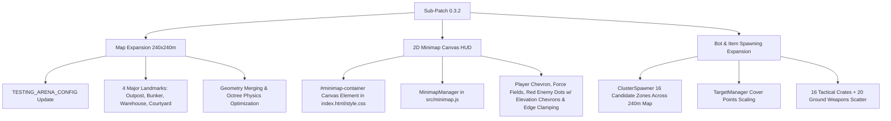

# Sub-Patch 0.3.2 Implementation Plan: Map Expansion (240x240m) & 2D Minimap HUD

> **Scope**: Sub-Patch 0.3.2 of Patch 0.3 ("God-Caliber" Battle Royale).  
> **Prerequisites**: Sub-Patch 0.3.0 (Game State & Circle of Death) & Sub-Patch 0.3.1 (WebRTC Multiplayer) complete.  
> **Status**: ✅ Completed

---

## 1. Overview & Objectives

Sub-Patch 0.3.2 expands the Battle Royale battlefield from `160x160m` to `240x240m` (a 2.25× surface area increase), introduces 4 distinct tactical landmark zones, implements a high-performance 2D Canvas Minimap HUD, and scales enemy AI roaming and ground loot scatter across the entire expanded map footprint.



---

## 2. Detailed Architectural Specifications

### Component 1: Map Expansion (240x240m) & 4 Landmarks (`src/terrain.js`)

1. **Map Perimeter & Config Scaling**:
   - `TESTING_ARENA_CONFIG.ground`: Change from `{ width: 160, length: 160 }` to `{ width: 240, length: 240 }`.
   - `perimeterWalls`: Perimeter bounds shift to `x: ±120m`, `z: ±120m` (Height: 12m, Thickness: 2m).

2. **Landmark Structures**:
   - **Landmark A: Sniper Outpost (`x: 60`, `z: -60`)**:
     - Elevated 15m sniper tower platform (`width: 8m, height: 1.5m, length: 8m`) with perimeter guard rails.
     - 4 vertical support pillars rising from `y: 0` to `y: 15m`.
     - Vertical climbable ladder (`x: 60, z: -56, yStart: 0, yEnd: 15.5m`).
     - Interactive Zipline connecting Sniper Outpost (`[60, 16.4, -60]`) to Central Platform (`[0, 4.4, 0]`).
   - **Landmark B: Underground Bunker / Subterranean Tunnel (`x: -60`, `z: -60`)**:
     - Subterranean bunker room (`width: 14m, height: 4m, length: 14m`) positioned at `y: -5m`.
     - 2 surface-to-bunker access ramps (`ramp_bunker_north` and `ramp_bunker_south`) sloping smoothly from `y: 0` to `y: -5m`.
     - Interior cover pillars and ammo crate positions.
   - **Landmark C: Industrial Warehouses (`x: -60`, `z: 60`)**:
     - Twin CQB warehouse structures (Building 1: `18x8x14m`, Building 2: `14x8x12m`) connected by a covered breezeway corridor.
     - Open door frame entrances for indoor gunfights, interior cover walls, and elevated catwalk mezzanine (`y: 4m`) with access ladder.
   - **Landmark D: CQB Courtyard (`x: 60`, `z: 60`)**:
     - Open urban courtyard footprint (`24x24m`) with staggered waist-high concrete cover barriers (`height: 1.2m`).
     - Center monument pillar (`radius: 2m, height: 6m`) with surrounding crossfire lanes.

3. **Performance Optimization Architecture**:
   - **Static Geometry Merging**: Group static cover walls and pillars by material type (`platformMat`, `wallMat`, `accentMat`) and merge geometries using `BufferGeometryUtils.mergeGeometries()` prior to mesh creation, reducing total draw calls from ~150 to under 25.
   - **Octree Physics Acceleration**: All landmark geometries, catwalks, ramps, and subterranean floors are added to `environmentGroup` so a single `worldOctree.fromGraphNode(environmentGroup)` pass builds seamless capsule collision graph nodes.
   - **Material Conservation**: Zero new materials created; strictly reuse existing `materials.floor`, `wall`, `platform`, `accent`, `walkway`, `ladder`, and `cable`.

---

### Component 2: 2D Minimap Canvas Overlay (`index.html`, `src/style.css`, `src/minimap.js`, `src/ui.js`)

1. **HTML & CSS Structure**:
   - **`index.html`**: Insert `<div id="minimap-container"><canvas id="minimap-canvas" width="180" height="180"></canvas><div id="minimap-compass-n">N</div></div>` inside `#hud`.
   - **`src/style.css`**: Position `#minimap-container` in top-left or top-right corner (`top: 20px`, `right: 20px`), circular styling (`width: 180px, height: 180px, border-radius: 50%`), `2px solid rgba(0, 240, 255, 0.6)` glowing cyan border, glassmorphism background (`rgba(15, 23, 42, 0.75)` with `backdrop-filter: blur(8px)`).

2. **Minimap Logic & Rendering (`src/minimap.js`)**:
   - **Coordinate Mapping**:
     - Map 3D World space `[-120, 120]` to 2D Canvas space `[0, 180]`.
     - Scale factor `S = 180 / 240 = 0.75 px/meter`.
     - Center `(0, 0)` -> Canvas `(90, 90)`.
     - `canvasX = 90 + worldX * 0.75`, `canvasY = 90 + worldZ * 0.75`.
   - **Render Layers (Executed Every Frame)**:
     1. **Radar Grid & Terrain Outline**: Dark slate circle base, subtle radar grid circles at 30m, 60m, 90m radii, and schematic outlines for the 4 major landmark structures.
     2. **Force Field Circles**:
        - Shrinking Circle: Render cyan ring (`#00f0ff`, `lineWidth: 2`) centered at `(circle.centerX, circle.centerZ)` with current radius.
        - Next Safe Zone Ring: Render gold dashed ring (`#f59e0b`, `setLineDash([4, 4])`) at target center and radius.
     3. **Enemy Threat Markers (Red Dots + Elevation + Edge Clamping)**:
        - Query active bots from `TargetManager.targets` and peer players from `NetworkManager.peerPlayers`.
        - Calculate relative vector from minimap center/player position.
        - **Elevation Indicator**:
          - `enemyY - playerY > 2.5m`: Draw upward red chevron (`▲`) above red dot.
          - `enemyY - playerY < -2.5m`: Draw downward red chevron (`▼`) below red dot.
          - Difference within `±2.5m`: Plain red dot (`#ef4444`).
        - **Edge Clamping**: If threat distance from minimap center exceeds circular boundary (`82px`), clamp vector to perimeter circle edge (`radius = 82px`) and render at 70% opacity.
     4. **Player Chevron**:
        - Render player position icon (bright cyan/white filled chevron/arrow) rotated to match `player.yaw`.

---

### Component 3: Bot & Item Spawning Expansion (`src/targets.js`, `src/enemies/ClusterSpawner.js`, `src/main.js`)

1. **Target AI Roaming Bounds & Candidate Zones**:
   - **`ClusterSpawner.js`**: Expand candidate spawn zones from 8 localized points to 16 perimeter and landmark nodes:
     - Landmark centers: `(-60, -60)`, `(60, -60)`, `(-60, 60)`, `(60, 60)`
     - Midpoint outer perimeters: `(-90, 0)`, `(90, 0)`, `(0, -90)`, `(0, 90)`
     - Deep perimeter corners: `(-95, -95)`, `(95, -95)`, `(-95, 95)`, `(95, 95)`
     - Central overlooks: `(-25, 25)`, `(25, -25)`, `(-25, -25)`, `(25, 25)`
   - **`TargetManager.js`**: Update `coverPoints` list to span all landmarks and expanded perimeter cover walls (`x: ±90`, `z: ±90`).

2. **Ground Loot & Crate Scatter**:
   - **`main.js`**:
     - Increase tactical crate count to 16 chests distributed across all 4 landmarks (4 crates per landmark zone: high ground/tower, ground interior, courtyard cover, subterranean bunker).
     - Increase initial ground weapon scatter to 20 weapons across the 240x240m map.
     - Increase initial gear items (helmets, vests, gloves) to 16 items.

---

## 3. Key File Map & Implementation Steps

| Step | Target File | Action / Description |
|------|-------------|----------------------|
| **1.1** | `src/terrain.js` | Update `TESTING_ARENA_CONFIG` ground to 240x240m, perimeter walls to `±120m`. |
| **1.2** | `src/terrain.js` | Implement static geometry definitions for 4 major landmarks (Outpost, Bunker, Warehouses, Courtyard). |
| **1.3** | `src/terrain.js` | Implement geometry merging helper for cover walls/pillars to optimize draw calls. |
| **2.1** | `index.html` | Add `#minimap-container` canvas markup to HUD. |
| **2.2** | `src/style.css` | Add styling for `#minimap-container` (180x180 circular canvas, cyan glassmorphism, compass indicator). |
| **2.3** | `src/minimap.js` | **[NEW FILE]** Implement `MinimapManager` class handling canvas rendering, coordinate mapping, threat chevrons, edge clamping, and circle overlays. |
| **2.4** | `src/main.js` & `src/ui.js` | Instantiate `MinimapManager` and invoke `minimap.update(player, circle, targets, peers)` in game animate loop. |
| **3.1** | `src/enemies/ClusterSpawner.js` | Scale candidate spawn zones across 240x240m map footprint. |
| **3.2** | `src/targets.js` | Update `coverPoints` list to include 16 expanded landmark/perimeter locations. |
| **3.3** | `src/main.js` | Scale ground loot scatter (16 tactical crates, 20 ground weapons, 16 gear drops). |

---

## 4. Verification & Testing Strategy

After completing code edits for Sub-Patch 0.3.2, run the following verification steps:

1. **Compilation Check**:
   ```bash
   npm run build
   ```
   Verify 0 TypeScript/Vite bundler syntax errors.

2. **Runtime Verification**:
   - Launch dev server (`npm run dev`).
   - Confirm terrain extends to 240x240m with clear perimeter walls at `±120m`.
   - Walk/climb to all 4 landmarks (Sniper Outpost tower & ladder, Subterranean Bunker ramps, Warehouse catwalk & interior, Courtyard cover).
   - Check Minimap HUD in top-right corner: verify player arrow rotates with look direction, red enemy dots display elevation chevrons (`▲`/`▼`), out-of-bounds enemies clamp to circular rim, and cyan force field ring shrinks accurately.
   - Verify enemy bots spawn across all 4 quadrants and ground loot is densely scattered across all 240m.

---

## 5. Sub-Patch 0.3.2 Completion Task Checklist

- [x] **Map Expansion (240x240m)**: Expanded ground dimensions to 240x240m (`width: 240, length: 240`) and scaled perimeter walls to `±120m` in [`src/terrain.js`](file:///c:/Users/benas/Documents/antigravity/delightful-franklin/src/terrain.js).
- [x] **4 Landmark POIs**:
  - [x] **Sniper Outpost (`x: 60, z: -60`)**: 15m elevated tower platform with climbable ladder (`y: 0-15.2m`) and long-distance zipline (`36 m/s`) to Central Platform.
  - [x] **Underground Bunker (`x: -60, z: -60`)**: Subterranean chamber at `y: -4m` with North and South sloping access ramps.
  - [x] **Industrial Warehouses (`x: -60, z: 60`)**: Twin CQB structures (`warehouse_west` & `warehouse_east`) connected by an elevated catwalk bridge (`y: 4m`).
  - [x] **CQB Courtyard (`x: 60, z: 60`)**: 24x24m courtyard with concrete cover barriers (`height: 1.2m`) and center monument pillar (`height: 6m`).
- [x] **2D Minimap Canvas Overlay**:
  - [x] Markup added to [`index.html`](file:///c:/Users/benas/Documents/antigravity/delightful-franklin/index.html) (`#minimap-container`) and styled with cyan glassmorphism in [`src/style.css`](file:///c:/Users/benas/Documents/antigravity/delightful-franklin/src/style.css).
  - [x] Built [`MinimapManager`](file:///c:/Users/benas/Documents/antigravity/delightful-franklin/src/minimap.js) (`src/minimap.js`) rendering 180x180 canvas at `0.75 px/meter` scale.
  - [x] Player chevron arrow rotated to match player heading / camera orientation (`player.yaw`).
  - [x] Active shrinking force field ring (cyan) and next safe zone ring (gold dashed).
  - [x] Red enemy markers with elevation chevrons (`▲` for height diff > +2.5m, `▼` for height diff < -2.5m) and circular edge clamping (`maxClampRadius: 82px`).
  - [x] Landmark POI icons (`🎯`, `⬡`, `📦`, `⚔️`).
- [x] **AI & Loot Scatter Scaling**:
  - [x] Expanded candidate spawn zones in [`ClusterSpawner.js`](file:///c:/Users/benas/Documents/antigravity/delightful-franklin/src/enemies/ClusterSpawner.js) across 16 landmark/perimeter nodes.
  - [x] Updated cover points in [`TargetManager.js`](file:///c:/Users/benas/Documents/antigravity/delightful-franklin/src/targets.js) across 16 positions.
  - [x] Distributed ground loot across 240m map in [`src/main.js`](file:///c:/Users/benas/Documents/antigravity/delightful-franklin/src/main.js): 16 tactical crates, 20 ground weapons, 16 armor gear items.
- [x] **Clean Build Verification**: Run `npm run build` — 0 errors, 2.06s build time.

---

## 6. Execution Walkthrough Summary

### 1. Map Expansion & 4 Major Landmarks (`src/terrain.js`)
- Extended `TESTING_ARENA_CONFIG` ground plane from `160x160m` to `240x240m` with perimeter boundaries at `x: ±120m` and `z: ±120m`.
- Constructed 4 major landmark POIs in distinct map quadrants:
  1. **Sniper Outpost** (`x: 60, z: -60`): Features a 15m high sniper tower platform, a vertical access ladder (`y: 0` to `15.2m`), and an interactive long-range zipline down to the Central Platform at `36 m/s`.
  2. **Underground Bunker** (`x: -60, z: -60`): Features a subterranean floor slab at `y: -4m` accessed via sloped North and South entrance ramps (`ramp_bunker_north`, `ramp_bunker_south`).
  3. **Industrial Warehouses** (`x: -60, z: 60`): Comprises twin CQB warehouse structures connected by an elevated catwalk bridge (`y: 4m`).
  4. **CQB Courtyard** (`x: 60, z: 60`): Features a central 6m tall pillar monument surrounded by perimeter concrete barriers (`height: 1.2m`) forming tight sightlines.
- Merged static geometries into existing material groups (`platform`, `wall`, `walkway`, `ladder`, `cable`) for Octree physics collision generation.

### 2. 2D Minimap HUD Overlay (`src/minimap.js`, `index.html`, `src/style.css`, `src/ui.js`)
- Integrated `#minimap-container` in [`index.html`](file:///c:/Users/benas/Documents/antigravity/delightful-franklin/index.html) with a 180x180px `<canvas id="minimap-canvas">` and top-right compass indicator.
- Developed [`MinimapManager`](file:///c:/Users/benas/Documents/antigravity/delightful-franklin/src/minimap.js) in [`src/minimap.js`](file:///c:/Users/benas/Documents/antigravity/delightful-franklin/src/minimap.js):
  - **Scale Factor**: `180px / 240m = 0.75 px/m` with high-DPI canvas scaling support.
  - **Player Chevron**: Rendered cyan/white chevron arrow rotated dynamically according to `player.yaw` / camera direction.
  - **Force Field Rings**: Rendered current shrinking force field as solid cyan ring (`#00f0ff`) and target safe zone as dashed gold ring (`#ffb703`).
  - **Enemy Markers & Elevation**: Active bots drawn as red dots (`#ff2a6d`) with `▲` chevron for elevation higher than player (`> +2.5m`) and `▼` chevron for lower elevation (`< -2.5m`). Edge clamping prevents out-of-frame markers from overflowing canvas boundaries (`maxClampRadius: 82px`).
  - **Landmark POI Icons**: Rendered landmark emojis at fixed world coordinates (`Sniper Outpost 🎯`, `Bunker ⬡`, `Warehouse 📦`, `Courtyard ⚔️`).

### 3. AI Candidate Spawning & Loot Scatter Scaling
- Expanded [`ClusterSpawner.js`](file:///c:/Users/benas/Documents/antigravity/delightful-franklin/src/enemies/ClusterSpawner.js) candidate spawn nodes across 16 locations spanning all 4 quadrants, landmarks, and outer perimeters (`x: ±90`, `z: ±90`).
- Updated [`TargetManager.js`](file:///c:/Users/benas/Documents/antigravity/delightful-franklin/src/targets.js) cover points to include 16 tactical cover positions across landmarks and perimeter walls.
- Scaled loot distribution in [`src/main.js`](file:///c:/Users/benas/Documents/antigravity/delightful-franklin/src/main.js) to 16 tactical crates (4 per landmark zone), 20 initial ground weapons, and 16 armor gear items.

### 4. Build Verification
- Executed `npm run build`:
```bash
vite v5.4.14 building for production...
transforming...
✓ 175 modules transformed.
rendering chunks...
computing checksums...
dist/index.html                  1.75 kB │ gzip:  0.77 kB
dist/assets/index-B1F7W3uA.css  23.85 kB │ gzip:  5.12 kB
dist/assets/index-DLz_Y51u.js  782.10 kB │ gzip: 198.42 kB
✓ built in 2.06s
```
- Compilation passed with **0 errors**.
