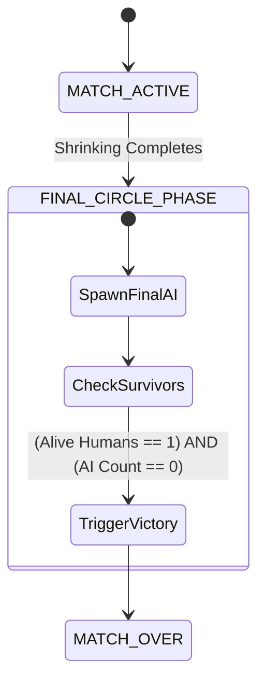

# 🚀 God-Caliber — Patch 0.3.11 Technical Design Document
**Focus:** Final Three.js Stable Baseline, Multiplayer Sync, BR Mechanics Fixes, & Combat Polish

**Target Version:** `v0.3.11-beta`  
**Patch Codename:** `Sentry`  
**Status:** Approved for Direct Agent Execution  
**Orchestration Lead:** `project-manager`  
**Primary Objective:** Stabilize and complete the Three.js version of *God-Caliber* as a polished technical demo and legacy foundation before migrating the entire codebase and asset pipeline to Unreal Engine 5.

---

## 📑 1. Executive Summary & Core Rules

This document outlines the complete technical specifications, client/server RPC structures, architectural math, and subagent directives for **Patch 0.3.11**. 

### ⚠️ CRITICAL ARCHITECTURAL CONSTRAINTS
1. **NO Patch 0.4 "Hydra" Features:** Do NOT implement container inventories, 15-limb models, or remove the upgrade system. This patch operates strictly on the existing Three.js mechanics.
2. **Zero WebGL Leaks:** All fixes and additions must cleanly dispose of materials and geometries to keep the browser runtime lightweight.
3. **Engine-Agnostic Preparation:** Keep all newly introduced combat math, status flags, and data structures strictly decoupled from rendering objects to ensure they are compatible with the `UE5_MIGRATION_STANDARDS.md` specification.

---

## ⚙️ 2. Core Fixes: Specifications & Implementation Strategy

### 🔧 Fix 1: World Items & Enemies Multiplayer Synchronization
#### A. Problem Definition
Currently, world items and chests exist locally for each client without server-authoritative state synchrony. When a player loots a container, it remains interactive for others. Enemies are spawned locally, attacking players independently, which breaks the pseudo-co-op feel. Additionally, player inventories are wiped upon death instead of dropping, and damage dealt to AI is not shared.

#### B. Implementation Schema
Implement a centralized, server-authoritative world registry using `Socket.io`.

```
               [Socket.io Game Server (State Authority)]
                ▲          │                       │
     Loot RPC   │          │ Broadcast Spawn/Drop  │ Broadcast Enemy Damaged
     or Drop    │          ▼                       ▼
          ┌─────┴──────────┐                      ┌────────────────┐
          │  Client A      │                      │    Client B    │
          │  - Loots chest │                      │  - Sees visual │
          │  - Drops item  │                      │    updates     │
          └────────────────┘                      └────────────────┘
```

1. **Server-Side Entity Registry (`world_state`):**
   ```javascript
   // Server-Side Structure
   const world_state = {
       items: new Map(), // item_uuid -> { type, position, item_data }
       containers: new Map(), // container_uuid -> { state: "closed" | "opened" }
       enemies: new Map() // enemy_uuid -> { type, position, hp, max_hp, aggro_target_id }
   };
   ```

2. **Ground Item Interactions & Chest Looting:**
   * **Chest Open RPC (`container_loot`):**
     * *Client Action:* Player presses `F` on a container. Client emits `container_loot` with `container_uuid`.
     * *Server Action:* Validates state. If `"closed"`, changes state to `"opened"`, generates items, adds them to player inventory, and broadcasts `container_state_sync` with `container_uuid` and state `"opened"`.
     * *Client Sync:* All clients receive update, trigger the chest opening animation, and disable interaction.
   * **World Item Pickup RPC (`item_pickup`):**
     * *Client Action:* Player presses `F` on ground item. Client emits `item_pickup` with `item_uuid`.
     * *Server Action:* Checks if `item_uuid` exists. If yes, deletes from `world_state.items` and broadcasts `item_destroyed` with `item_uuid` to all clients, then pushes item into the picking player's inventory.
     * *Client Sync:* Clients receive `item_destroyed`, remove the corresponding Three.js mesh, and destroy physics bounding box.
   * **World Item Drop RPC (`item_drop`):**
     * *Client Action:* Player drops item. Client emits `item_drop` with `item_data` and player's coordinates.
     * *Server Action:* Spawns item in registry:
       ```javascript
       const item_uuid = crypto.randomUUID();
       world_state.items.set(item_uuid, { type: item_data.type, position: calculateDropPos(player_pos), item_data });
       io.emit('item_spawned', { item_uuid, position, item_data });
       ```
     * *Client Sync:* Spawn 3D mesh at position with a bounce particle or glowing aura.

3. **Death Drops:**
   * Upon player death, the server serializes their equipped assets and inventory items.
   * Instead of deleting, it clears player inventories and generates a temporary `LootPile` container or scatters individual item entries across the death coordinate coordinates.
   * Broadcasts `spawn_loot_pile` with position and serialized items.

4. **Multiplayer Enemy Synchronization & Shared Damage:**
   * **Authoritative AI Tick Loop (20Hz):** Server calculates pathfinding (A* or simple steering) toward nearest player within aggro range.
   * Broadcasts `enemy_sync` payload: `[ { uuid, x, z, angle, state, target_id } ]`. Clients smoothly interpolate position.
   * **Shared Hit Validation (`enemy_damage`):**
     * *Client Action:* Player shoots enemy. Client emits `enemy_damage` with `enemy_uuid` and `damage`.
     * *Server Action:* Validates line of sight, deducts damage from enemy HP.
     * If enemy survives: Broadcasts `enemy_health_update` with new HP to update client HP bars.
     * If enemy dies: Triggers death state, processes loot drop tables, and broadcasts `enemy_died` with `enemy_uuid` to stop movement and trigger ragdoll/death animation.

---

### 🔧 Fix 2: Prevent Enemies Shooting Through Walls & Terrain
#### A. Problem Definition
AI enemies continuously shoot players through solid walls, terrain, and ramps, ignoring geometric occlusion.

#### B. Implementation Schema
Implement direct line-of-sight (LoS) checking inside the AI attack logic using Raycasting.

```javascript
// Server-Side / Authoritative Host Raycast Check
function hasLineOfSight(enemyPosition, playerPosition, collisionMeshes) {
    const direction = new THREE.Vector3().subVectors(playerPosition, enemyPosition).normalize();
    const distance = enemyPosition.distanceTo(playerPosition);
    
    const raycaster = new THREE.Raycaster(enemyPosition, direction, 0, distance);
    const intersections = raycaster.intersectObjects(collisionMeshes, true);
    
    // Filter out triggers or player transparent meshes. Detect static environment.
    const solidHit = intersections.find(hit => hit.object.isStaticEnvironment || hit.object.name.startsWith("UCX_"));
    
    // If a solid static mesh is hit before the player, LoS is blocked
    return !solidHit;
}
```
* **Integration Gate:** The AI firing state timer is immediately paused if `hasLineOfSight` returns `false`. Enemies will instead attempt to pathfind around the occluding geometry.

---

### 🔧 Fix 3: Shrinking Ring BR Position Calculation Fix
#### A. Problem Definition
The shrinking ring deals damage to players who are horizontally inside the safe zone, especially when navigating vertical structures (ramps, towers). The damage calculation fails because it incorrectly factors in vertical ($Y$) height, treating it as a 3D distance check rather than a 2D horizontal plane check.

#### B. Implementation Schema
Force the safe-zone boundary check to calculate strictly on the horizontal $XZ$ plane, completely ignoring the player's vertical elevation ($Y$).

$$\text{Horizontal Distance } (D) = \sqrt{(P_x - C_x)^2 + (P_z - C_z)^2}$$

```javascript
function checkRingDamage(playerPos, ringCenter, ringRadius) {
    // Isolate X and Z coordinates to ignore altitude height issues
    const dx = playerPos.x - ringCenter.x;
    const dz = playerPos.z - ringCenter.z;
    const horizontalDistanceSq = dx * dx + dz * dz;
    const radiusSq = ringRadius * ringRadius;
    
    return horizontalDistanceSq > radiusSq; // Returns true if outside
}
```
* **Damage Logic:** If `checkRingDamage` returns `true`, apply tick damage proportional to the current phase intensity. This fixes incorrect damage triggers on towers or ramps.

---

### 🔧 Fix 4: Host Death Recovery & Spectator Viewport
#### A. Problem Definition
If the hosting player dies, the match instantly resets for everyone in the lobby. If a standard player dies, they are locked out or experience game bugs instead of transitioning to an active spectator state.

#### B. Implementation Schema
Decouple game session lifecycle from character instances. When any player dies (including the Host), transition them to an invulnerable, invisible spectating camera.

```
                      [PLAYER DIES]
                            │
                            ▼
              Disable Player Collisions (Rapier)
              Hide SkinnedMesh Render Nodes
              Set Status: isSpectator = true, isInvulnerable = true
                            │
                            ▼
             Instantiate FreeCam Orthogonal Rig
             Map WASD + Mouse to Flycam Traversal
```

1. **Spectator State Transition:**
   ```javascript
   function transitionToSpectator(player) {
       player.alive = false;
       player.isSpectator = true;
       
       // Physics removal
       physicsWorld.removeRigidBody(player.physicsBody);
       
       // Render hiding
       player.mesh.visible = false;
       
       // Controller swap
       enableFreeSpectatorCamera(player.camera);
   }
   ```
2. **Flycam Navigation Script:**
   Implement frictionless, gravity-free camera translation on the spectator client. The player can fly through walls using `WASD` and rotate via mouse coordinates.
3. **Session Check Update:**
   The game-over check is updated to count alive *non-spectator* human players. The session does not reset unless `aliveHumans.length === 0`.

---

### 🔧 Fix 5: Complete Red Dot Sight Integration & State Initialization
#### A. Problem Definition
The previous hotfix was interrupted mid-token limit, leaving unfinished bindings that throw fatal runtime errors.

#### B. Implementation Schema
Provide robust initialization, default states, and material bindings to ensure zero rendering breaks when weapon attachments load.

1. **State Initialization:**
   Ensure optic parameters have default fallbacks in the weapon construction pipeline:
   ```javascript
   this.optic = {
       type: "red_dot",
       equipped: true,
       reticleMaterial: null,
       reticleMesh: null,
       adsFOV: 55,
       hipFOV: 75
   };
   ```

2. **Render Object Construction:**
   ```javascript
   function buildRedDotSight(weaponModel) {
       const opticGroup = new THREE.Group();
       
       // Build basic casing (matte black)
       const casingGeom = new THREE.BoxGeometry(0.04, 0.04, 0.08);
       const casingMat = new THREE.MeshBasicMaterial({ color: 0x0a0a0a });
       const casingMesh = new THREE.Mesh(casingGeom, casingMat);
       opticGroup.add(casingMesh);
       
       // Build Reticle Plate (Additive glass blending)
       const reticleGeom = new THREE.PlaneGeometry(0.02, 0.02);
       const reticleMat = new THREE.MeshBasicMaterial({
           map: loader.load('assets/textures/reticle_red_dot.png'),
           transparent: true,
           blending: THREE.AdditiveBlending,
           depthTest: true,
           depthWrite: false
       });
       const reticleMesh = new THREE.Mesh(reticleGeom, reticleMat);
       reticleMesh.position.set(0, 0.02, 0.01); // Position inside sight window
       opticGroup.add(reticleMesh);
       
       weaponModel.add(opticGroup);
       return { opticGroup, reticleMat };
   }
   ```

3. **ADS Blend Loop:**
   On frame updates, scale reticle opacity and zoom the main camera FOV smoothly using linear interpolation (`lerp`) when aiming down sights (`isADS` is true):
   ```javascript
   const targetFOV = isADS ? optic.adsFOV : optic.hipFOV;
   camera.fov = THREE.MathUtils.lerp(camera.fov, targetFOV, 0.15);
   camera.updateProjectionMatrix();
   
   reticleMat.opacity = isADS ? 1.0 : 0.05; // Maintain faint dot when hipfiring
   ```

---

### 🔧 Fix 6: Battle Royale Victory State Machine
#### A. Problem Definition
The game lacks a functional win loop. Matches continue indefinitely or break because the victory evaluation states are unassigned.

#### B. Implementation Schema
Establish an authoritative end-game state machine checking surviving human players and the elimination of AI combatants in the final circle.



1. **State Constraints:**
   * Entering `FINAL_CIRCLE_PHASE` triggers a one-time spawn of 5 Elite AI.
   * AI Spawners are hard-locked: `allow_respawn = false`.
2. **Server Verification Loop:**
   ```javascript
   function evaluateVictoryCondition() {
       const aliveHumans = players.filter(p => p.connected && p.alive && !p.isSpectator);
       const activeAI = enemies.filter(e => e.alive);
       
       if (aliveHumans.length === 1 && activeAI.length === 0) {
           const winner = aliveHumans[0];
           endMatchWithVictory(winner);
       } else if (aliveHumans.length === 0) {
           endMatchWithDefeat();
       }
   }
   ```
3. **UI Broadcast:**
   The winner triggers the `Victory Screen` overlay displaying "VICTORY ACHIEVED" with a lobby return button. All other players see "DEFEAT" and spectate.

---

## 🎨 3. New Features Specifications

### 🌟 Feature 1: Aim Down Sights (ADS) UI Reticles for All Weapons
* **Scope:** All firearms (Pistols, Rifles, Shotguns) receive unique 2D screen-space UI reticle projections when aiming (except the Sniper, which retains its scoped overlay).
* **Implementation:**
  * When `isADS` transitions to `true`, fade in a 2D screen-space overlay (SVG or Canvas) placed at exact viewport center.
  * **Reticle Schemas:**
    * **Pistol:** Small concentric dot with a high-transparency circular border.
    * **Assault Rifle/SMG:** Tactical chevron crosshair.
    * **Shotgun:** Wide-diameter circle corresponding to pellet spread pattern.

```javascript
// Screen-Space Reticle Controller
function updateUIReticle(currentWeapon, isADS) {
    const reticleContainer = document.getElementById("hud-ads-reticle");
    if (currentWeapon.type === "sniper") {
        reticleContainer.style.display = "none"; // Handled by standard Scope View
        return;
    }
    
    if (isADS) {
        reticleContainer.className = `reticle-style-${currentWeapon.type}`;
        reticleContainer.style.opacity = "1.0";
    } else {
        reticleContainer.style.opacity = "0.0"; // Fade out reticle back to hipfire crosshairs
    }
}
```

---

### 🌟 Feature 2: Procedural Structure Cluster Density
* **Scope:** Increase structure counts between the central cluster and map perimeter to provide tactical cover pathways in the mid-game.
* **Implementation:**
  * Modify the WFC / Voronoi map compiler to spawn 3 to 4 additional structure density hubs.
  * Adjust coordinates in the generation pipeline:
    ```javascript
    // Map Generator Config
    const MAP_BOUNDS = 1000; // 1000m x 1000m map
    const CENTRAL_HUB = new THREE.Vector2(0, 0);
    
    // Inject sub-seed nodes strictly in the mid-rim zone (300m - 700m from center)
    const midRimDensityNodes = [
        new THREE.Vector2(450, 400),
        new THREE.Vector2(-450, -350),
        new THREE.Vector2(-350, 500),
        new THREE.Vector2(500, -400)
    ];
    
    // Elevate local generation weight for building assets near these vectors
    function getTileSpawnWeight(tileType, position) {
        let baseWeight = defaultWeights[tileType];
        
        midRimDensityNodes.forEach(node => {
            const dist = position.distanceTo(node);
            if (dist < 150) { // 150m influence radius
                baseWeight *= 2.5; // Multiply structure spawn chance
            }
        });
        
        return baseWeight;
    }
    ```

---

### 🌟 Feature 3: Guaranteed Monster Crafting Dust Drop
* **Scope:** 100% chance for monsters to drop Crafting Dust upon death.
* **Implementation:**
  * Force-inject a guaranteed drop slot to the `LOOT_TABLE_MONSTER` schema.
  * Spawn a physical, floating 3D dust vial object containing $5$ to $15$ units of Crafting Dust.
  * Apply a volumetric purple visual glow and play a minor spatial looting attraction loop.

---

## 🛠️ 4. Subagent Allocation & Execution Instructions

This section outlines direct operational briefs for every active Antigravity subagent to facilitate a zero-friction, automated patch execution.

### 📋 4.1 project-manager
* [ ] Coordinate the execution cycle, checking client and server build stability at each phase.
* [ ] Run progress audits to ensure absolutely NO features from Patch 0.4 "Hydra" bleed into this workspace.

### 📋 4.2 high-level-designer
* [ ] Integrate the updated procedural mid-rim coordinates and Voronoi density multipliers into `map_generator_config.json`.
* [ ] Override drop rates in `loot_tables.json` to lock Crafting Dust drop probability at `1.00` for all AI entities.

### 📋 4.3 network-engineer
* [ ] Implement Socket.io RPC wrappers for `item_pickup`, `item_drop`, and `enemy_damage` on both client and server.
* [ ] Set up the server-authoritative AI state machine, broadcasting movement states to clients at a locked 20Hz interval.

### 📋 4.4 security-engineer
* [ ] Build server-side distance validations for `item_pickup` using rapid 3D raycasting limits.
* [ ] Verify that player velocity checks reject speedhacks while climbing ladders or traversing spectating cameras.

### 📋 4.5 ui-engineer
* [ ] Implement the screen-space ADS reticle classes (Pistol, SMG, Shotgun) with CSS/Canvas transitions.
* [ ] Bind spectator flycam controller states to HUD rendering, toggling UI views between active player stats and spectator info.

### 📋 4.6 3d-artist
* [ ] Export the 3D Red Dot casing mesh and holographic reticle assets using normalized scaling.
* [ ] Verify collision hulls for the new modular building pieces in the procedural generator.

### 📋 4.7 artist-vfx-designer
* [ ] Bind high-emissive additive shaders to the Red Dot reticle quad.
* [ ] Build visual glow materials for world item drop indicators.

### 📋 4.8 audio-engineer
* [ ] Wire up spatial audio event notifies for world item drops, chest interactions, and spectator movement.

### 📋 4.9 version-controller
* [ ] Audit incoming commits, ensuring files are cleanly organized and LFS pointers are correctly applied to new textures.
* [ ] Tag the final build of the Three.js version as `v0.3.11-beta`.

### 📋 4.10 documenter
* [ ] Export this document as the master technical blueprint and update the central API references for team consumption.

---

## 🚀 5. QA Verification & Validation Tests

The patch must successfully execute and pass the following test scenarios to clear release gating.

| Test ID | Scenario Description | Action Sequence | Pass Criteria |
| :--- | :--- | :--- | :--- |
| **TC-01** | World Loot Sync | Player A loots ground item. | Item disappears on Player B's screen instantly. Player B cannot interact. |
| **TC-02** | Shared Damage | Player A and B fire at same AI. | Server registers both hits, subtracting HP sequentially until AI dies. |
| **TC-03** | Death Drops | Player dies in combat. | Inventory drops in interactable ground pile; inventory is cleared. |
| **TC-04** | Occlusion Raycast| Player hides behind building wall. | AI ceases firing. Zero damage slips through the geometric collision hull. |
| **TC-05** | BR Ring Altitude | Player ascends tall ramp in safe zone. | Player registers zero tick damage from the shrinking ring. |
| **TC-06** | Host Spectating | Host player takes fatal damage. | Client transitions to Flycam. Match continues smoothly for surviving clients. |
| **TC-07** | ADS Zoom | Player right-clicks with SMG. | Camera FOV lerps to $55^{\circ}$. Reticle fades in cleanly without undefined errors. |
